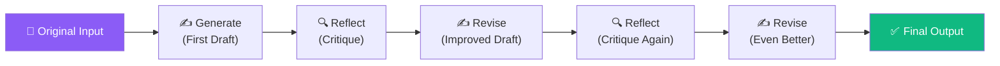
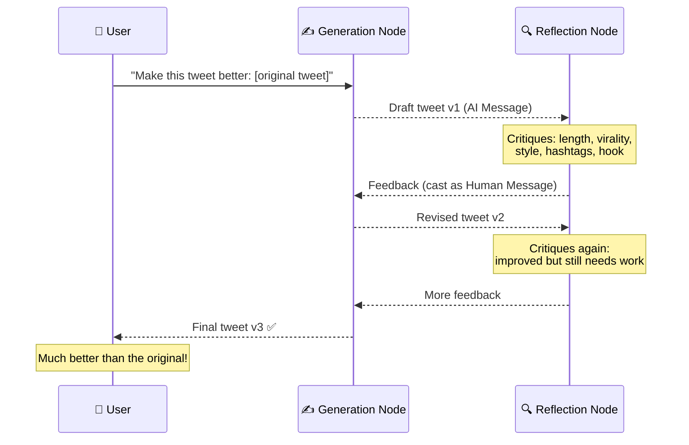

# 11.01 — What Are We Building?

## Overview

In this section we build a **Reflection Agent** — an AI system that doesn't just produce output, but **critiques and iteratively improves** that output through multiple rounds of self-reflection. The practical example is a Twitter post optimizer, but the pattern is universal and applies to any content generation, code writing, or decision-making task.

---

## What Is a Reflection Agent?

A **reflection agent** is an AI system that implements a feedback loop where the LLM:

1. **Generates** an initial output (e.g., a tweet, an essay, code)
2. **Reflects** on that output — critiquing its quality, identifying weaknesses, suggesting improvements
3. **Revises** the output based on the critique
4. **Repeats** steps 2–3 until a termination condition is met (e.g., a fixed number of iterations or a quality threshold)

This is inspired by how humans work: a good writer doesn't publish their first draft. They write, review, revise, review again, and iterate until the result meets their standards. The reflection agent automates this same process using LLMs.

### Why Does This Work?

It works because **the same LLM is better at evaluating content than generating perfect content on the first try**. This is a well-known phenomenon:

- **Generation** is open-ended — there are infinite ways to write a tweet, and the LLM picks one based on probability
- **Evaluation** is focused — given a specific tweet, the LLM can identify concrete issues (too long, not engaging, missing hashtags, unclear message)

By separating these two tasks into different chains with different prompts, each specialized for its job, the overall system produces better results than a single generation attempt.

> [!NOTE]
> This is the same pattern used in more advanced systems like Constitutional AI (where the AI aligns itself through self-critique) and iterative code generation (where the AI generates code, runs tests, and fixes bugs in a loop).

---

## The Practical Example: Twitter Post Optimizer

The reflection agent we build takes an existing Twitter post and improves it through iterative self-critique. Here's the concrete workflow:

### Why a Tweet?

Tweets are an excellent test case for reflection agents because:
- They're **short** — easy to evaluate and iterate on
- They have **clear quality metrics** — engagement, clarity, virality, style
- They're **measurable** — you can compare the original vs. the final version and clearly see improvement
- The pattern **generalizes** — the same approach works for emails, blog posts, code, or any text

---

## The Key Insight: Two Specialized Prompts

The power of the reflection agent comes from using **two different system prompts**:

| Chain | Role | System Prompt Focus |
|---|---|---|
| **Generation Chain** | Writer | "You are a Twitter techie influencer assistant. Generate the best Twitter posts possible. If the user provides critique, respond with a revised version." |
| **Reflection Chain** | Critic | "You are a viral Twitter influencer. Generate critique and recommendation for the user's tweet. Always provide detailed recommendations including length, virality, style." |

The **generation chain** is optimized to *create and revise*. The **reflection chain** is optimized to *evaluate and suggest improvements*. By giving them different personas and instructions, each chain excels at its specific job.

This is like having two specialized employees instead of one generalist:
- The **writer** focuses entirely on crafting the best version possible
- The **editor** focuses entirely on finding flaws and suggesting improvements

Neither could do the other's job as well, but together they produce excellent work.

---

## What Makes This "Agentic"?

A simple LLM call ("improve this tweet") is not agentic. What makes this system an **agent** is:

1. **Iterative execution** — the system runs through multiple cycles, not just once
2. **State management** — the system remembers the entire conversation history (all drafts, all critiques)
3. **Conditional termination** — the system decides when to stop (based on iteration count or quality)
4. **Autonomous improvement** — the system improves without human intervention between iterations

LangGraph makes this agent pattern trivial to implement — what would be complex loop logic with manual state management becomes a simple graph with two nodes and a conditional edge.

---

## Implementation Roadmap

The entire reflection agent is built in **less than 100 lines of code** thanks to LangGraph handling the orchestration:

| Step | Lesson | What We Build |
|---|---|---|
| 1 | [Project Setup](02-project-setup.md) | Poetry project, dependencies, API keys |
| 2 | [Chains](03-creating-the-reflector-chain-and-tweet-revisor.md) | The generation and reflection LCEL chains |
| 3 | [Graph](04-defining-our-langgraph-graph.md) | State, nodes, edges, conditional routing, compilation |
| 4 | [Execution](05-langsmith-tracing.md) | Running the graph and analyzing traces in LangSmith |

---

## Summary

| Concept | Description |
|---|---|
| **Reflection Agent** | An AI that generates output → critiques it → revises it → repeats |
| **Why it works** | LLMs are better at evaluating content than generating perfect content on the first try |
| **Two chains** | Generation (writer persona) and Reflection (critic persona) |
| **Iteration** | Multiple generate → reflect cycles until termination |
| **LangGraph** | Makes the iterative loop trivial — nodes + edges + conditional routing |
| **Result** | Significantly better output than a single LLM call |