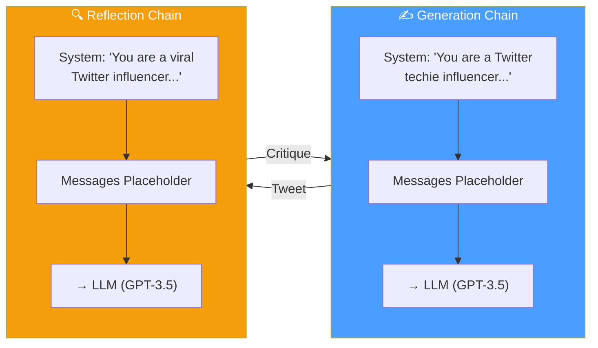
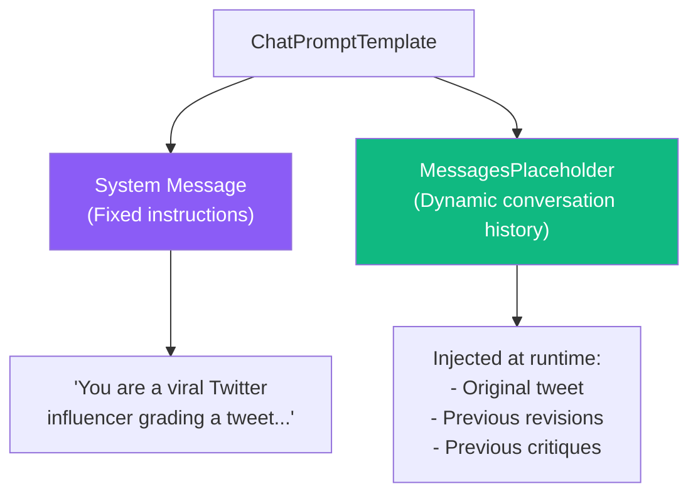

# 11.03 — Creating the Reflector Chain and Tweet Revisor

## Overview

Before building the graph, we need to build the **components that run inside it** — the chains. This lesson implements two LCEL (LangChain Expression Language) chains:

1. **Generation Chain** — the "writer" that creates and revises tweets
2. **Reflection Chain** — the "critic" that evaluates tweets and provides feedback

These chains are the core intelligence of the reflection agent. The graph (lesson 04) merely orchestrates *when* they run; the chains define *what* happens.

---

## The Two-Chain Architecture



The key insight is that both chains use the **same LLM** (GPT-3.5 Turbo), but with **different system prompts**. The system prompt is what gives each chain its specialized behavior — one acts as a writer, the other as a critic.

---

## Implementation

### Step 1: Imports

```python
# chains.py
from langchain_core.prompts import ChatPromptTemplate, MessagesPlaceholder
from langchain_openai import ChatOpenAI
```

Let's understand each import:

| Import | What It Does |
|---|---|
| `ChatPromptTemplate` | Creates structured prompts with system messages, human messages, and placeholders. It's LangChain's way of building reusable prompt templates. |
| `MessagesPlaceholder` | A special placeholder that accepts a **list of messages** — this is how we inject the conversation history into the prompt at runtime. |
| `ChatOpenAI` | LangChain's wrapper around OpenAI's chat models. Handles API calls, retries, and response parsing. |

### Step 2: The Reflection Prompt

```python
reflection_prompt = ChatPromptTemplate.from_messages(
    [
        (
            "system",
            "You are a viral Twitter influencer grading a tweet. "
            "Generate critique and recommendations for the user's tweet. "
            "Always provide detailed recommendations, including requests "
            "for length, virality, style, and hashtags.",
        ),
        MessagesPlaceholder(variable_name="messages"),
    ]
)
```

**Anatomy of this prompt:**



The prompt has two parts:

1. **System message (fixed):** Sets the persona and instructions — "you are a critic, give detailed feedback on length, virality, style, and hashtags." This never changes between iterations.

2. **MessagesPlaceholder (dynamic):** This is where the conversation history gets injected at runtime. On the first iteration, it might contain just the user's original tweet request and the first generated tweet. On later iterations, it contains the entire history — all previous tweets, all previous critiques — giving the LLM full context of how the content has evolved.

**Why use `MessagesPlaceholder` instead of a simple string variable?**

Because we need to inject a **list of messages** (human messages, AI messages) rather than a single string. The `MessagesPlaceholder` preserves the message types and ordering, which is important for the LLM to understand the conversation flow — who said what, and in what order.

### Step 3: The Generation Prompt

```python
generation_prompt = ChatPromptTemplate.from_messages(
    [
        (
            "system",
            "You are a Twitter techie influencer assistant tasked with "
            "writing excellent Twitter posts. Generate the best Twitter "
            "post possible for the user's request. If the user provides "
            "critique, respond with a revised version of your previous "
            "attempts.",
        ),
        MessagesPlaceholder(variable_name="messages"),
    ]
)
```

**Notice the crucial difference in the instructions:**

| Aspect | Reflection Prompt | Generation Prompt |
|---|---|---|
| **Persona** | "viral Twitter influencer **grading** a tweet" | "Twitter techie influencer **assistant**" |
| **Task** | "Generate **critique and recommendations**" | "Generate the **best Twitter post** possible" |
| **Key instruction** | "provide detailed recommendations" | "If critique is provided, respond with a **revised version**" |

The generation prompt includes the instruction "If the user provides critique, respond with a revised version of your previous attempts." This is critical — it tells the LLM that when it sees critique in the message history, it should produce a **revision**, not a completely new tweet. This ensures continuity across iterations.

### Step 4: Create the Chains

```python
# Initialize the LLM (defaults to GPT-3.5 Turbo)
llm = ChatOpenAI()

# Create the two chains using LCEL (pipe operator)
generate_chain = generation_prompt | llm
reflect_chain = reflection_prompt | llm
```

**What does the pipe (`|`) operator do?**

The pipe operator is **LCEL (LangChain Expression Language)** syntax for composing components into a chain. When you write `prompt | llm`, you're saying:

1. First, format the prompt with the input variables
2. Then, send the formatted prompt to the LLM
3. Return the LLM's response

It's equivalent to:

```python
# This is what `generate_chain.invoke({"messages": msgs})` does internally:
formatted_prompt = generation_prompt.format_messages(messages=msgs)
response = llm.invoke(formatted_prompt)
```

But the LCEL syntax is more concise and allows chaining many steps together.

---

## How the Chains Work Together

Let's trace through what happens in a complete reflection cycle:

### Iteration 1 — First Draft

```
Input to Generation Chain:
  messages = [
    HumanMessage("Make this tweet better: [original tweet]")
  ]

LLM receives:
  System: "You are a Twitter techie influencer assistant..."
  Human: "Make this tweet better: [original tweet]"

Output: AIMessage("🚀 Exciting news! LangChain's new tool calling feature...")
```

### Reflection on Iteration 1

```
Input to Reflection Chain:
  messages = [
    HumanMessage("Make this tweet better: [original tweet]"),
    AIMessage("🚀 Exciting news! LangChain's new tool calling feature...")
  ]

LLM receives:
  System: "You are a viral Twitter influencer grading a tweet..."
  Human: "Make this tweet better: [original tweet]"
  AI: "🚀 Exciting news! LangChain's new tool calling feature..."

Output: AIMessage("The tweet is a good start but could be improved:
  1. Too long — tweets should be punchy and under 280 characters
  2. Missing hashtags — add #AI #LangChain #DevTools
  3. The hook isn't strong enough — start with a question or bold statement
  4. Add a call to action at the end")
```

### Iteration 2 — Revised Draft

```
Input to Generation Chain:
  messages = [
    HumanMessage("Make this tweet better: [original tweet]"),
    AIMessage("🚀 Exciting news! LangChain's new tool calling feature..."),
    HumanMessage("The tweet is a good start but could be improved: 1. Too long...")
  ]

LLM receives all the history, including the critique, and generates an improved version.
```

> [!IMPORTANT]
> Notice that the reflection output (originally an AI message) is **cast to a HumanMessage** before being added back to the history. This is a deliberate prompt engineering technique that we'll explore in detail in the next lesson.

---

## The Complete `chains.py` File

```python
from langchain_core.prompts import ChatPromptTemplate, MessagesPlaceholder
from langchain_openai import ChatOpenAI

# --- Prompts ---

reflection_prompt = ChatPromptTemplate.from_messages(
    [
        (
            "system",
            "You are a viral Twitter influencer grading a tweet. "
            "Generate critique and recommendations for the user's tweet. "
            "Always provide detailed recommendations, including requests "
            "for length, virality, style, and hashtags.",
        ),
        MessagesPlaceholder(variable_name="messages"),
    ]
)

generation_prompt = ChatPromptTemplate.from_messages(
    [
        (
            "system",
            "You are a Twitter techie influencer assistant tasked with "
            "writing excellent Twitter posts. Generate the best Twitter "
            "post possible for the user's request. If the user provides "
            "critique, respond with a revised version of your previous "
            "attempts.",
        ),
        MessagesPlaceholder(variable_name="messages"),
    ]
)

# --- Chains ---

llm = ChatOpenAI()
generate_chain = generation_prompt | llm
reflect_chain = reflection_prompt | llm
```

> [!TIP]
> The file is intentionally short (~30 lines). Chains should be **focused and testable** — they contain only prompts and LLM configuration. All the orchestration logic (loops, conditions, state management) goes in the graph, not in the chains.

---

## Summary

| Component | Purpose | Key Design Decision |
|---|---|---|
| **Reflection Prompt** | Critique the tweet with specific recommendations | Persona is a "grading" influencer — focused on evaluation |
| **Generation Prompt** | Write and revise tweets | Includes the "if critique is provided, revise" instruction |
| **MessagesPlaceholder** | Inject dynamic conversation history | Preserves message types and full context across iterations |
| **LCEL pipe (`\|`)** | Compose prompt → LLM into a chain | Concise, composable, consistent with LangChain patterns |
| **Same LLM, different prompts** | Specialized behavior from a single model | The system prompt is what gives each chain its expertise |