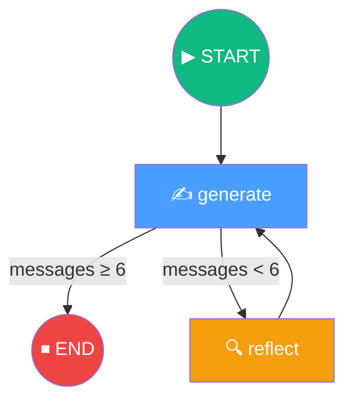
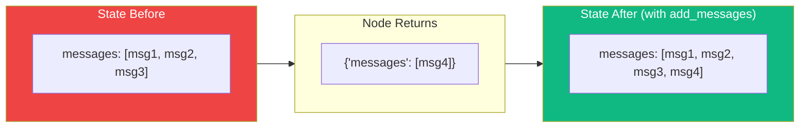
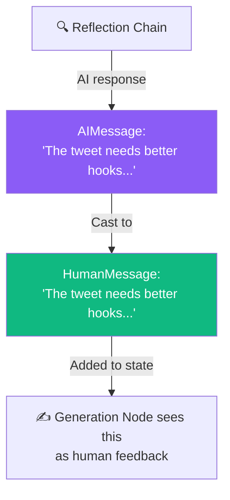
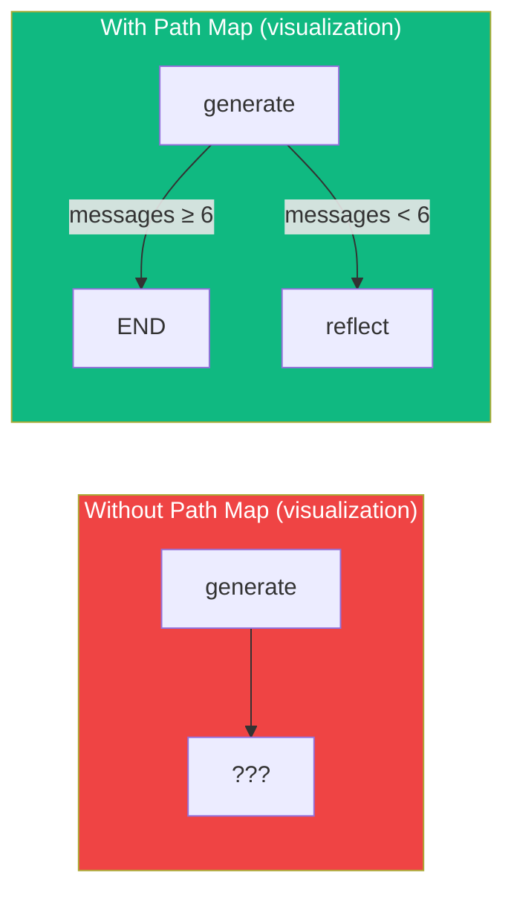
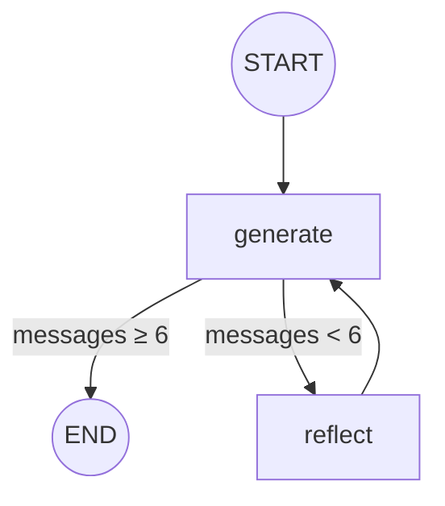
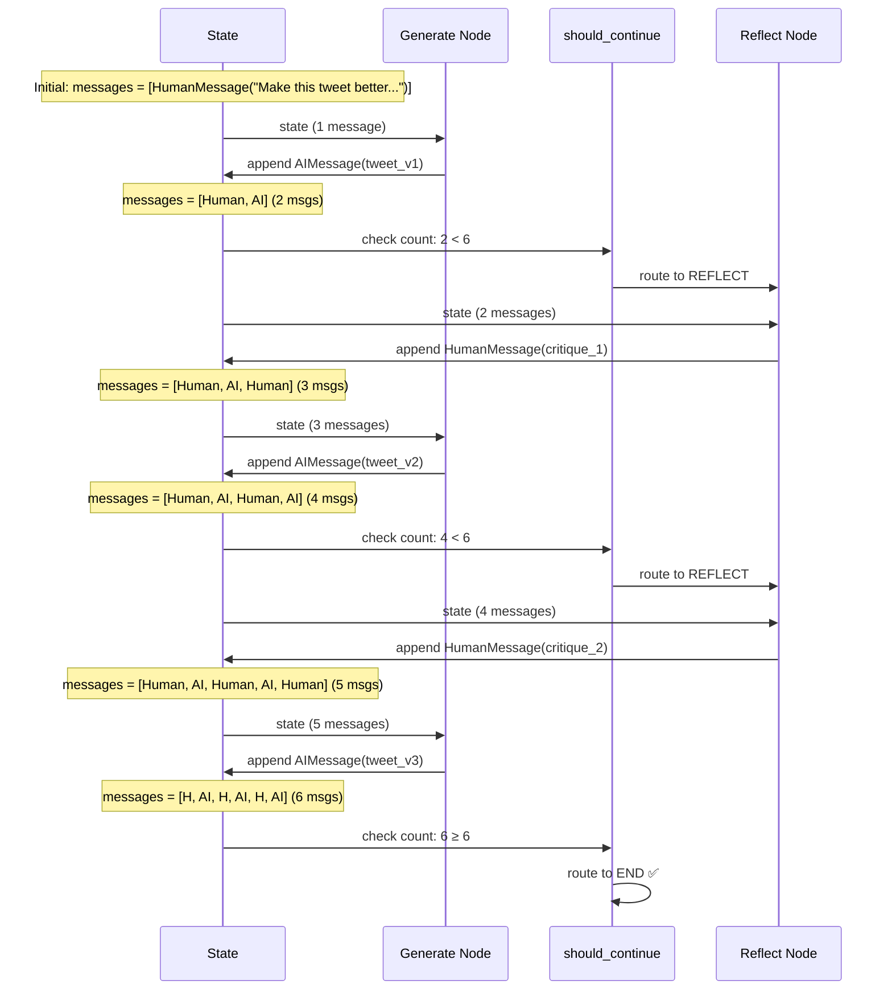

# 11.04 — Defining Our LangGraph Graph

## Overview

This is the **core lesson** of the Reflection Agent section. We take the chains from the previous lesson and wire them into a **LangGraph StateGraph** — defining the state schema, implementing node functions, connecting edges, adding conditional routing, and compiling the graph.

By the end of this lesson, you'll understand:
- How LangGraph state works (TypedDict + reducers)
- How nodes read from and write to state
- How conditional edges enable branching logic
- How path maps fix graph visualization issues
- How to compile and inspect a graph

---

## The Graph Architecture



The graph has:
- **2 nodes:** `generate` and `reflect`
- **1 deterministic edge:** `reflect` → `generate` (always go back to generation after reflection)
- **1 conditional edge:** `generate` → `reflect` OR `generate` → `END` (based on message count)
- **1 entry point:** `START` → `generate`

---

## Step 1: Imports

```python
from typing import TypedDict, Annotated
from langchain_core.messages import BaseMessage, HumanMessage
from langgraph.graph import END, StateGraph
from langgraph.graph.message import add_messages
from chains import generate_chain, reflect_chain
```

Let's understand each import deeply:

| Import | What It Is | Why We Need It |
|---|---|---|
| `TypedDict` | Python typing construct for typed dictionaries | Defines the **shape** of our graph state — what fields exist and their types |
| `Annotated` | Python typing construct for adding metadata to types | Attaches the **reducer** function to the state field, telling LangGraph *how* to update it |
| `BaseMessage` | Abstract base class for all LangChain message types | Type hint for the messages list — allows `HumanMessage`, `AIMessage`, `SystemMessage` |
| `HumanMessage` | Represents a message from a human user | Used to **cast** AI reflection output as human input (prompt engineering technique) |
| `END` | Special constant marking graph termination | The "finish" destination for our conditional edge |
| `StateGraph` | The main LangGraph class for building stateful graphs | The orchestration engine — we add nodes and edges to it, then compile |
| `add_messages` | LangGraph reducer function for message lists | Tells LangGraph to **append** new messages instead of **replacing** the list |
| `generate_chain`, `reflect_chain` | The LCEL chains from lesson 03 | The actual LLM logic that runs inside each node |

---

## Step 2: Define the State

```python
class MessageGraph(TypedDict):
    messages: Annotated[list[BaseMessage], add_messages]
```

This single class definition is doing a lot, so let's break it down:

### What Is the State?

The **state** is a data structure that flows through the entire graph. Every node receives the state as input, does some work, and returns updates to the state. It's like a shared notebook that gets passed from node to node — each node reads from it, writes to it, and passes it on.

In this project, the state only has one field: `messages` — a list that grows with each iteration.

### What Is `TypedDict`?

`TypedDict` creates a dictionary with **typed keys**. Unlike a regular Python dict (where keys can be anything), a `TypedDict` says: "this dictionary MUST have a key called `messages`, and its value MUST be a `list[BaseMessage]`."

```python
# TypedDict ensures type safety:
state: MessageGraph = {
    "messages": [HumanMessage("Hello")]  # ✅ Valid
}

state: MessageGraph = {
    "messages": "not a list"  # ❌ Type checker catches this
}
```

### What Does `Annotated` Do?

`Annotated` attaches metadata to the type hint. In this case, the metadata is the **reducer function** `add_messages`.

```python
# Without Annotated (plain TypedDict):
messages: list[BaseMessage]
# LangGraph would REPLACE the entire list on each update

# With Annotated + add_messages:
messages: Annotated[list[BaseMessage], add_messages]
# LangGraph will APPEND new messages to the existing list
```

### What Is a Reducer?

A **reducer** is a function that defines **how state updates are applied**. The name comes from functional programming (and Redux in web development). It answers the question: "When a node returns `{"messages": [new_msg]}`, do we *replace* the messages list or *append* to it?"

The `add_messages` reducer says: **append**. So if the state currently has 3 messages and a node returns 1 new message, the state will have 4 messages after the update.



**Why is appending important?** Because the reflection agent needs the **full conversation history** — all previous tweets, all previous critiques. If we replaced the list on each update, we'd lose the history, and the LLM wouldn't have context for its revisions.

> [!TIP]
> You can write your own reducer functions! For example, you could write one that only keeps the last N messages, or one that deduplicates messages. The `add_messages` function is the simplest and most common — it just appends.

---

## Step 3: Define Node Constants

```python
REFLECT = "reflect"
GENERATE = "generate"
```

These are just string constants for node names. Using constants instead of raw strings ("magic strings") prevents typos — if you misspell `REFLECT`, Python raises a `NameError` immediately. If you misspell `"reflet"` in a string, you get a silent bug that's hard to track down.

---

## Step 4: Implement the Generation Node

```python
def generation_node(state: MessageGraph) -> dict:
    return {"messages": [generate_chain.invoke({"messages": state["messages"]})]}
```

This function is deceptively simple, so let's unpack exactly what it does:

### Input: The State

The function receives the entire `MessageGraph` state. At any point during execution, `state["messages"]` contains the full conversation history:

| Iteration | Contents of `state["messages"]` |
|---|---|
| 1st generation | `[HumanMessage("Make this tweet better: ...")]` |
| 2nd generation | `[HumanMessage("Make this tweet better: ..."), AIMessage(tweet_v1), HumanMessage(critique_1)]` |
| 3rd generation | `[HumanMessage("..."), AIMessage(tweet_v1), HumanMessage(critique_1), AIMessage(tweet_v2), HumanMessage(critique_2)]` |

### Processing: Invoke the Chain

`generate_chain.invoke({"messages": state["messages"]})` sends the entire message history to the generation chain. The chain:
1. Formats the `generation_prompt` with these messages (filling the `MessagesPlaceholder`)
2. Sends the formatted prompt to GPT-3.5
3. Returns an `AIMessage` with the generated/revised tweet

### Output: State Update

The function returns `{"messages": [...]}` — a dictionary with the `messages` key. Because of the `add_messages` reducer, this new message gets **appended** to the existing list, not replacing it.

The LLM response wrapping `[...]` is important — the reducer expects a list of messages to append, even if it's a list with one item.

---

## Step 5: Implement the Reflection Node

```python
def reflection_node(state: MessageGraph) -> dict:
    res = reflect_chain.invoke({"messages": state["messages"]})
    return {"messages": [HumanMessage(content=res.content)]}
```

This node is similar to the generation node, with one **critical difference**: it **casts the AI response to a HumanMessage**.

### Why Cast AI Response to HumanMessage?

This is a **prompt engineering heuristic** and one of the most important techniques in the reflection agent:



**The problem:** When the generation chain receives the message history, it sees both human and AI messages. If the critique appears as an `AIMessage`, the generation LLM might think: "Oh, I already said that — let me say something different" or "That was my previous output, not user feedback." This can confuse the model.

**The solution:** By casting the critique to a `HumanMessage`, we trick the generation LLM into thinking a **human reviewer** provided the feedback. LLMs are specifically trained to respond helpfully to human feedback through RLHF (Reinforcement Learning from Human Feedback). When they see critique labeled as human input, they naturally try to address every point.

**Example of how the generation LLM sees the history:**

```
System: "You are a Twitter techie influencer assistant..."
Human: "Make this tweet better: [original tweet]"        ← User's original request
AI: "🚀 LangChain just dropped tool calling..."          ← My first attempt
Human: "Good start but: 1) Too long  2) Needs hashtags   ← Looks like human feedback!
        3) Weak hook  4) No call to action"
```

The generation LLM responds naturally: "Okay, the human wants me to fix these 4 things. Let me revise."

> [!IMPORTANT]
> This casting technique is a **heuristic**, not a guaranteed optimization. It works well in practice because LLMs respond better to feedback labeled as human input, but the exact impact depends on the model and the use case. It's one of those "tricks of the trade" in prompt engineering.

---

## Step 6: Define the Routing Function

```python
def should_continue(state: MessageGraph) -> str:
    if len(state["messages"]) >= 6:
        return END
    return REFLECT
```

This function determines **where the graph goes next** after the generation node. It's not a node — it doesn't do any processing or update the state. It's a **routing function** that returns a **node name** (string).

### The Logic

The number 6 is chosen to allow **2 complete reflection cycles**:

| Message # | Content | Count |
|---|---|---|
| 1 | User's initial request | 1 |
| 2 | Generated tweet v1 | 2 |
| 3 | Critique (cast as Human) | 3 |
| 4 | Revised tweet v2 | 4 |
| 5 | Critique (cast as Human) | 5 |
| 6 | Revised tweet v3 | 6 → **STOP** |

After 6 messages, the graph terminates and returns the final tweet.

### Key Details

- The function receives the **state** (same as nodes) — this gives it access to all information needed for routing decisions
- The function returns a **string** — either a node name (`REFLECT`) or the special constant `END`
- The returned string **must correspond to a valid node** (or `END`) — returning an invalid name causes an error
- This is a **conditional edge function**, not a node — it doesn't return `{"messages": ...}`, it returns a plain string

> [!TIP]
> This simple message-counting logic could be replaced with something much more sophisticated. For example, you could call an LLM to evaluate "is this tweet good enough?" and route based on the response. You could also analyze the critique to see if there are still significant issues. The beauty of LangGraph is that you have full flexibility in the routing function.

---

## Step 7: Build and Compile the Graph

```python
# Create the graph with our state schema
builder = StateGraph(MessageGraph)

# Add nodes
builder.add_node(GENERATE, generation_node)
builder.add_node(REFLECT, reflection_node)

# Set the entry point (START → generate)
builder.set_entry_point(GENERATE)

# Add conditional edge (generate → reflect OR generate → END)
builder.add_conditional_edges(
    GENERATE,           # Source node
    should_continue,    # Routing function
    {END: END, REFLECT: REFLECT}  # Path map
)

# Add deterministic edge (reflect → generate, always)
builder.add_edge(REFLECT, GENERATE)

# Compile the graph
graph = builder.compile()
```

### Understanding Each Method

**`StateGraph(MessageGraph)`** — Creates a new graph builder with our state schema. This tells LangGraph what the state looks like and how to update it.

**`add_node(name, function)`** — Registers a function as a named node. The function must accept the state as input and return a state update dict.

**`set_entry_point(name)`** — Defines which node runs first. Internally, this creates an edge from the built-in `START` node to the specified node.

**`add_conditional_edges(source, routing_fn, path_map)`** — Creates a branching edge from the source node. After the source node runs, LangGraph calls `routing_fn(state)` and follows the returned path.

**`add_edge(source, destination)`** — Creates a fixed (deterministic) edge. After the source runs, the destination always runs next.

**`compile()`** — Finalizes the graph, validates all connections, and returns an executable graph object.

### The Path Map

The third argument to `add_conditional_edges` is a **path map** — a dictionary that maps routing function return values to node names:

```python
{END: END, REFLECT: REFLECT}
```

**Why is this needed?** Without the path map, LangGraph doesn't know what the possible outputs of `should_continue` are. It just sees a Python function — it can't inspect the function body to discover the possible return values. The path map explicitly tells LangGraph: "This function might return `END` or `REFLECT`, and here's where each leads."

**What happens without a path map?** The graph **executes correctly** (it calls `should_continue` and follows the returned string), but the **graph visualization is incomplete** — the diagram won't show the conditional edges because LangGraph doesn't know what they are.



---

## Step 8: Visualize the Graph

LangGraph provides built-in methods to visualize the compiled graph:

### Mermaid Diagram Output

```python
print(graph.get_graph().draw_mermaid())
```

This outputs Mermaid syntax that you can render in any Mermaid-compatible tool (VS Code, GitHub, Excalidraw):



### ASCII Output

```python
graph.get_graph().print_ascii()
```

This prints an ASCII representation directly in the terminal — useful when you don't have a Mermaid renderer available.

---

## How Messages Flow Through the Graph

Let's trace the exact state at each step for a concrete understanding:



---

## The Complete `main.py` File

```python
from typing import TypedDict, Annotated
from dotenv import load_dotenv
from langchain_core.messages import BaseMessage, HumanMessage
from langgraph.graph import END, StateGraph
from langgraph.graph.message import add_messages

from chains import generate_chain, reflect_chain

load_dotenv()

# --- State ---
class MessageGraph(TypedDict):
    messages: Annotated[list[BaseMessage], add_messages]

# --- Constants ---
REFLECT = "reflect"
GENERATE = "generate"

# --- Nodes ---
def generation_node(state: MessageGraph) -> dict:
    return {"messages": [generate_chain.invoke({"messages": state["messages"]})]}

def reflection_node(state: MessageGraph) -> dict:
    res = reflect_chain.invoke({"messages": state["messages"]})
    return {"messages": [HumanMessage(content=res.content)]}

# --- Routing ---
def should_continue(state: MessageGraph) -> str:
    if len(state["messages"]) >= 6:
        return END
    return REFLECT

# --- Graph ---
builder = StateGraph(MessageGraph)
builder.add_node(GENERATE, generation_node)
builder.add_node(REFLECT, reflection_node)
builder.set_entry_point(GENERATE)
builder.add_conditional_edges(GENERATE, should_continue, {END: END, REFLECT: REFLECT})
builder.add_edge(REFLECT, GENERATE)
graph = builder.compile()

if __name__ == "__main__":
    print(graph.get_graph().draw_mermaid())
```

---

## Summary

| Concept | What We Learned |
|---|---|
| **State (TypedDict + Reducer)** | State is a typed dictionary; `add_messages` reducer appends instead of replacing |
| **Nodes** | Functions that receive state, invoke chains, and return state updates |
| **HumanMessage casting** | Reflection output is cast to HumanMessage — prompt engineering trick for better revisions |
| **Conditional edges** | Routing functions return node names to control flow; they're NOT nodes themselves |
| **Path maps** | Explicit mapping of routing outputs to nodes — needed for correct graph visualization |
| **Deterministic edges** | Fixed connections (reflect → generate — always runs in this order) |
| **Compilation** | `builder.compile()` validates and produces an executable graph |
| **Visualization** | `draw_mermaid()` and `print_ascii()` for inspecting the graph structure |