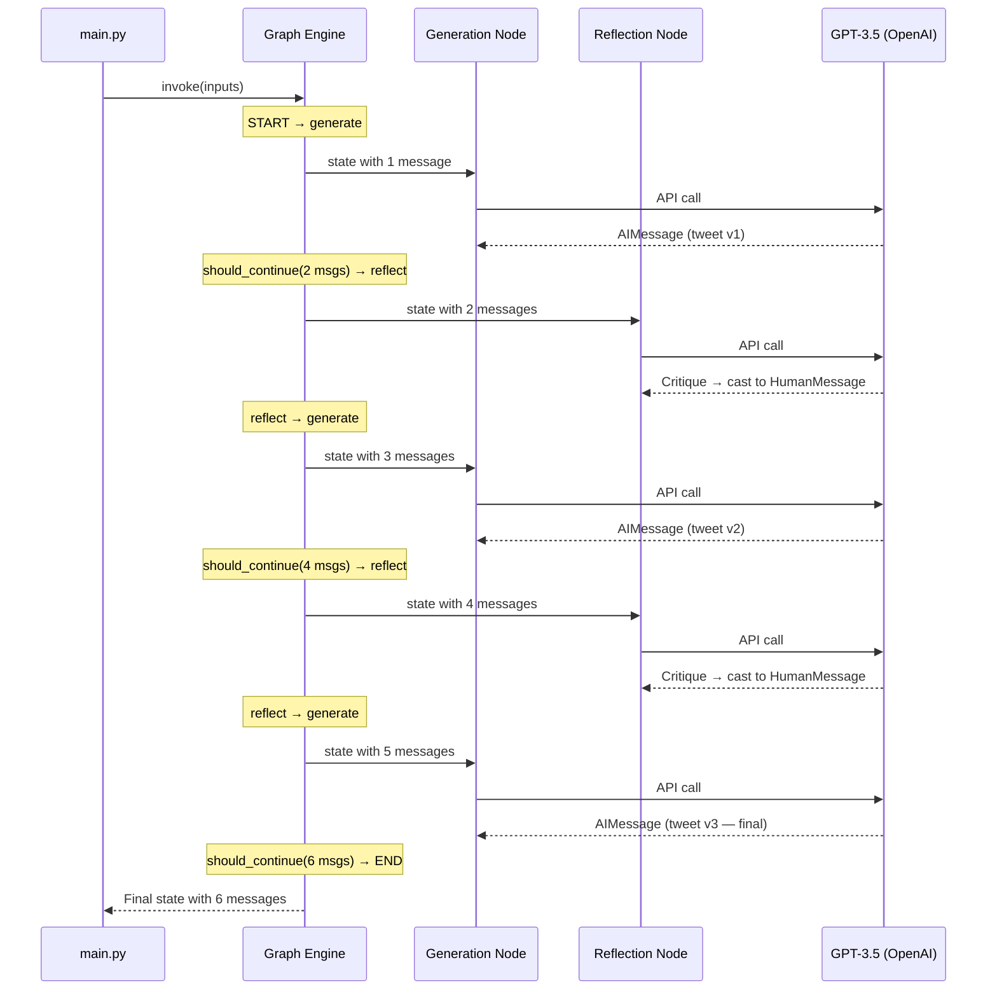

# 11.05 — LangSmith Tracing & Execution

## Overview

This is the **payoff lesson** — we invoke the compiled graph with a real input, watch it execute through multiple generate → reflect cycles, and use **LangSmith** to trace and analyze every step of the execution.

---

## Invoking the Graph

```python
if __name__ == "__main__":
    inputs = {
        "messages": [
            HumanMessage(
                content="Make this tweet better: "
                "LangChain just announced a huge update: tool calling! "
                "This gives us a single interface for function calling "
                "across all supported LLMs — OpenAI, Gemini, Anthropic. "
                "No more vendor-specific code. This is big for AI devs!"
            )
        ]
    }
    
    response = graph.invoke(inputs)
```

### What Happens When We Call `graph.invoke(inputs)`

The moment you call `invoke`, LangGraph executes the entire graph from start to finish:



**Total LLM API calls: 5** (3 generation + 2 reflection). This is why the execution takes ~20 seconds — each API call takes 3–4 seconds.

---

## What LangSmith Shows

When `LANGCHAIN_TRACING_V2=true` is set, every step of the graph execution is automatically logged to LangSmith. Let's explore what the trace reveals.

### The Trace View

In the LangSmith dashboard, under the "reflection-agent" project, you'll see a trace that looks like:

```
📊 Trace: graph.invoke (20.3s)
├── 🔵 generate (3.2s)
│   └── 🤖 ChatOpenAI (3.1s)
├── 🟡 should_continue
├── 🔵 reflect (3.8s)
│   └── 🤖 ChatOpenAI (3.7s)
├── 🔵 generate (4.1s)
│   └── 🤖 ChatOpenAI (4.0s)
├── 🟡 should_continue
├── 🔵 reflect (3.5s)
│   └── 🤖 ChatOpenAI (3.4s)
├── 🔵 generate (3.9s)
│   └── 🤖 ChatOpenAI (3.8s)
└── 🟡 should_continue → END
```

LangSmith traces **every component**:
- Each **node execution** (generate, reflect) with timing
- Each **LLM call** (ChatOpenAI) with input/output
- Each **routing decision** (should_continue) with the result
- The **total execution time** for the entire graph

### What to Look For in the Trace

**1. The Growing Prompt:**

The most illuminating part of the trace is watching the prompt **grow** with each iteration. Click on the last `ChatOpenAI` call to see the full prompt the LLM received:

| Message # | Type | Content |
|---|---|---|
| 1 | System | "You are a Twitter techie influencer assistant..." |
| 2 | Human | "Make this tweet better: LangChain just announced..." |
| 3 | AI | Tweet v1 (first draft) |
| 4 | Human | Critique: "Good start, but needs: 1) shorter length, 2) stronger hook..." |
| 5 | AI | Tweet v2 (revised based on critique) |
| 6 | Human | Critique: "Much better! But could still improve: 1) add emojis, 2) clearer CTA..." |

By the last call, the LLM has the **complete history** of the evolution — every draft, every critique. This context allows it to produce a significantly better final version.

**2. The HumanMessage Casting in Action:**

In the trace, you can clearly see that reflection outputs are tagged as **Human** messages, even though they were generated by the AI. This confirms the prompt engineering technique from lesson 04 is working as intended.

**3. Per-Node Timing:**

The trace shows how long each node takes. Since every node makes an LLM call, the time is dominated by API latency. If you see one call taking significantly longer, it's usually because the prompt was longer (more history to process).

---

## Analyzing the Quality Improvement

Let's examine what a typical execution produces:

### Original Tweet (User Input)
> "LangChain just announced a huge update: tool calling! This gives us a single interface for function calling across all supported LLMs — OpenAI, Gemini, Anthropic. No more vendor-specific code. This is big for AI devs!"

### After Generation v1
> "🚀 Game-changing alert! LangChain's new tool calling feature unifies function calling across ALL major LLMs — GPT, Gemini, Claude — with a SINGLE interface. No more vendor lock-in. The future of AI dev is here. #LangChain #AI #DevTools"

### After Reflection + Generation v2
> "One API to call them all. ⚡ LangChain just shipped tool calling — one interface for function calling across GPT, Gemini, and Claude. Write your tool logic once, run it everywhere. This changes everything for AI engineers. Who's already tried it? 👇 #LangChain #AI"

### After Reflection + Generation v3 (Final)
> "Write once, call anywhere. LangChain just dropped tool calling ⚡ One interface. Every major LLM. Zero vendor lock-in. The era of portable AI tools starts now → link #AI #LangChain #DevTools"

**What improved across iterations:**
1. **Length** — got progressively shorter and punchier
2. **Hook** — moved from generic ("Game-changing alert!") to specific and intriguing ("Write once, call anywhere.")
3. **Clarity** — the message became more focused on the key value proposition
4. **Engagement** — added a call to action, question, and relevant hashtags
5. **Style** — evolved from press-release style to authentic tech influencer voice

---

## LangSmith as a Debugging Tool

Beyond just viewing traces, LangSmith is essential for **debugging** reflection agents:

| Issue | What LangSmith Shows |
|---|---|
| **Agent not improving** | Check if the reflection critique is too vague — the LLM might not have specific enough feedback to work with |
| **Agent going in circles** | Check if revisions are just random variations rather than directed improvements |
| **Execution too slow** | Check per-node timing — maybe the prompt is too long or the model is overloaded |
| **Unexpected routing** | Check `should_continue` output — verify it's returning the expected node name |
| **Quality plateau** | See if later critiques are just nitpicking — might need fewer iterations |

> [!TIP]
> LangSmith's **Playground** feature lets you re-run any individual LLM call with modified inputs. This is perfect for experimenting with different system prompts or message histories without re-running the entire graph.

---

## Could We Do This Without LangGraph?

Yes — but it would be more work and less clean:

```python
# Without LangGraph (manual loop):
messages = [HumanMessage(content="Make this tweet better: ...")]
for i in range(3):
    response = generate_chain.invoke({"messages": messages})
    messages.append(response)
    if i < 2:  # Don't reflect on the last iteration
        critique = reflect_chain.invoke({"messages": messages})
        messages.append(HumanMessage(content=critique.content))
```

This works, but:
- **No built-in visualization** — you can't `draw_mermaid()` to see the flow
- **No built-in tracing** — LangSmith's graph-aware tracing shows node boundaries; a manual loop shows a flat sequence
- **Harder to modify** — adding conditions, new nodes, or parallel branches requires rewriting the loop
- **No state management** — you handle appending messages manually, which is error-prone in complex graphs
- **No serialization** — LangGraph can checkpoint state, enabling human-in-the-loop or error recovery

LangGraph makes the pattern **declarative** — you describe *what* should happen (nodes + edges), not *how* to implement the loop.

---

## Summary

| What We Did | What We Learned |
|---|---|
| Invoked `graph.invoke(inputs)` | The graph executes all nodes and edges autonomously — 5 LLM calls in ~20 seconds |
| Viewed the LangSmith trace | Every node, routing decision, and LLM call is logged with inputs, outputs, and timing |
| Analyzed quality improvement | The tweet improved significantly across 3 iterations — shorter, punchier, more engaging |
| Compared to manual looping | LangGraph provides visualization, tracing, state management, and extensibility that raw Python loops don't |

> [!IMPORTANT]
> The Reflection Agent pattern — generate → reflect → revise — is one of the fundamental building blocks of agentic AI. The same pattern applies to code generation (generate → test → fix), essay writing (draft → review → revise), and decision-making (propose → evaluate → improve). The specific chains change, but the graph structure remains the same.