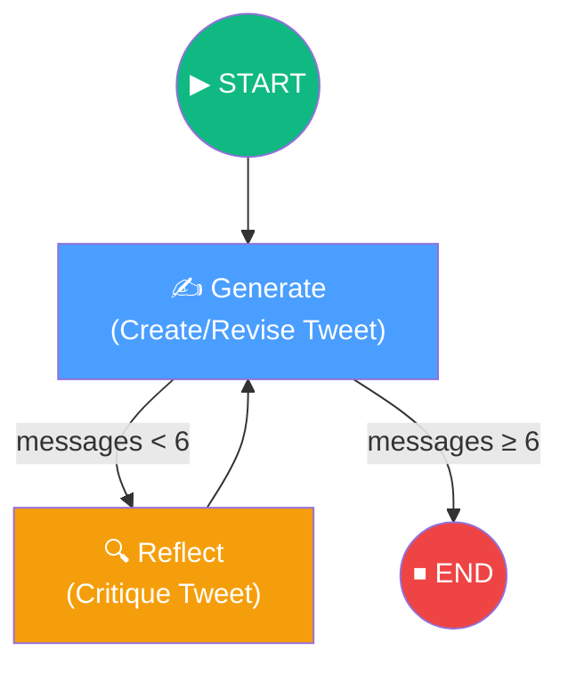

# 11. Reflection Agent

## Overview

The **Reflection Agent** implements a powerful AI pattern where an LLM **critiques its own output** and iteratively improves it through a generate → reflect → revise loop. This section builds a complete reflection agent using LangGraph that takes a Twitter post and refines it through multiple rounds of self-critique.

## Architecture at a Glance

## Lesson Map

| # | Lesson | Focus |
|---|---|---|
| 1 | [What Are We Building?](01-what-are-we-building.md) | The reflection pattern — why self-critique produces better outputs |
| 2 | [Project Setup](02-project-setup.md) | Poetry, dependencies, environment variables, sanity checks |
| 3 | [Creating the Chains](03-creating-the-reflector-chain-and-tweet-revisor.md) | The generation and reflection chains using LCEL |
| 4 | [Defining the LangGraph](04-defining-our-langgraph-graph.md) | State, nodes, edges, conditional routing, and graph compilation |
| 5 | [LangSmith Tracing](05-langsmith-tracing.md) | Executing the graph, tracing the execution, and analyzing results |

## Key Technologies

| Technology | Role |
|---|---|
| **LangGraph** | Graph-based workflow orchestration (generate ↔ reflect loop) |
| **LangChain** | Prompt templates, LCEL chains, message types |
| **OpenAI GPT-3.5** | LLM for both generation and reflection |
| **LangSmith** | Observability — traces every node execution and LLM call |
| **Poetry** | Dependency management and virtual environment |
