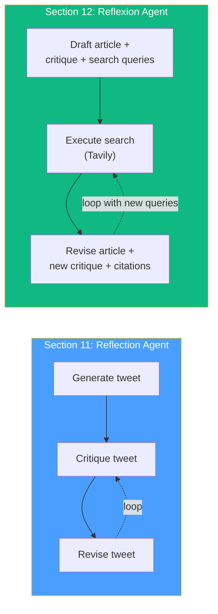
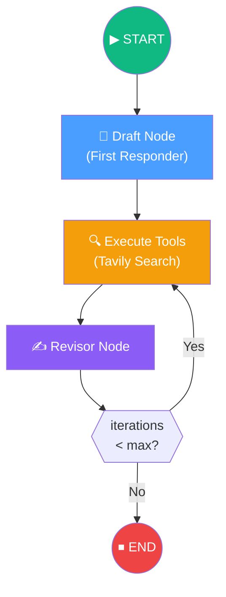

# 12.01 — What Are We Building?

## Overview

In Section 11 we built a **Reflection Agent** — a system that generates content, critiques it, and iteratively improves it. But that agent had a significant limitation: it worked entirely from the LLM's **parametric knowledge** (what it learned during training). It couldn't access real-time information, verify facts, or cite sources.

The **Reflexion Agent** solves this by adding three critical capabilities:

1. **Tool usage** — a web search engine (Tavily) fetches real-time data to ground the response
2. **Structured output** — function calling + Pydantic ensures the LLM returns article, critique, and search queries in a predictable format
3. **Citations** — references from web searches are tracked and included in the final output

---

## From Reflection to Reflexion

The name "Reflexion" comes from a **research paper** by Northeastern, MIT, and Princeton that formalizes this iterative self-improvement pattern with external tools.

| Feature | Reflection Agent (§11) | Reflexion Agent (§12) |
|---|---|---|
| **Task** | Revise a tweet | Write a detailed research article |
| **LLM** | GPT-3.5 Turbo | GPT-4 Turbo (needs stronger reasoning) |
| **External data** | ❌ None | ✅ Tavily web search |
| **Output format** | Free-form text | Structured (Pydantic + function calling) |
| **Citations** | ❌ None | ✅ URL references from search results |
| **Critique format** | Free-form text | Structured (missing info + superfluous info) |
| **Prompt reuse** | Separate prompts for each chain | Shared prompt template with swappable instructions |

---

## The Architecture

The Reflexion Agent follows a **Draft → Search → Revise** loop:

### Node-by-Node Breakdown

**1. Draft Node (First Responder)**

The first responder receives the user's topic and generates three things simultaneously:
- **Article** — a ~250-word first draft on the topic
- **Critique** — self-evaluation identifying missing information and superfluous content
- **Search queries** — 1–3 search terms that would help improve the article

All three are produced in a single LLM call, structured via function calling into a Pydantic `AnswerQuestion` object.

**2. Execute Tools Node (Tavily Search)**

Takes the search queries from the draft, runs them through Tavily's search API **concurrently**, and returns real-time web results. These results contain up-to-date information that the LLM's training data may not have.

**3. Revisor Node**

Receives the full conversation history — original draft, critique, and search results — and produces:
- **Revised article** — improved version incorporating external data and addressing the critique
- **New critique** — fresh evaluation of the revised version
- **New search queries** — additional searches that would improve the revised version further
- **Citations** — URLs from the search results that were used in the revision

**4. Conditional Loop**

After revision, the system checks: have we exceeded the maximum iterations? If not, go back to Execute Tools with the new search queries. If yes, end.

---

## What Makes This Challenging?

The Reflexion Agent is significantly more complex than the basic Reflection Agent because:

### 1. Generating a critique is easier than incorporating one

> *"To create a critique, it's not that hard. But to really leverage the LLM to incorporate that critique and to improve over time is something which is challenging."*

The basic reflection agent could rely on the LLM's natural tendency to respond to feedback (via the HumanMessage casting trick). The Reflexion Agent needs more sophisticated techniques:
- **Structured critique** (missing info + superfluous info) forces concrete, actionable feedback
- **Function calling** ensures the output format is predictable
- **Pydantic field descriptions** act as additional prompts, guiding the LLM toward specific response patterns

### 2. Managing multiple data streams

Each node receives different types of information:
- Draft node: only the user's question
- Execute tools: search queries from the previous node
- Revisor: original draft + critique + tool results + message history

The `MessageState` (a list of messages) accumulates all of this, and the prompt engineering must ensure the LLM can navigate this growing context.

### 3. Search query quality matters

The agent's improvement depends on the **relevance of its search queries**. Poor queries lead to irrelevant data, which leads to poor revisions. The system relies on the LLM's ability to:
- Identify what information is missing from the current draft
- Formulate search queries that would fill those gaps
- Vary search queries across iterations (not repeat the same searches)

---

## The Example Task

The example used throughout this section is:

> *"Write about AI-powered SOC / autonomous SOC problem domain, and list startups that have raised capital on this."*

This is an excellent test case because:
- It requires **current information** (startup funding data changes constantly)
- It needs **specific facts** (company names, funding amounts)
- It benefits from **web grounding** (the LLM's training data may be outdated)
- The quality improvement across iterations is **clearly measurable**

---

## Technology Stack

| Technology | Why This Choice |
|---|---|
| **GPT-4 Turbo** | Needs strong reasoning for self-critique and structured output; GPT-3.5 isn't reliable enough for this task |
| **Function calling** | Forces structured output (article + critique + queries) instead of unpredictable free-form text |
| **Tavily** | Search engine optimized for LLM consumption — returns clean, structured results that are easy to inject into prompts |
| **Pydantic** | Type-safe schemas for the agent's output — `AnswerQuestion` and `ReviseAnswer` classes |
| **LangGraph** | Orchestrates the draft → search → revise loop with conditional termination |

---

## Summary

The Reflexion Agent is an **evolution** of the basic Reflection Agent:

| Aspect | What Changed |
|---|---|
| **External data** | Added Tavily web search for real-time information |
| **Output structure** | Added function calling + Pydantic for predictable output |
| **Critique quality** | Structured into "missing" and "superfluous" categories |
| **Citations** | URLs from web search are tracked and included |
| **Prompt engineering** | Shared template with swappable instructions for reuse |
| **Complexity** | Significantly more complex — 3 nodes, tool execution, structured output parsing |