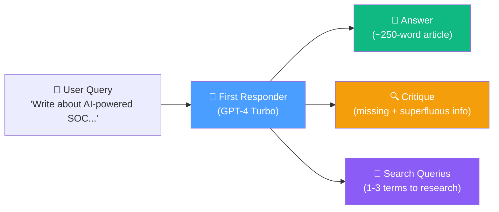
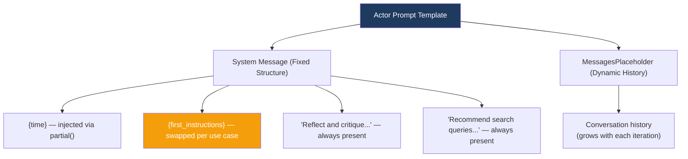
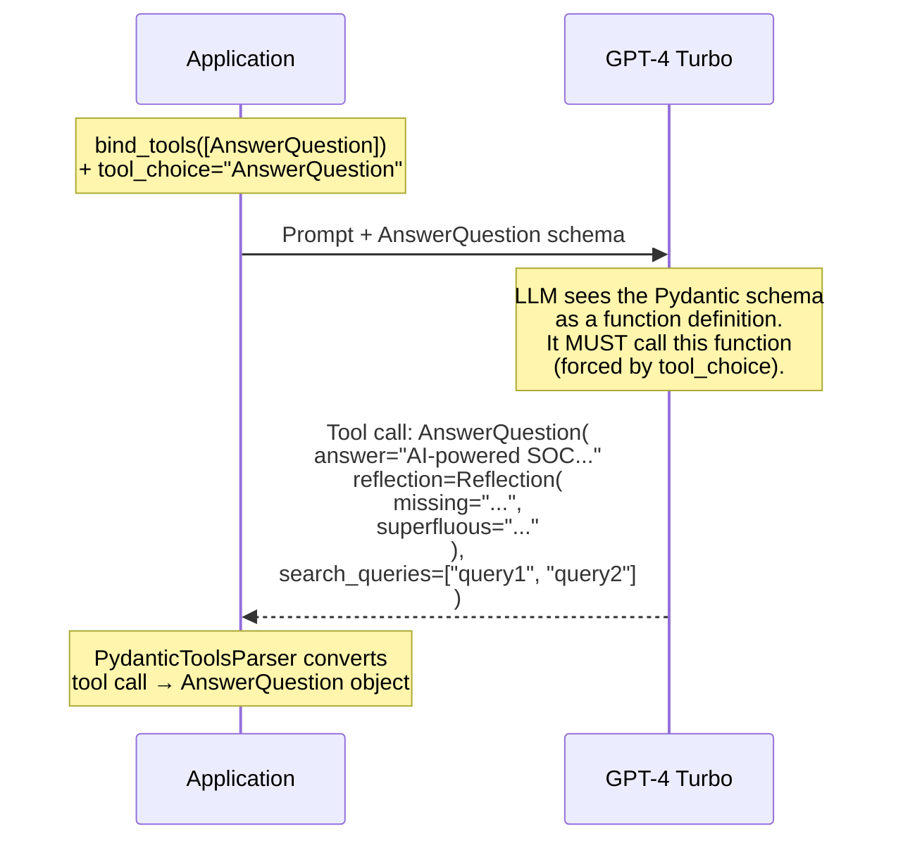
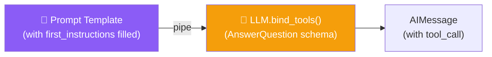

# 12.04 — Actor Agent (First Responder)

## Overview

This lesson implements the **First Responder Chain** — the component that generates the initial article draft, self-critique, and search queries in a single LLM call. It introduces several critical techniques:

- **Function calling** to force structured output from the LLM
- **Pydantic schemas** that double as prompts (field descriptions guide the LLM's response)
- **Prompt template reuse** — the same template serves both the first responder and the revisor
- **Output parsers** that convert raw LLM responses into typed Python objects

---

## The First Responder's Job

The first responder receives a user's topic and produces **three outputs simultaneously**:



All three are packaged into a single **structured response** via function calling, ensuring the LLM doesn't produce unpredictable free-form text.

---

## The Prompt Template

```python
actor_prompt_template = ChatPromptTemplate.from_messages(
    [
        (
            "system",
            """You are an expert researcher.
Current time: {time}

1. {first_instructions}
2. Reflect and critique your answer. Be severe to maximize improvement.
3. Recommend search queries to research information and improve your answer.""",
        ),
        MessagesPlaceholder(variable_name="messages"),
    ]
).partial(time=lambda: datetime.datetime.now().isoformat())
```

### Template Anatomy



**Three key design decisions:**

### 1. Dynamic Time Injection

```python
.partial(time=lambda: datetime.datetime.now().isoformat())
```

The `partial()` method pre-fills the `{time}` placeholder with a **lambda function** that returns the current timestamp. The lambda is evaluated **lazily** — only when the prompt is actually invoked, not when it's defined. This ensures the LLM always knows the current date, which is important for generating search queries about recent events.

### 2. The `{first_instructions}` Placeholder

This is a **prompt reuse technique**. The same template is used in two different contexts:

| Context | What Gets Plugged In |
|---|---|
| **First Responder** | `"Provide a detailed ~250 word answer."` |
| **Revisor** | `"Revise your previous answer using the new information. You should use the previous critique to add important information... You must include numerical citations..."` |

By using a placeholder, we avoid duplicating the entire prompt template. The system message structure (time, instructions, critique, search queries) stays the same — only the instructions change.

### 3. MessagesPlaceholder for Conversation History

For the first responder, the `messages` placeholder contains just the user's initial question. For the revisor (in later iterations), it contains the **entire conversation history** — all previous drafts, critiques, search results, and revisions.

---

## Structured Output with Pydantic Schemas

### The Core Problem

If we just asked the LLM to "write an article, critique it, and suggest search queries," we'd get unstructured text that's difficult to parse programmatically. We **need** the output in a predictable format because:
- The search queries need to be extracted and sent to Tavily
- The critique needs to be passed to the revisor node
- The article needs to be separated from the metadata

### The Solution: Function Calling + Pydantic

We define **Pydantic models** that describe the exact output format we want, then use **function calling** to force the LLM to produce output that matches these schemas.

```python
# schemas.py

from typing import List
from pydantic import BaseModel, Field

class Reflection(BaseModel):
    missing: str = Field(
        description="Critique of what is missing."
    )
    superfluous: str = Field(
        description="Critique of what is superfluous."
    )

class AnswerQuestion(BaseModel):
    """Answer the question."""
    answer: str = Field(
        description="~250 word detailed answer to the question."
    )
    reflection: Reflection = Field(
        description="Your reflection on the initial answer."
    )
    search_queries: List[str] = Field(
        description="1-3 search queries for researching improvements "
        "to address the critique of your current answer."
    )
```

### How This Works Behind the Scenes



### The "Prompting Through Schema" Technique

> [!IMPORTANT]
> The Pydantic field **descriptions** aren't just documentation — they're **part of the prompt**. When the schema is sent to the LLM as a function definition, the field descriptions are included. The LLM reads these descriptions and uses them to understand what each field should contain.

This means you're prompting the LLM in **two places**:
1. The system prompt (high-level instructions)
2. The Pydantic field descriptions (per-field guidance)

**Example:** The `search_queries` field description says "1-3 search queries for researching improvements to address the critique." This tells the LLM:
- How many queries to generate (1-3)
- What they should be about (improvements)
- What they should address (the critique)

Without this description, the LLM might generate irrelevant or too many search queries.

### The `Reflection` Class Design

The critique is structured into two specific categories:

| Field | Purpose | Why This Structure |
|---|---|---|
| `missing` | Information the article should include but doesn't | Gives the LLM a concrete direction for improvement — "add this" |
| `superfluous` | Information that's unnecessary and should be removed | Prevents the article from growing bloated — "remove this" |

This **binary structure** is much more actionable than free-form critique. Instead of "the article could be better," the LLM must identify specific gaps and redundancies.

---

## Building the First Responder Chain

```python
# chains.py

from langchain_core.output_parsers.openai_tools import PydanticToolsParser
from langchain_openai import ChatOpenAI
from schemas import AnswerQuestion

# Initialize GPT-4 Turbo
llm = ChatOpenAI(model="gpt-4-turbo")

# Output parsers
parser_pydantic = PydanticToolsParser(tools=[AnswerQuestion])

# Prepare the prompt for first response
initial_answer_prompt = actor_prompt_template.partial(
    first_instructions="Provide a detailed ~250 word answer."
)

# Build the chain
first_responder_chain = initial_answer_prompt | llm.bind_tools(
    tools=[AnswerQuestion],
    tool_choice="AnswerQuestion"
)
```

### Chain Breakdown



**`llm.bind_tools(tools=[AnswerQuestion])`** — Converts the Pydantic model into a function schema and attaches it to the LLM. The LLM now "knows" about the `AnswerQuestion` function.

**`tool_choice="AnswerQuestion"`** — **Forces** the LLM to use this tool. Without this, the LLM might choose to answer in free-form text. With it, the LLM **must** produce its response as an `AnswerQuestion` tool call.

> [!WARNING]
> Function calling is **not 100% reliable**. The LLM might occasionally omit fields (like `search_queries`), especially with complex schemas. Strategies to mitigate this include: stronger prompt instructions ("You MUST provide search queries"), making fields optional with defaults, or retrying failed calls. In production, always validate the output.

---

## Testing the Chain

```python
if __name__ == "__main__":
    from langchain_core.messages import HumanMessage
    
    chain = initial_answer_prompt | llm.bind_tools(
        tools=[AnswerQuestion],
        tool_choice="AnswerQuestion"
    ) | parser_pydantic
    
    res = chain.invoke({
        "messages": [
            HumanMessage(
                content="Write about AI-powered SOC / autonomous SOC "
                "problem domain, list startups that raised capital."
            )
        ]
    })
    
    # res is now an AnswerQuestion object
    print(res[0].answer)          # The article
    print(res[0].reflection)      # Reflection(missing=..., superfluous=...)
    print(res[0].search_queries)  # ["AI SOC startup funding", ...]
```

### Example Output

**Answer:** *"AI-powered SOC, or autonomous SOC, represent a cutting-edge approach in the cybersecurity domain, leveraging AI and machine learning technologies to enhance threat detection, response, and overall security operations..."*

**Reflection:**
- `missing`: *"The answer could benefit from more precise data on the amount of capital raised by each mentioned startup"*
- `superfluous`: *"The detailed explanation on the problem might be slightly redundant for readers already familiar with the concept"*

**Search Queries:** `["AI-powered SOC startup funding", "Darktrace funding history", "Vectra capital raised"]`

---

## Summary

| Concept | What We Learned |
|---|---|
| **Prompt template reuse** | `{first_instructions}` placeholder lets the same template serve both first responder and revisor |
| **Function calling** | `bind_tools()` + `tool_choice` forces the LLM to produce structured output |
| **Pydantic as prompt** | Field descriptions guide the LLM's response — prompting through schema |
| **Structured critique** | `Reflection(missing=..., superfluous=...)` gives actionable, specific feedback |
| **Output parsers** | `PydanticToolsParser` converts raw tool calls into typed Python objects |
| **Partial application** | `partial(time=lambda: ...)` pre-fills known values with lazy evaluation |