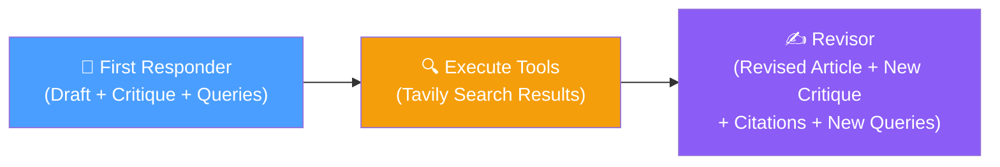
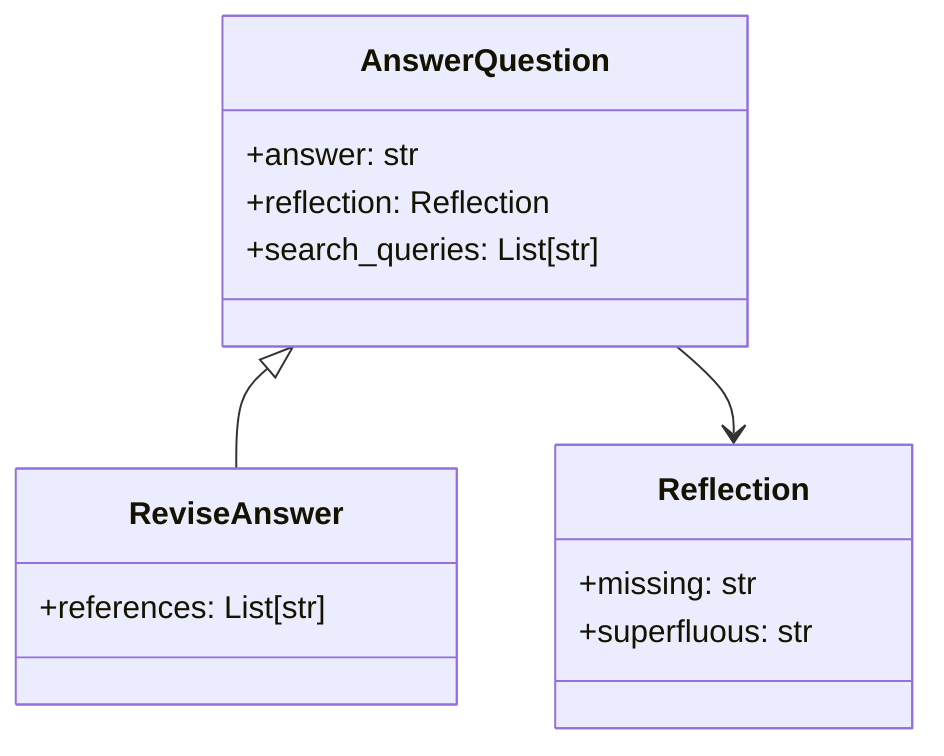

# 12.05 — Revisor Agent

## Overview

The Revisor Agent takes the first draft (with its critique and search results) and produces an **improved version** of the article. Because most of the infrastructure was already built for the First Responder (lesson 04), the Revisor is surprisingly simple — it reuses the same prompt template with different instructions and extends the output schema with a `references` field.

---

## How the Revisor Fits in the Architecture



By the time the Revisor runs, the message history contains:
1. The user's original question
2. The first draft (as an AI message with tool call)
3. The search results (as tool messages from Tavily)

The Revisor has access to **all of this context** and uses it to produce a better article.

---

## The Revision Instructions

```python
revision_instructions = """Revise your previous answer using the new information.
- You should use the previous critique to add important information to your answer.
- You MUST include numerical citations in your revised answer to ensure it can be verified.
- Add a "References" section to the bottom of your answer (in the form of [1] URL).
- You should use the previous critique to remove superfluous information from your answer.
- Keep the answer under 250 words."""
```

These instructions are plugged into the **same `actor_prompt_template`** from lesson 04, replacing the `{first_instructions}` placeholder:

| Use Case | `{first_instructions}` Content |
|---|---|
| **First Responder** | `"Provide a detailed ~250 word answer."` |
| **Revisor** | The revision instructions above |

> [!IMPORTANT]
> The revision instructions are specifically designed to **address the two categories of critique** from the `Reflection` class. "Add important information" addresses the `missing` field. "Remove superfluous information" addresses the `superfluous` field. This creates a direct feedback loop from critique to revision.

---

## The `ReviseAnswer` Schema

```python
# schemas.py

class ReviseAnswer(AnswerQuestion):
    """Revise your original answer."""
    references: List[str] = Field(
        description="Citations motivating your updated answer."
    )
```

### Inheritance from `AnswerQuestion`

`ReviseAnswer` **inherits** from `AnswerQuestion`, which means it automatically has all the same fields:



| Field | Source | Purpose |
|---|---|---|
| `answer` | Inherited from `AnswerQuestion` | The revised article (~250 words) |
| `reflection` | Inherited | New critique of the revised version |
| `search_queries` | Inherited | New search queries for the next iteration |
| `references` | **New in `ReviseAnswer`** | Citation URLs from the search results used |

**Why inherit?** Because the Revisor needs to produce the same outputs as the First Responder (article + critique + queries) **plus** citations. Inheritance avoids code duplication and ensures both schemas share the same structure.

---

## Building the Revisor Chain

```python
# chains.py

from schemas import ReviseAnswer

# Create the revision chain using the same template
revisor_chain = actor_prompt_template.partial(
    first_instructions=revision_instructions
) | llm.bind_tools(
    tools=[ReviseAnswer],
    tool_choice="ReviseAnswer"
)
```

### Comparison with the First Responder Chain

| Aspect | First Responder Chain | Revisor Chain |
|---|---|---|
| **Prompt template** | `actor_prompt_template` | Same `actor_prompt_template` |
| **Instructions** | "Provide a detailed ~250 word answer" | Detailed revision instructions with citations |
| **Bound tool** | `AnswerQuestion` | `ReviseAnswer` |
| **Tool choice** | `"AnswerQuestion"` | `"ReviseAnswer"` |
| **Output** | Article + critique + queries | Article + critique + queries + **references** |

The chains are almost identical — same template, same LLM, same structure. The only differences are the instructions and the output schema. This is the power of the **template reuse** pattern established in lesson 04.

---

## What the Revisor Produces

When the Revisor runs, it receives the full message history and produces:

```
ReviseAnswer(
    answer="AI-powered SOC platforms leverage ML to automate 
            threat detection and response [1]. Companies like 
            Darktrace ($230M raised [2]) and Vectra AI ($350M [3])
            lead the space...",
    reflection=Reflection(
        missing="Could include more detail on ROI metrics...",
        superfluous="The general AI overview is still too broad..."
    ),
    search_queries=[
        "AI SOC ROI case studies",
        "autonomous SOC market size 2025"
    ],
    references=[
        "[1] https://www.darktrace.com/...",
        "[2] https://techcrunch.com/...",
        "[3] https://vectra.ai/..."
    ]
)
```

The key improvements over the first draft:
- **Grounded in real data** — specific funding amounts come from search results, not hallucination
- **Citations included** — every claim links to a source URL
- **Critique addressed** — missing information was added, superfluous content was removed
- **New critique generated** — fresh feedback for the next iteration
- **New search queries** — different from the first round, targeting remaining gaps

---

## Summary

| What Was Built | Key Decision |
|---|---|
| **Revision instructions** | Plugged into the shared template via `{first_instructions}` |
| **`ReviseAnswer` schema** | Inherits from `AnswerQuestion`, adds `references` field |
| **Revisor chain** | Same template + same LLM + different instructions + different schema |
| **Citation support** | The `references` field captures URLs from search results |

> [!TIP]
> The Revisor is intentionally simple — it reuses infrastructure from the First Responder rather than building new components. This is a good pattern for agent development: build the core components first, then extend them for specialized roles.