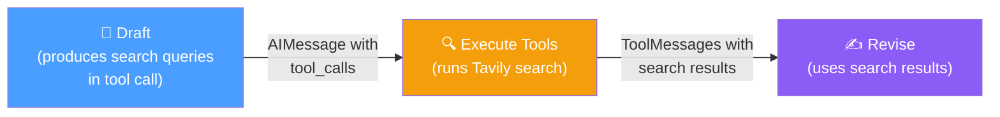
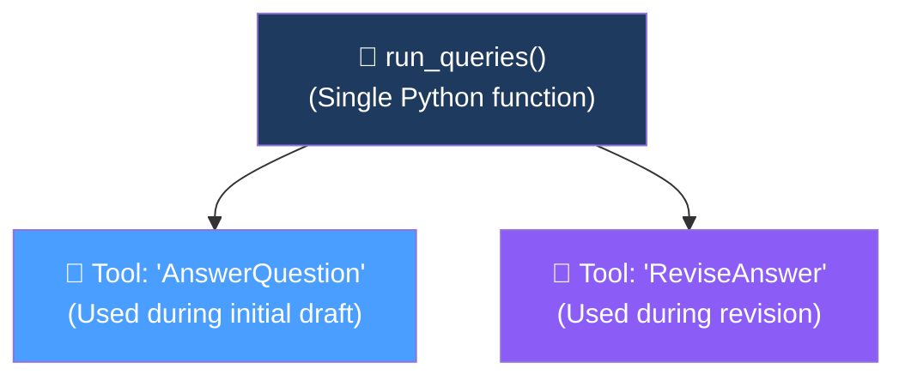
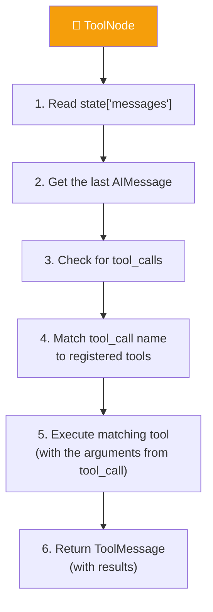

# 12.06 — ToolNode — Executing Tools

## Overview

This lesson implements the **Execute Tools node** — the component that takes search queries generated by the LLM and runs them through Tavily's search engine to fetch real-time web data. It introduces two important LangGraph concepts:

- **`ToolNode`** — a pre-built LangGraph node that automatically detects and executes tool calls from the message state
- **`StructuredTool`** — a LangChain utility for creating named tools from regular Python functions

---

## Where This Fits



The Execute Tools node is the **bridge** between the LLM's requests and the real world. When the Draft or Revisor node produces search queries as part of a function call, this node actually runs those searches.

---

## The Tavily Search Tool

```python
# tool_executor.py
from dotenv import load_dotenv
from langchain_community.tools.tavily_search import TavilySearchResults
from langchain_core.tools import StructuredTool
from langgraph.prebuilt import ToolNode

load_dotenv()

# Initialize Tavily search (max 5 results per query)
search = TavilySearchResults(max_results=5)
```

**Tavily** is a search engine specifically designed for LLM applications. It returns clean, structured results that are easy to inject into LLM prompts — unlike raw Google results, which include ads, UI elements, and other noise.

> [!NOTE]
> Make sure `langchain-tavily` is installed (`poetry add langchain-tavily`) and that your `TAVILY_API_KEY` is set in the `.env` file.

---

## The "Two Tools, One Function" Pattern

The Reflexion Agent uses a clever architectural pattern: it creates **two differently-named tools** that both execute the **same search function**:



### Why Two Tools?

When the LLM uses function calling, it produces a **tool call** with the name of the tool it's calling. The Draft node calls the `AnswerQuestion` tool, and the Revisor node calls the `ReviseAnswer` tool. Even though both trigger the same search function, having separate names enables:

1. **Clear tracing** — in LangSmith, you can see whether a search was triggered by the initial draft or by a revision
2. **Debugging** — if something goes wrong, you immediately know which stage caused it
3. **Future flexibility** — you could later give each tool different search configurations (e.g., more results during revision)

### Implementation

```python
def run_queries(search_queries: list[str], **kwargs) -> list[str]:
    """Run the generated search queries."""
    if search_queries:
        return search.batch(search_queries)
    return []
```

The function:
1. Takes a list of search query strings
2. Runs them **concurrently** using Tavily's `.batch()` method
3. Returns a list of search results

The `**kwargs` is a safety net — if the LLM passes unexpected arguments through the function call, they're silently absorbed instead of causing an error.

### Creating the Two Tools

```python
from schemas import AnswerQuestion, ReviseAnswer

tool_1 = StructuredTool.from_function(
    func=run_queries,
    name=AnswerQuestion.__name__,  # "AnswerQuestion"
    description="Run search queries"
)

tool_2 = StructuredTool.from_function(
    func=run_queries,
    name=ReviseAnswer.__name__,    # "ReviseAnswer"
    description="Run search queries"
)
```

**`StructuredTool.from_function()`** converts a Python function into a LangChain tool by:
1. Extracting the function signature and type hints
2. Generating a schema that the LLM can understand
3. Wrapping it with the provided name and description

The tool names match the Pydantic class names (`AnswerQuestion` and `ReviseAnswer`) because when the LLM makes a function call for `AnswerQuestion`, LangGraph's `ToolNode` needs to find a tool with that exact name to execute.

---

## LangGraph's ToolNode

```python
execute_tools = ToolNode(tools=[tool_1, tool_2])
```

**`ToolNode`** is a pre-built LangGraph node that automates tool execution. Here's what it does under the hood:



### What ToolNode Saves You

Without `ToolNode`, you'd have to manually:
1. Extract the last message from the state
2. Check if it contains tool calls
3. Parse the tool name and arguments
4. Find the matching function
5. Execute it
6. Format the result as a `ToolMessage`
7. Handle errors

`ToolNode` does all of this automatically, including **parallel execution** of multiple tool calls in a single message.

> [!TIP]
> `ToolNode` supports **concurrent execution** — if the LLM's response contains 3 tool calls (3 search queries), all 3 are executed simultaneously. This is significantly faster than running them sequentially, especially for network-bound operations like search API calls.

---

## The Complete `tool_executor.py`

```python
from dotenv import load_dotenv
from langchain_community.tools.tavily_search import TavilySearchResults
from langchain_core.tools import StructuredTool
from langgraph.prebuilt import ToolNode

from schemas import AnswerQuestion, ReviseAnswer

load_dotenv()

# Initialize search engine
search = TavilySearchResults(max_results=5)

def run_queries(search_queries: list[str], **kwargs) -> list[str]:
    """Run the generated search queries."""
    if search_queries:
        return search.batch(search_queries)
    return []

# Create two named tools from the same function
tool_1 = StructuredTool.from_function(
    func=run_queries,
    name=AnswerQuestion.__name__,
    description="Run search queries"
)

tool_2 = StructuredTool.from_function(
    func=run_queries,
    name=ReviseAnswer.__name__,
    description="Run search queries"
)

# Create the ToolNode with both tools
execute_tools = ToolNode(tools=[tool_1, tool_2])
```

---

## Summary

| Concept | What We Learned |
|---|---|
| **Tavily Search** | LLM-optimized search engine — `.batch()` runs multiple queries concurrently |
| **StructuredTool** | Converts Python functions into named LangChain tools with schema generation |
| **Two tools, one function** | Same search function with different names for traceability |
| **ToolNode** | Pre-built LangGraph node that automatically detects and executes tool calls from state |
| **Concurrent execution** | ToolNode runs multiple tool calls in parallel, reducing latency |
| **`**kwargs` safety** | Absorbs unexpected LLM arguments to prevent runtime errors |