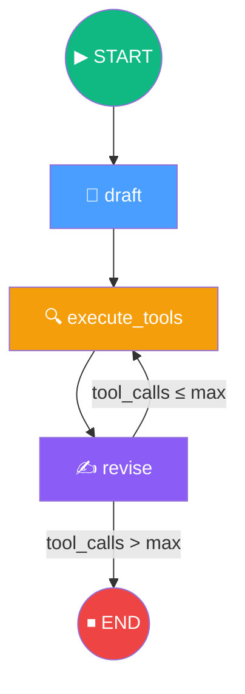
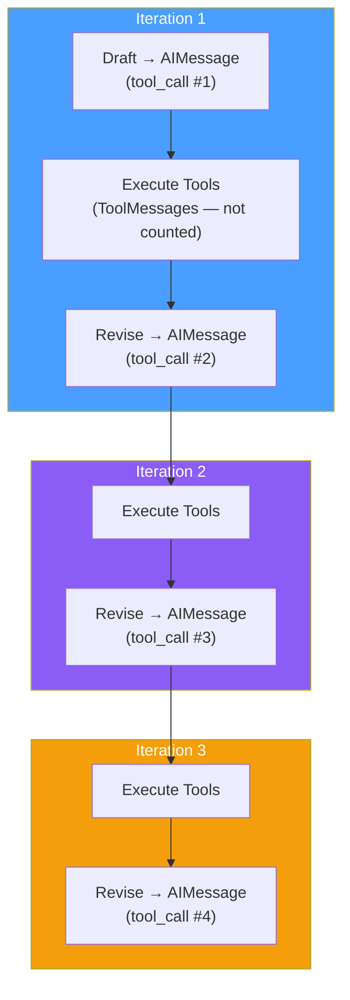

# 12.07 — Building Our LangGraph Graph

## Overview

This lesson assembles all the components from lessons 04–06 into a complete **LangGraph StateGraph**. We wire the Draft, Execute Tools, and Revise nodes together, implement the conditional termination loop, compile the graph, and invoke it with a real query.

> [!NOTE]
> This lesson uses **LangGraph 1.0+**, which includes `MessageState` as a pre-built state schema. Earlier versions required manual state definition (as we did in Section 11).

---

## The Target Architecture



---

## Step 1: Imports

```python
# main.py
from typing import Literal
from langchain_core.messages import AIMessage, ToolMessage
from langgraph.graph import END, START, StateGraph, MessageState

from chains import first_responder_chain, revisor_chain
from tool_executor import execute_tools

MAX_ITERATIONS = 2
```

| Import | Purpose |
|---|---|
| `Literal` | Type hint for the conditional edge return type |
| `AIMessage`, `ToolMessage` | Message types for counting tool calls |
| `END`, `START` | Special constants for graph entry and termination |
| `StateGraph` | Main graph builder class |
| `MessageState` | Pre-built state schema — a simple `{"messages": list}` with `add_messages` reducer |

### `MessageState` — The Pre-built State

In Section 11, we manually defined our state:

```python
# Section 11 — manual definition
class MessageGraph(TypedDict):
    messages: Annotated[list[BaseMessage], add_messages]
```

In Section 12, we use the pre-built `MessageState` which does exactly the same thing:

```python
# Section 12 — pre-built
from langgraph.prebuilt import MessageState
# Equivalent to the manual definition above
```

Both result in a state that is simply a **list of messages** with the `add_messages` reducer (new messages are appended, not replaced).

---

## Step 2: Implement the Node Functions

### Draft Node

```python
def draft_node(state: MessageState) -> dict:
    res = first_responder_chain.invoke({"messages": state["messages"]})
    return {"messages": [res]}
```

The draft node:
1. Takes all messages from the state (initially just the user's question)
2. Invokes the first responder chain (which calls GPT-4 Turbo with function calling)
3. Returns the response as an `AIMessage` with a tool call containing the `AnswerQuestion` structured output
4. The `add_messages` reducer appends it to the state

### Revise Node

```python
def revise_node(state: MessageState) -> dict:
    res = revisor_chain.invoke({"messages": state["messages"]})
    return {"messages": [res]}
```

Nearly identical to the draft node, but uses the `revisor_chain` instead. By this point, the message history contains:
- The user's original question
- The first draft (AIMessage with AnswerQuestion tool call)
- The search results (ToolMessages from Tavily)
- (In later iterations) Previous revisions and their search results

### Execute Tools Node

The execute tools node was already created in lesson 06:

```python
from tool_executor import execute_tools
# execute_tools is a ToolNode instance — ready to use as a graph node
```

---

## Step 3: The Conditional Loop

### Counting Tool Calls

The termination condition counts **tool calls** in the message history. Each LLM response (from the Draft or Revise chain) produces a tool call (because we force it with `tool_choice`). The ToolNode doesn't produce tool calls — it produces `ToolMessage` results.



### The Event Loop Function

```python
def event_loop(state: MessageState) -> Literal["execute_tools", "__end__"]:
    num_tool_calls = sum(
        isinstance(msg, AIMessage) and msg.tool_calls
        for msg in state["messages"]
    )
    if num_tool_calls > MAX_ITERATIONS:
        return END
    return "execute_tools"
```

**How it works:**
1. Iterates through all messages in the state
2. Counts messages that are `AIMessage` instances **and** have `tool_calls`
3. If the count exceeds `MAX_ITERATIONS` (2), returns `END` to terminate
4. Otherwise, returns `"execute_tools"` to continue the loop

> [!WARNING]
> **Timing subtlety:** The `event_loop` runs as a conditional edge **after the Revise node**. However, the Revise node's output hasn't been committed to the state yet when the conditional edge evaluates. This means the count is effectively one behind — with `MAX_ITERATIONS = 2`, you actually get **3** revision iterations, not 2. This is a known quirk of the implementation.

### Why Count Tool Calls Instead of Messages?

Messages include `ToolMessage` responses from search results, which aren't iterations of the agent's reasoning. By counting only `AIMessage` instances with `tool_calls`, we count only the LLM's decisions — each draft or revision is exactly one tool call:

| Message Type | Example | Counted? |
|---|---|---|
| `HumanMessage` | User's question | ❌ |
| `AIMessage` (with tool_calls) | Draft or revision output | ✅ |
| `ToolMessage` | Search results from Tavily | ❌ |

---

## Step 4: Assemble the Graph

```python
builder = StateGraph(MessageState)

# Add nodes
builder.add_node("draft", draft_node)
builder.add_node("execute_tools", execute_tools)
builder.add_node("revise", revise_node)

# Add edges
builder.add_edge(START, "draft")           # START → draft
builder.add_edge("draft", "execute_tools") # draft → execute_tools
builder.add_edge("execute_tools", "revise") # execute_tools → revise

# Add conditional edge (revise → execute_tools OR revise → END)
builder.add_conditional_edges(
    "revise",
    event_loop,
    ["execute_tools", END]
)

# Compile
graph = builder.compile()
```

### Edge Summary

| Edge | Type | Description |
|---|---|---|
| START → draft | Deterministic | Always start by drafting |
| draft → execute_tools | Deterministic | Always run search after drafting |
| execute_tools → revise | Deterministic | Always revise after getting search results |
| revise → execute_tools | Conditional | Continue if iterations < max |
| revise → END | Conditional | Stop if iterations ≥ max |

---

## Step 5: Invoke the Graph

```python
if __name__ == "__main__":
    from dotenv import load_dotenv
    load_dotenv()
    
    res = graph.invoke({
        "messages": [
            {
                "role": "user",
                "content": "Write about AI-Powered SOC / autonomous SOC "
                "problem domain, list startups that have raised "
                "capital on that."
            }
        ]
    })
    
    # Extract the final answer from the last AIMessage
    last_message = res["messages"][-1]
    if isinstance(last_message, AIMessage) and last_message.tool_calls:
        answer = last_message.tool_calls[0]["args"]["answer"]
        print(answer)
```

### Extracting the Final Answer

The final message in the state is an `AIMessage` with a tool call (because we force function calling). The actual article text is inside the tool call's arguments:

```
res["messages"][-1]                    # Last AIMessage
    .tool_calls[0]                     # First (and only) tool call
        ["args"]                       # The arguments dict
            ["answer"]                 # The article text
```

### Example Output

```
AI-Driven Autonomous SOC: Problem Domain

Traditional SOCs face alert overload, manual triage delays, 
and shortage of skilled analysts. AI-powered SOCs apply 
supervised/unsupervised ML and graph analytics to reduce 
false positives by up to 50% and automate 70%+ of routine 
alerts, cutting investigation time by 70-90% [1].

Startups by Maturity Tier:
- Leaders: Darktrace ($230M+), Vectra AI ($350M+)
- Scale-Up: Exabeam, Cybereason  
- Innovators: Deep Instinct, SecBI, Blumira

References:
[1] https://www.darktrace.com/...
[2] https://techcrunch.com/...
[3] https://vectra.ai/...
```

---

## The Complete `main.py`

```python
from typing import Literal
from dotenv import load_dotenv
from langchain_core.messages import AIMessage, HumanMessage, ToolMessage
from langgraph.graph import END, START, StateGraph, MessageState

from chains import first_responder_chain, revisor_chain
from tool_executor import execute_tools

load_dotenv()

MAX_ITERATIONS = 2

# --- Nodes ---
def draft_node(state: MessageState) -> dict:
    res = first_responder_chain.invoke({"messages": state["messages"]})
    return {"messages": [res]}

def revise_node(state: MessageState) -> dict:
    res = revisor_chain.invoke({"messages": state["messages"]})
    return {"messages": [res]}

# --- Conditional Edge ---
def event_loop(state: MessageState) -> Literal["execute_tools", "__end__"]:
    num_tool_calls = sum(
        isinstance(msg, AIMessage) and msg.tool_calls
        for msg in state["messages"]
    )
    if num_tool_calls > MAX_ITERATIONS:
        return END
    return "execute_tools"

# --- Graph ---
builder = StateGraph(MessageState)
builder.add_node("draft", draft_node)
builder.add_node("execute_tools", execute_tools)
builder.add_node("revise", revise_node)

builder.add_edge(START, "draft")
builder.add_edge("draft", "execute_tools")
builder.add_edge("execute_tools", "revise")
builder.add_conditional_edges("revise", event_loop, ["execute_tools", END])

graph = builder.compile()

if __name__ == "__main__":
    res = graph.invoke({
        "messages": [{"role": "user", "content": "Write about AI-Powered SOC..."}]
    })
    last = res["messages"][-1]
    if isinstance(last, AIMessage) and last.tool_calls:
        print(last.tool_calls[0]["args"]["answer"])
```

---

## Summary

| Concept | What We Learned |
|---|---|
| **MessageState** | Pre-built state schema replacing manual TypedDict definition |
| **Node functions** | Thin wrappers that invoke chains and return state updates |
| **ToolNode as a graph node** | The pre-built `execute_tools` is used directly as a node |
| **Conditional termination** | `event_loop` counts AIMessage tool calls to decide when to stop |
| **Timing subtlety** | The conditional edge evaluates before the Revise node's output is committed |
| **Answer extraction** | Final answer lives inside `last_message.tool_calls[0]["args"]["answer"]` |
| **Graph compilation** | `builder.compile()` validates all edges and returns an executable graph |