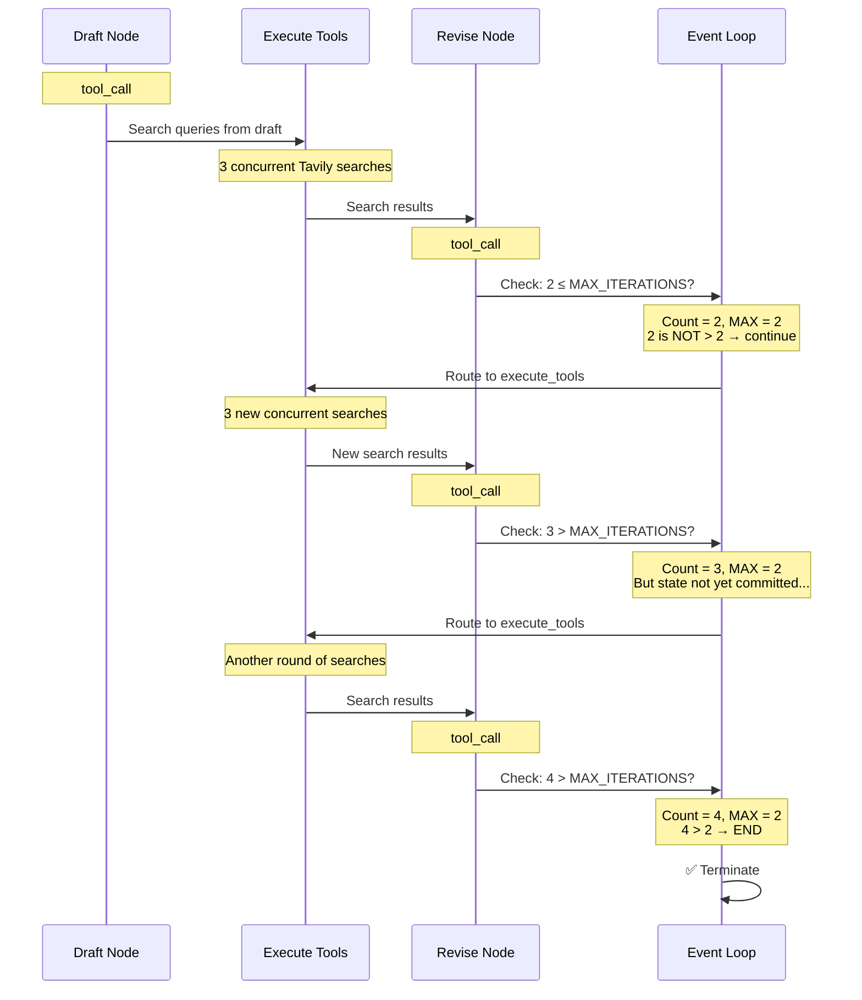
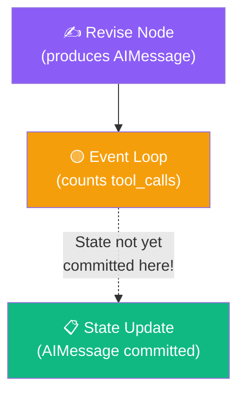

# 12.08 — Tracing the Graph in LangSmith

## Overview

This lesson walks through the **complete LangSmith trace** of the Reflexion Agent's execution, mapping every trace entry back to the architecture diagram. We examine the execution flow, timing, token usage, concurrent tool execution, and the iteration counting subtlety.

---

## The Full Trace Overview

When the Reflexion Agent runs with `MAX_ITERATIONS = 2`, the LangSmith trace shows:

```
📊 Trace: graph.invoke (~50 seconds, ~35K tokens)
├── 📝 draft (first responder)
│   └── 🤖 ChatOpenAI (tool_call: AnswerQuestion)
├── 🔍 execute_tools
│   ├── 🔎 Search: "AI-powered SOC startups venture funding 2025"
│   ├── 🔎 Search: "autonomous SOC market sizing and use cases"
│   └── 🔎 Search: "comparative analysis AI SOC platforms"
├── ✍️ revise
│   └── 🤖 ChatOpenAI (tool_call: ReviseAnswer)
├── 🟡 event_loop → "execute_tools"
├── 🔍 execute_tools
│   ├── 🔎 Search: "AI SOC ROI case studies"
│   ├── 🔎 Search: "autonomous SOC market size 2025"
│   └── 🔎 Search: "industry adoption AI SOC"
├── ✍️ revise
│   └── 🤖 ChatOpenAI (tool_call: ReviseAnswer)
├── 🟡 event_loop → "execute_tools"
├── 🔍 execute_tools
│   └── 🔎 Search: [new queries]
├── ✍️ revise
│   └── 🤖 ChatOpenAI (tool_call: ReviseAnswer)
└── 🟡 event_loop → END ✅
```

---

## Mapping the Trace to the Architecture



---

## Key Observations from the Trace

### 1. Execution Time and Token Usage

| Metric | Value | Why |
|---|---|---|
| **Total time** | ~50 seconds | Multiple LLM calls + search API calls |
| **Token consumption** | ~35K tokens | Prompt grows with each iteration (full history) |
| **LLM calls** | 4 total | 1 draft + 3 revisions |
| **Search batches** | 3 batches of ~3 queries each | 9 total search queries |

The execution time is dominated by **LLM API calls** (3–5 seconds each) and **network latency** for search requests. The token count is high because each subsequent LLM call includes the **full message history** — every previous draft, critique, and search result.

### 2. Concurrent Search Execution

One of the most powerful features visible in the trace is **concurrent tool execution**:

```
🔍 execute_tools
├── 🔎 Search #1 — Start: 14:23:05.100
├── 🔎 Search #2 — Start: 14:23:05.100
└── 🔎 Search #3 — Start: 14:23:05.100
```

All three search queries in each batch start at the **same timestamp** — `ToolNode` runs them in parallel. This means 3 search queries take roughly the same time as 1, which is a significant performance optimization.

### 3. Evolving Search Queries

The trace reveals how search queries **evolve** across iterations:

| Iteration | Search Queries |
|---|---|
| **Draft** | "AI-powered SOC startups venture funding 2025", "autonomous SOC market sizing", "comparative analysis AI SOC platforms" |
| **Revision 1** | "AI SOC ROI case studies", "autonomous SOC market size 2025", "industry adoption AI SOC" |
| **Revision 2** | Different queries targeting remaining gaps |

Each revision generates **new, different search queries** based on the updated critique. The LLM doesn't repeat the same searches — it identifies what information is still missing and formulates targeted queries.

### 4. Growing Prompt Size

Each LLM call receives a **larger prompt** than the last because the message history accumulates:

| LLM Call | Prompt Contents |
|---|---|
| **Draft** | System prompt + user question |
| **Revision 1** | System prompt + user question + draft + 3 search results |
| **Revision 2** | System prompt + user question + draft + 3 results + revision 1 + 3 more results |
| **Revision 3** | Everything above + revision 2 + 3 more results |

This is why token usage grows significantly with each iteration and why limiting the number of iterations is important for cost control.

---

## The Iteration Count Subtlety

The trace reveals a non-obvious behavior:

> With `MAX_ITERATIONS = 2`, the agent actually performs **3 revision iterations**, not 2.

This happens because of the **timing of state updates** in LangGraph:



When the `event_loop` conditional edge evaluates, the Revise node's output (an AIMessage with a tool call) **hasn't been committed to the state yet**. The event loop counts tool calls in the current state, which is one behind the actual count.

**Practical impact:**

| After Node | Actual Tool Calls | What Event Loop Sees | Decision |
|---|---|---|---|
| Revision 1 | 2 (draft + rev1) | 1 (draft only) | Continue → `1 ≤ 2` |
| Revision 2 | 3 | 2 | Continue → `2 ≤ 2` (not > 2) |
| Revision 3 | 4 | 3 | Stop → `3 > 2` |

> [!WARNING]
> This is a known behavior, not a bug. If you need exactly N iterations, set `MAX_ITERATIONS = N - 1`. Alternatively, use a different counting strategy (e.g., a dedicated counter in the state) for precise control.

---

## What the LLM Sees on the Final Call

The most revealing part of the trace is the **final LLM call's input**. By clicking on the last `ChatOpenAI` entry, you can see the complete prompt the LLM received:

```
System: "You are an expert researcher. Current time: 2025-01-15T...
         Revise your previous answer using the new information..."

[All previous messages in chronological order:]
1. Human: "Write about AI-powered SOC..."
2. AI: tool_call(AnswerQuestion) — first draft
3. Tool: Search results for "AI SOC startups..."
4. Tool: Search results for "autonomous SOC market..."
5. Tool: Search results for "comparative analysis..."
6. AI: tool_call(ReviseAnswer) — first revision
7. Tool: Search results for "AI SOC ROI..."
8. Tool: Search results for "autonomous SOC market size..."
9. Tool: Search results for "industry adoption..."
10. AI: tool_call(ReviseAnswer) — second revision
11. Tool: [more search results]
```

The LLM has the **complete history** of the agent's evolution — every draft, every critique, every search result. This rich context enables it to produce a significantly better final answer than any single-shot response could.

---

## Looking Ahead

The iteration counting mechanism used here (magic number + tool call counting) is **simple but imprecise**. In the next section (Agentic RAG, Section 13), we'll see a more sophisticated approach:

| Approach | This Section | Next Section |
|---|---|---|
| **Termination** | Count tool calls against a hardcoded max | **LLM as Judge** — an LLM evaluates quality and decides whether to continue |
| **Precision** | Imprecise (off by one due to state timing) | Precise (evaluation happens on the actual output) |
| **Flexibility** | Fixed number of iterations | Dynamic — stops when quality is sufficient |

---

## Summary

| What We Observed | Key Insight |
|---|---|
| **~50s execution, ~35K tokens** | Multi-iteration agents are expensive — limit iterations in production |
| **Concurrent search** | ToolNode runs 3 queries in parallel — same time as 1 query |
| **Evolving queries** | Each iteration discovers new information gaps |
| **Growing prompts** | Token usage scales with iterations — full history is included |
| **State timing subtlety** | `MAX_ITERATIONS = 2` actually produces 3 iterations due to state commit timing |
| **Full trace visibility** | LangSmith shows every node, LLM call, tool execution, and routing decision |