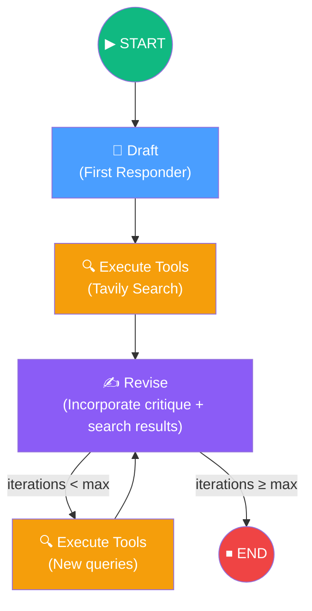

# 12. Reflexion Agent

## Overview

The **Reflexion Agent** extends the basic reflection pattern from Section 11 by adding **tool usage** (web search), **structured output** (function calling + Pydantic), and **grounded citations**. Instead of simply critiquing and revising text, this agent dynamically fetches real-time information from the web to enrich and verify its responses.

Based on the **Reflexion paper** (Northeastern, MIT, Princeton), this architecture shows how to combine self-critique with external data retrieval for high-quality, citation-backed article generation.

## Architecture at a Glance

## Lesson Map

| # | Lesson | Focus |
|---|---|---|
| 1 | [What Are We Building?](01-what-are-we-building.md) | Architecture overview — how Reflexion extends basic reflection |
| 2 | [Project Setup](02-project-setup.md) | Poetry, dependencies, API keys (OpenAI, Tavily, LangSmith) |
| 3 | [Section Resources](03-section-resources.md) | Paper references, LangChain blog, and course code links |
| 4 | [Actor Agent (First Responder)](04-actor-agent-v2.md) | Structured output via function calling, Pydantic schemas, prompt reuse |
| 5 | [Revisor Agent](05-revisor-agent.md) | Revision chain — incorporating critique + search results with citations |
| 6 | [ToolNode — Executing Tools](06-toolnode-executing-tools.md) | Tavily search integration, StructuredTool, LangGraph ToolNode |
| 7 | [Building the LangGraph](07-building-our-langgraph-graph.md) | Graph assembly — nodes, edges, conditional loop, compilation |
| 8 | [Tracing the Graph](08-tracing-our-graph.md) | LangSmith trace analysis — understanding the full execution flow |

## Key Technologies

| Technology | Role |
|---|---|
| **LangGraph** | Graph-based workflow orchestration with MessageState |
| **LangChain** | Prompt templates, output parsers, LCEL chains |
| **OpenAI GPT-4 Turbo** | LLM for drafting, critiquing, and revising (with function calling) |
| **Tavily Search** | Real-time web search engine optimized for LLM applications |
| **Pydantic** | Structured output schemas (AnswerQuestion, ReviseAnswer) |
| **LangSmith** | Observability — full trace of every node, tool call, and LLM invocation |
