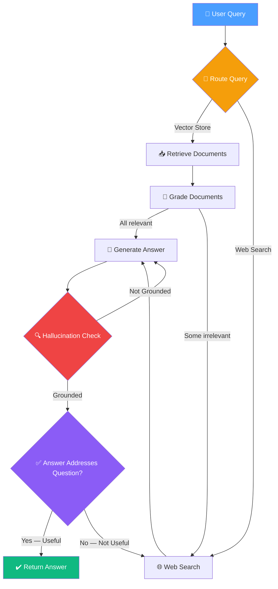

# 13.01 — Agentic RAG Architecture

## Overview

This section introduces the **Agentic RAG** (Retrieval-Augmented Generation) system — an advanced, production-oriented RAG workflow built with **LangGraph**. Unlike traditional RAG pipelines that follow a simple retrieve → augment → generate flow, Agentic RAG incorporates **reflection**, **self-correction**, and **adaptive routing** to dramatically improve response quality.

> [!NOTE]
> This project is inspired by the LangChain × Mistral Cookbook but has been **refactored for production-readiness** — emphasizing maintainability, readability, testability, and extensibility.

---

## What Is RAG and Why Does It Matter?

Before diving into the "Agentic" part, let's make sure we understand standard **Retrieval-Augmented Generation (RAG)**. 

Large Language Models like GPT-4 are trained on massive datasets, but their knowledge has a **cutoff date**, and they can't access your private or organization-specific data. RAG solves this by combining the LLM's reasoning ability with **real-time document retrieval**:

1. **The user asks a question** — for example, "What is agent memory?"
2. **The system searches a knowledge base** (a vector store full of your documents) to find the most relevant text chunks
3. **Those chunks are injected into the LLM's prompt** as context, so the model can generate an answer grounded in your actual data
4. **The LLM generates a response** that combines its reasoning capability with the specific information from your documents

Think of it like this: imagine asking a brilliant person a question, but before they answer, you hand them a few pages from a textbook with the relevant information. They read those pages and then give you an answer that's informed by both their intelligence and the specific material you provided.

**The problem?** Standard RAG is a **one-shot pipeline** — it retrieves, augments, and generates in a single pass. If the retrieved documents are bad, the answer is bad. If the LLM hallucinates despite having good documents, there's no safety net. There's no checking, no correction, no fallback plan.

This is where **Agentic RAG** comes in.

---

## What Makes RAG "Agentic"?

The word **"agentic"** means the system has **agency** — it can make decisions, evaluate its own work, and take corrective actions. Instead of blindly executing a fixed pipeline, an Agentic RAG system:

- **Decides** where to search for information (vector store vs. the internet)
- **Evaluates** whether the retrieved documents are actually useful
- **Judges** whether its own generated answer is good enough
- **Loops back** to try again if something isn't right

This is fundamentally different from standard RAG. Standard RAG is like an assembly line that runs from start to finish no matter what. Agentic RAG is like a knowledge worker who checks their own work, asks for more information when needed, and only delivers an answer when they're confident it's correct.

---

## Research Paper Foundations

The system synthesizes ideas from **three seminal research papers**, each addressing a different weakness of standard RAG:

| Paper | Core Idea | Role in the System |
|---|---|---|
| **Corrective RAG (CRAG)** | Grade retrieved documents for relevance; fall back to web search when documents are insufficient | Document filtering + fallback retrieval |
| **Self-RAG** | Reflect on the generated answer — check if it is grounded in documents and if it actually answers the question | Hallucination detection + answer validation |
| **Adaptive RAG** | Route queries to the most appropriate data source before retrieval begins | Intelligent query routing |

Let's understand what each paper contributes and why it matters:

### Paper 1: Corrective RAG (CRAG)

**The problem it solves:** When you retrieve documents from a vector store, some of them might not actually be relevant to the question. Vector search uses *similarity*, which doesn't always equal *relevance*. A document about "computer memory (RAM)" might be retrieved for a question about "agent memory" because they share the word "memory" — but they're about completely different topics.

**The solution:** After retrieving documents, use an LLM to **grade each document** individually — "Is this document actually relevant to the user's question?" If some documents are irrelevant, filter them out and search the web for additional information to fill the gap. This way, the LLM only sees high-quality, relevant context.

### Paper 2: Self-RAG

**The problem it solves:** Even with perfectly relevant documents, the LLM might still generate a bad answer. It might **hallucinate** (make up facts that aren't in the documents) or generate an answer that's technically grounded in the documents but doesn't actually address what the user asked.

**The solution:** After the LLM generates an answer, run two checks:
- **Grounding check:** Is this answer actually supported by the documents, or did the LLM make things up?
- **Relevance check:** Does this answer actually address the user's question?

If the answer fails these checks, the system can either regenerate (if it hallucinated) or search for more information (if the current documents aren't enough to answer the question).

### Paper 3: Adaptive RAG

**The problem it solves:** Sometimes the user's question has nothing to do with what's in your vector store. If someone asks "What's the weather in Berlin today?", searching your vector store about AI topics is a waste of time — and the irrelevant documents you retrieve will only confuse the LLM.

**The solution:** Before doing any retrieval at all, use an LLM to **route the question** to the most appropriate data source. If the question is about topics covered in the vector store, go there. If it's about something else entirely, skip the vector store and go directly to web search.

---

## Architectural Philosophy

The Agentic RAG system introduces three layers of intelligence on top of a standard RAG pipeline:

### Layer 1: Document Reflection (Corrective RAG)

After retrieving documents from the vector store, the system **grades each document** for relevance against the original query. This is like a quality control inspector on an assembly line — checking every item before it moves to the next stage.

Irrelevant documents are filtered out. If any document is deemed irrelevant, a **web search** is triggered to supplement the knowledge base. The reasoning is: if the vector store couldn't fully cover this topic (as evidenced by returning irrelevant results), there might be better information available on the internet.

### Layer 2: Answer Reflection (Self-RAG)

After the LLM generates a response, the system performs **two-stage validation**:

- **Grounding Check** — Is the answer supported by the retrieved documents? This catches hallucinations — cases where the LLM generates plausible-sounding but fabricated information that doesn't appear in any of the source documents.
- **Relevance Check** — Does the answer actually address the user's original question? This catches cases where the LLM generates a factually correct response about the documents but fails to answer what was actually asked.

If the grounding check fails (hallucination detected), the system loops back and regenerates the answer. If the relevance check fails, the system searches for more information online and tries again.

### Layer 3: Query Routing (Adaptive RAG)

Before any retrieval begins, the system uses an LLM-powered router to **determine the optimal data source** for the query — either the local vector store or an external web search. This prevents wasted computation and irrelevant retrieval when the question is outside the vector store's domain.

---

## High-Level System Flow

Here is the complete flow of the Agentic RAG system, showing all three layers working together:

**Reading this diagram:** Follow any path from the top "User Query" to the bottom "Return Answer". The system can take many different paths depending on what it encounters along the way. Notice the **loops** — the system can go back to regenerate or re-search multiple times before finally producing an answer it's satisfied with.

---

## Real-World Analogy

Imagine you're a research analyst answering questions for your boss:

1. **Adaptive RAG (Routing):** Your boss asks a question. You first decide: "Do I have this information in my filing cabinet, or do I need to look it up online?" You don't waste time digging through your files if you know the topic isn't in there.

2. **Corrective RAG (Document Grading):** You pull several documents from your filing cabinet. Before reading them thoroughly, you quickly scan each one: "Is this actually about what my boss asked?" You put aside anything that's off-topic, and if your filing cabinet didn't have great coverage, you also do a quick Google search.

3. **Self-RAG (Answer Reflection):** You write your answer. Before sending it to your boss, you re-read it and ask yourself two questions: "Did I make up anything that isn't in these documents?" and "Does my answer actually address what they asked?" If not, you revise.

This is exactly what the Agentic RAG system does, except automatically and at scale.

---

## Key Design Principles

| Principle | Description |
|---|---|
| **Modular Nodes** | Each graph node (retrieve, grade, search, generate) is a self-contained function. You can change, test, or replace any node without affecting the others. |
| **Separation of Concerns** | Chains (LLM logic) are separated from nodes (state management). The chain handles "what to send to the LLM and how to parse the response." The node handles "what to read from state and what to write back." |
| **Testability** | Every chain has dedicated unit tests with positive and negative cases. You can validate that the retrieval grader correctly identifies relevant vs. irrelevant documents, that the hallucination checker catches fabricated answers, etc. |
| **Structured Outputs** | Pydantic models enforce LLM output schemas via function calling. Instead of parsing free-text responses and hoping the LLM formatted things correctly, the system uses OpenAI's function calling feature to guarantee the output matches a specific schema. |
| **Observability** | LangSmith tracing is integrated for end-to-end execution visibility. You can see every node that executed, every LLM call that was made, the exact prompts sent, and the responses received. |
| **Gradual Construction** | The system is built incrementally — each lesson adds one component. This makes it easier to understand how each piece fits into the whole. |

---

## Technology Stack

| Component | Technology | Why This Choice |
|---|---|---|
| Orchestration | LangGraph (StateGraph) | Purpose-built for multi-step, cyclic agent workflows with conditional branching |
| LLM | OpenAI GPT (via ChatOpenAI) | High-quality responses, supports function calling for structured outputs |
| Vector Store | ChromaDB | Open-source, runs locally, no server setup required, persists to disk |
| Embeddings | OpenAI Embeddings | High-quality text embeddings, compatible with ChromaDB |
| Web Search | Tavily Search API | Specifically designed for LLM applications — returns clean, structured results |
| Prompt Management | LangChain Hub | Pre-built, community-tested prompts (especially for RAG) |
| Tracing & Observability | LangSmith | Visualize graph execution, debug chains, track token usage |
| Testing | Pytest | Industry-standard Python testing framework |
| Dependency Management | Poetry | Deterministic builds, virtual environment isolation |

---

## What You Will Build

By the end of this section, you will have a fully functional **Agentic RAG agent** that:

1. **Routes queries intelligently** to the right data source — saving compute and improving relevance
2. **Retrieves and grades documents** for relevance — ensuring only high-quality context reaches the LLM
3. **Falls back to web search** when local knowledge is insufficient — providing a safety net for knowledge gaps
4. **Generates answers and validates them** against documents — catching hallucinations before they reach the user
5. **Ensures the answer addresses the original question** — catching cases where the LLM goes off-topic
6. **Re-generates or re-searches** when quality checks fail — creating a self-correcting loop

The system is not just a demo — it's designed with **production software engineering practices**: clean code structure, modular components, comprehensive testing, and full observability.

> [!IMPORTANT]
> All code for this section is available on GitHub, organized by branch per lesson, allowing you to follow along incrementally or jump to any specific implementation stage.