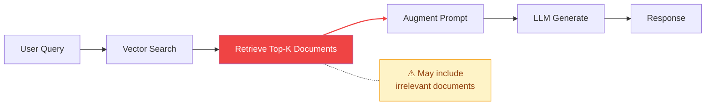
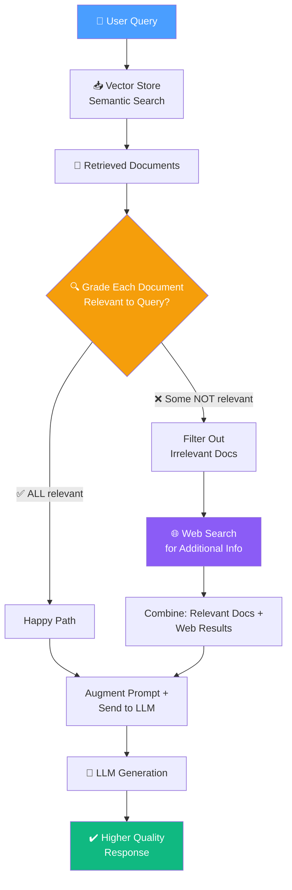

# 13.02 — Improving RAG with Corrective Flow

## Overview

**Corrective RAG (CRAG)** is an advanced retrieval technique based on the [Corrective Retrieval-Augmented Generation](https://arxiv.org/abs/2401.15884) research paper. It addresses a fundamental weakness of standard RAG systems: **blindly trusting all retrieved documents** regardless of their actual relevance to the user's query.

CRAG introduces a **self-reflection layer** that evaluates each retrieved document before passing it to the LLM — filtering out noise and supplementing missing information through external web search.

> [!NOTE]
> In standard RAG, if a vector store returns marginally relevant or outright irrelevant documents, those documents still get stuffed into the prompt — leading to confused, hallucinated, or low-quality answers. CRAG fixes this.

---

## The Problem with Standard RAG

To understand why CRAG exists, we need to understand what goes wrong with standard RAG in practice.

In a standard RAG pipeline, the process is straightforward:



The critical weakness is at the "Retrieve Top-K Documents" step. Vector search works by converting the user's query into an embedding (a numerical vector) and then finding the document chunks in the vector store that have the most similar embeddings. The top-K most similar chunks are returned.

**But similarity is not the same as relevance.** Here's why this is a problem:

### How Vector Search Can Fail

Imagine you ask: "What is agent memory in the context of autonomous AI systems?"

The vector store does a similarity search and returns 4 document chunks. But here's what might actually come back:

- **Document 1:** A detailed section about different types of memory in AI agents (short-term, long-term, sensory). ✅ Highly relevant.
- **Document 2:** A paragraph about how agents use tools to interact with external APIs. ❌ Mentions "agents" but is about tool use, not memory.
- **Document 3:** A section about memory management in computer operating systems. ❌ Mentions "memory" but in a completely different context.
- **Document 4:** A discussion of ReAct prompting for AI agents. ❌ Mentions "agents" but is about prompting, not memory.

In standard RAG, **all four documents** get stuffed into the LLM's context window. The LLM now has to generate an answer using a mix of relevant and irrelevant information. This creates several failure modes:

| Failure Mode | What Happens | Example |
|---|---|---|
| **Semantic Drift** | Documents match keywords but not the actual intent of the question | "Memory" in operating systems context vs. "memory" in AI agent context |
| **Topic Contamination** | Irrelevant documents dilute the useful information in the context window | Agent tool-use content mixed in with agent memory content |
| **Hallucination Amplification** | The LLM tries to synthesize all documents and generates fabricated connections between unrelated topics | LLM creates a fictitious link between OS memory management and AI agent memory |
| **Stale Information** | The vector store may have outdated documents, or may simply lack coverage of certain sub-topics | No recent research on a fast-evolving topic |
| **Context Window Waste** | Irrelevant documents occupy valuable tokens in the context window, potentially pushing out more relevant content | 3 out of 4 context slots wasted on irrelevant content |

The core issue is that standard RAG treats retrieval as a **trusted, infallible step**. It assumes that if the vector store returns something, it must be useful. CRAG challenges this assumption.

---

## The CRAG Solution: Self-Reflective Document Grading

CRAG introduces a **critique loop** between retrieval and generation. Instead of passing documents directly to the LLM for answer generation, it first asks a separate LLM call to **evaluate each document** individually.

Think of it as adding a **quality control checkpoint** to an assembly line:



---

## Step-by-Step CRAG Flow

### Step 1: Retrieve

The first step is the same as standard RAG — perform **semantic / vector search** against the vector store using the user's original query. This returns the top-K most similar document chunks (typically 4 documents by default).

At this point, we have a **candidate set** of documents. We don't yet know if they're all relevant — that's what the next step determines.

### Step 2: Grade (Self-Reflect)

This is the key innovation of CRAG. For **each** retrieved document (not the set as a whole, but **each individual document**), an LLM-powered **retrieval grader** evaluates:

> *"Is this document relevant to the user's question?"*

The grader returns a binary score: `yes` (relevant) or `no` (irrelevant).

**Why grade each document individually?** Because a set of 4 retrieved documents might contain 2 excellent ones, 1 mediocre one, and 1 completely irrelevant one. By grading individually, we can keep the good ones and discard only the bad ones.

**How does the grading work technically?** The system uses another LLM call with a specialized prompt. The prompt says something like: "You are a grader assessing relevance. Here is the document content. Here is the user's question. Are they related? Answer yes or no." The LLM's response is constrained to a structured output (a Pydantic model) to ensure we get a clean yes/no answer rather than a verbose explanation.

### Step 3: Filter

All documents graded as **irrelevant** are removed from the context. Only confirmed-relevant documents survive into the generation step.

Going back to our earlier example: if Documents 2, 3, and 4 were graded as irrelevant, only Document 1 (the one actually about agent memory) would survive. Instead of the LLM seeing 4 documents (3 of which are noise), it now sees only 1 highly relevant document.

### Step 4: Supplement (Conditional)

This is the **intelligent fallback** mechanism. If **any** document was filtered out (i.e., the vector store did not provide fully adequate coverage), the system triggers an **external web search** using the original query. The web search results are appended to the surviving relevant documents.

> [!TIP]
> This is a deliberate **heuristic**: if even one document is irrelevant, it indicates the vector store may not have complete coverage of the topic — making a web search a worthwhile supplement. The reasoning is that a perfect vector store would return only relevant results, so the presence of irrelevant results suggests gaps in coverage.

This heuristic is simple but effective. In our example, 3 out of 4 documents were irrelevant, which is a strong signal that the vector store doesn't have great coverage of "agent memory." A web search might find more recent, detailed, or complementary information.

**What if ALL documents are relevant?** Then no web search is triggered — the system proceeds directly to generation with all the original documents intact. This is the "happy path."

### Step 5: Generate

The augmented prompt — containing only the **relevant** documents (plus any web search results if triggered) and the original question — is sent to the LLM for answer generation.

Because the context now contains only high-quality, verified-relevant information, the LLM is much less likely to hallucinate or get confused by irrelevant content. The answer quality is significantly higher than standard RAG.

---

## Why CRAG Produces Higher Quality Answers

Here's a direct comparison between standard RAG and Corrective RAG:

| Aspect | Standard RAG | Corrective RAG |
|---|---|---|
| **Document Trust** | Trusts all retrieved docs blindly — whatever the vector store returns gets used | Grades each document individually for relevance, only trusts confirmed-relevant docs |
| **Noise Handling** | Irrelevant docs pollute the context window and confuse the LLM | Irrelevant docs are filtered out before the LLM sees them |
| **Knowledge Gaps** | Limited to whatever is in the vector store, even if coverage is poor | Falls back to real-time web search when the vector store's coverage is insufficient |
| **Context Quality** | Variable — heavily depends on the quality of the initial retrieval | Curated — only verified-relevant content reaches the LLM |
| **Robustness** | Single point of failure (if retrieval is bad, the answer is bad) | Multi-source retrieval with quality gates at every step |
| **Token Efficiency** | May waste context window tokens on irrelevant documents | Every token in the context is relevant, maximizing useful information density |

---

## The Cost of CRAG

CRAG is not free — it involves **additional LLM calls** for document grading. For each retrieved document, you make one extra LLM call to determine relevance. If you retrieve 4 documents, that's 4 extra LLM calls before generation.

However, this tradeoff is usually worth it because:

1. **Document grading uses simple yes/no prompts** — these are fast and cheap (low token count)
2. **The generation step gets much better context** — leading to higher quality answers on the first try
3. **You avoid the cost of regeneration** — a bad answer from standard RAG might require the user to rephrase and try again
4. **Modern LLMs are fast and cheap** — the cost of 4 simple classification calls is negligible compared to one complex generation call

---

## Implementation Preview

In the upcoming lessons, this CRAG flow will be implemented using **LangGraph** with the following components:

```
chains/
├── retrieval_grader.py   # LLM chain to grade document relevance (yes/no per document)
└── generation.py         # LLM chain for final answer generation

graph/
├── nodes/
│   ├── retrieve.py       # Vector store retrieval node — gets raw documents
│   ├── grade_documents.py # Document grading + filtering node — quality control
│   ├── web_search.py     # External web search node — fallback information source
│   └── generate.py       # LLM generation node — produces the final answer
├── state.py              # GraphState (question, documents, web_search flag, generation)
├── consts.py             # Node name constants
└── graph.py              # LangGraph wiring — nodes, edges, conditional branches
```

Each component maps directly to a step in the CRAG flow:
- `retrieve.py` → Step 1 (Retrieve)
- `retrieval_grader.py` + `grade_documents.py` → Step 2 (Grade) + Step 3 (Filter)
- `web_search.py` → Step 4 (Supplement)
- `generation.py` + `generate.py` → Step 5 (Generate)

> [!IMPORTANT]
> CRAG is just the **first layer** of the full Agentic RAG system. Later lessons add **Self-RAG** (answer reflection — checking if the generated answer is actually correct) and **Adaptive RAG** (query routing — deciding where to search before even starting) on top of this foundation.