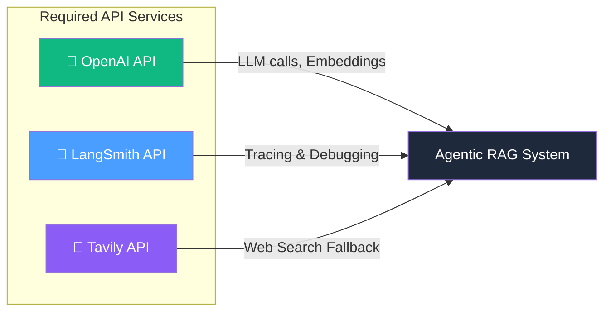

# 13.03 — Boilerplate Setup

## Overview

This lesson covers the **project initialization** for the Agentic RAG system — setting up the development environment, installing dependencies, configuring API keys, and validating that everything works before writing any domain logic.

This may seem like "boring setup" work, but getting the foundation right is critical. Misconfigured API keys, missing dependencies, or incorrect Python paths will cause cryptic errors later in the project. Taking the time to set things up properly now saves hours of debugging later.

---

## Environment & Dependency Setup

### 1. Initialize the Project with Poetry

[Poetry](https://python-poetry.org/) is used for dependency management and virtual environment isolation.

```bash
# Create project directory
mkdir langgraph-course
cd langgraph-course

# Initialize Poetry environment
poetry init
```

This generates a `pyproject.toml` file that will track all project dependencies and their versions.

**Why Poetry instead of pip?** Poetry provides two key advantages over plain `pip`:
1. **Deterministic builds** — the `poetry.lock` file captures exact dependency versions, so every developer (and every CI/CD run) gets the same environment
2. **Virtual environment isolation** — Poetry automatically creates and manages a virtual environment for your project, preventing conflicts with other Python projects on your system

### 2. Install Dependencies

```bash
poetry add \
  beautifulsoup4 \
  langchain \
  langgraph \
  langchain-hub \
  langchain-community \
  tavily-python \
  chromadb \
  python-dotenv \
  black \
  isort \
  pytest
```

#### Dependency Breakdown

| Package | Purpose |
|---|---|
| `beautifulsoup4` | HTML parsing — used by LangChain's `WebBaseLoader` to scrape web articles for ingestion |
| `langchain` | Core LangChain framework — chains, prompts, output parsers |
| `langgraph` | Graph-based orchestration for multi-step agent workflows |
| `langchain-hub` | Pull pre-built prompts from the LangChain Hub (e.g., RAG prompts) |
| `langchain-community` | Community-maintained document loaders, vector stores, and tools |
| `tavily-python` | Tavily Search API SDK — optimized search for LLM-powered applications |
| `chromadb` | Open-source vector database — runs locally, stores embeddings on disk |
| `python-dotenv` | Load environment variables from `.env` files |
| `black` | Python code formatter |
| `isort` | Import statement sorter |
| `pytest` | Testing framework for running unit and integration tests |

> [!TIP]
> Using `poetry` ensures deterministic builds — every team member gets the exact same dependency versions via the `poetry.lock` file.

---

## Environment Variables

Create a `.env` file in the project root:

```env
# OpenAI
OPENAI_API_KEY=sk-your-openai-api-key

# LangSmith Tracing
LANGCHAIN_TRACING_V2=true
LANGCHAIN_PROJECT=crag
LANGCHAIN_API_KEY=ls-your-langsmith-api-key

# Tavily Search
TAVILY_API_KEY=tvly-your-tavily-api-key

# Python Path (for module resolution)
PYTHONPATH=.
```

Let's understand what each of these does:

- **`OPENAI_API_KEY`** — Authenticates with OpenAI's API. Used for every LLM call (GPT for grading/generation) and every embedding call (for query and document embedding). This is the most critical key.
- **`LANGCHAIN_TRACING_V2=true`** — Enables LangSmith tracing. Every LLM call, chain invocation, and graph execution will be logged to LangSmith for debugging and observability.
- **`LANGCHAIN_PROJECT=crag`** — Names the tracing project in LangSmith. All traces will appear under this project name in the dashboard.
- **`LANGCHAIN_API_KEY`** — Authenticates with LangSmith. Required when tracing is enabled.
- **`TAVILY_API_KEY`** — Authenticates with the Tavily search engine. Used by the Web Search Node for fallback retrieval.
- **`PYTHONPATH=.`** — Tells Python to include the current directory in its module search path. This is essential — without it, `from graph.nodes import retrieve` would fail because Python wouldn't know where `graph/` is.

### API Key Requirements



| Service | How to Get | Used For |
|---|---|---|
| **OpenAI** | [platform.openai.com](https://platform.openai.com) | LLM calls (GPT-3.5/4), embedding generation |
| **LangSmith** | [smith.langchain.com](https://smith.langchain.com) | Tracing graph execution, debugging chains |
| **Tavily** | [tavily.com](https://tavily.com) | AI-optimized web search for fallback retrieval |

> [!WARNING]
> Never commit your `.env` file to version control. Add `.env` to your `.gitignore`.

---

## Boilerplate Entry Point

Create a `main.py` file to validate the setup:

```python
from dotenv import load_dotenv

load_dotenv()

if __name__ == "__main__":
    print("Hello Advanced RAG!")
```

### Validation

Run the entry point to confirm the environment is working:

```bash
python main.py
# Expected output: Hello Advanced RAG!
```

If this runs without import errors or missing key warnings, all dependencies are correctly installed and environment variables are loaded.

---

## IDE Configuration (PyCharm)

1. Open the project directory in PyCharm
2. PyCharm should auto-detect the Poetry virtual environment
3. Approve the detected interpreter
4. Wait for package indexing to complete
5. Verify in `pyproject.toml` that all dependency versions are listed

> [!NOTE]
> If using VS Code, configure the Python interpreter to point to the Poetry virtual environment: `poetry env info --path` will give you the venv path.

---

## Summary Checklist

- [x] Project directory created
- [x] Poetry environment initialized
- [x] All dependencies installed
- [x] `.env` file created with API keys
- [x] `main.py` boilerplate runs successfully
- [x] IDE configured with correct Python interpreter
- [x] LangSmith tracing enabled

> [!TIP]
> GitHub branch reference: `1-start-here`