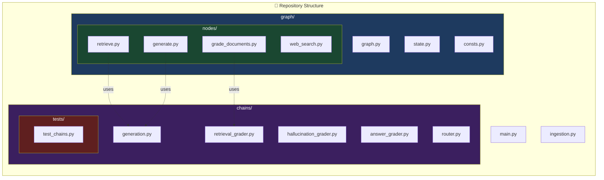
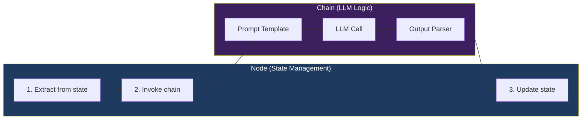

# 13.04 — Code Structure

## Overview

This lesson establishes the **project architecture** for the Agentic RAG system. Before writing any logic, we define the folder structure, file organization, and testing setup.

Why does code structure matter so much? Because an LLM application isn't like a simple script — it has many moving parts: prompt templates, LLM calls, vector store interactions, state management, conditional routing, and testing. Without clear organization, the codebase quickly becomes a tangled mess where debugging, testing, and extending become nightmarish.

> [!IMPORTANT]
> The guiding principle: **the repository structure should mirror the graph architecture**. Each node, chain, and edge in the LangGraph has a corresponding file in the project. When you look at the graph diagram, you should be able to find the matching code file instantly.

This may seem like over-engineering for a project this size, but it's a deliberate choice — the patterns established here scale to production systems with dozens of nodes and chains.

---

## Project Directory Layout

```
langgraph-course/
├── main.py                    # Entry point — invokes the compiled graph
├── ingestion.py               # Document loading, chunking, and vector store indexing
├── .env                       # API keys and environment variables
├── pyproject.toml             # Poetry dependency manifest
│
├── graph/                     # 🧠 Core orchestration package
│   ├── __init__.py
│   ├── graph.py               # LangGraph wiring — nodes, edges, conditional branches
│   ├── state.py               # GraphState TypedDict definition
│   ├── consts.py              # Node name constants (avoid magic strings)
│   │
│   └── nodes/                 # 📦 Node implementations (one file per node)
│       ├── __init__.py
│       ├── retrieve.py        # Retrieve documents from vector store
│       ├── grade_documents.py # Grade + filter documents for relevance
│       ├── web_search.py      # External web search via Tavily
│       └── generate.py        # LLM answer generation
│
└── chains/                    # ⛓️ LLM chain definitions (one file per chain)
    ├── __init__.py
    ├── retrieval_grader.py    # Chain: grade document relevance
    ├── generation.py          # Chain: RAG answer generation
    ├── hallucination_grader.py # Chain: check answer grounding
    ├── answer_grader.py       # Chain: check answer addresses question
    ├── router.py              # Chain: route query to vector store or web
    │
    └── tests/                 # 🧪 Test suite
        ├── __init__.py
        └── test_chains.py     # Pytest tests for all chains
```

---

## Architecture Mapping

The directory structure **directly reflects** the graph architecture:



---

## Package Responsibilities

### `graph/` — Core Orchestration

| File | Responsibility |
|---|---|
| `graph.py` | Connects all nodes and edges into a LangGraph `StateGraph`. Defines conditional branches, entry points, and termination. This is the **orchestrator**. |
| `state.py` | Defines `GraphState` — the TypedDict that flows through every node during execution. |
| `consts.py` | Centralized constants for node names. Prevents magic string duplication across the codebase. |

### `graph/nodes/` — Node Implementations

Each file contains a **single node function** that:
1. Receives the current `GraphState`
2. Performs its operation (retrieval, grading, searching, or generation)
3. Returns a dictionary of state updates

| File | Node Function | Purpose |
|---|---|---|
| `retrieve.py` | `retrieve()` | Query the vector store and populate `documents` |
| `grade_documents.py` | `grade_documents()` | Grade each document, filter irrelevant ones, set `web_search` flag |
| `web_search.py` | `web_search()` | Search the web via Tavily, append results to `documents` |
| `generate.py` | `generate()` | Run the generation chain, populate `generation` |

### `chains/` — LLM Chain Definitions

Each file contains a **LangChain chain** — the LLM logic that a corresponding node invokes. This separation of concerns is critical:

| File | Chain Object | Input | Output |
|---|---|---|---|
| `retrieval_grader.py` | `retrieval_grader` | question + document | `GradeDocument` (yes/no) |
| `generation.py` | `generation_chain` | context docs + question | Generated answer (string) |
| `hallucination_grader.py` | `hallucination_grader` | documents + generation | `GradeHallucinations` (bool) |
| `answer_grader.py` | `answer_grader` | question + generation | `GradeAnswer` (yes/no) |
| `router.py` | `question_router` | question | `RouteQuery` (vectorstore/websearch) |

### `chains/tests/` — Test Suite

All chain tests live under `chains/tests/test_chains.py`. Tests are run using **Pytest**:

```bash
pytest . -s -v
```

> [!TIP]
> **Naming convention matters for Pytest**: test directories must start with `test` or `tests`, and test files must have a `test_` prefix. Test functions follow the same `test_` prefix convention.

---

## The Node ↔ Chain Separation Pattern

This is the most important architectural decision in the entire project, so let's understand it deeply.

A **node** and a **chain** serve fundamentally different purposes, and keeping them separate is what makes the codebase testable and maintainable.

### What Is a Node?

A **node** is a function that participates in the LangGraph. It:
- Receives the entire graph state as input
- Extracts the specific data fields it needs
- Calls some processing logic (usually a chain)
- Returns a dictionary of state updates

The node's job is **state management** — it's the bridge between the graph's data flow and the actual processing logic.

### What Is a Chain?

A **chain** is a LangChain pipeline — a sequence of steps that typically includes a prompt template, an LLM call, and an output parser. It:
- Receives specific inputs (a question, a document, etc.)
- Processes them through the LLM
- Returns a structured result

The chain's job is **LLM logic** — it knows how to talk to the language model and how to parse its response.

### Why Separate Them?

Imagine a kitchen in a restaurant:
- The **chain** is like the chef — they know how to cook the food, what ingredients to use, and how to plate it.
- The **node** is like the waiter — they know what the customer ordered (read from state), they bring it to the chef (invoke the chain), and they deliver the finished dish back to the customer (update state).

If the chef and waiter were the same person, you couldn't test the cooking without also testing the ordering system. By separating them, you can test each independently.



**Concrete example:** The `grade_documents` node reads `state["documents"]` and `state["question"]`, loops through each document calling the `retrieval_grader` chain for each one, and then returns `{"documents": filtered_docs, "web_search": True}`. The node handles the loop and state update. The chain handles the LLM call and parsing.

**Why this separation?**

| Benefit | Explanation |
|---|---|
| **Testability** | Chains can be tested independently — you can test `retrieval_grader.invoke({"question": ..., "document": ...})` without running the full graph. This makes tests faster, cheaper, and more focused. |
| **Reusability** | The same chain can be used in multiple nodes or contexts. For example, the `generation_chain` could be used in a different graph or a standalone script. |
| **Readability** | Node logic is focused and easy to read — "read state, call chain, update state." Chain logic is also focused — "format prompt, call LLM, parse response." Neither is cluttered with the other's concerns. |
| **Debuggability** | When something goes wrong, you can immediately narrow down whether the issue is in the state flow (node) or the LLM logic (chain). This cuts debugging time significantly. |
| **Swappability** | You can swap out the LLM (e.g., from GPT-4 to Claude) by changing only the chain, without touching any node code. |

---

## Testing Infrastructure

### Dummy Test for Validation

```python
# chains/tests/test_chains.py

def test_foo() -> None:
    """Sanity check — validates pytest is correctly configured."""
    assert 1 == 1
```

### Running Tests

```bash
# From project root
pytest . -s -v

# -s  → show stdout output (useful for debugging LLM responses)
# -v  → verbose mode (shows individual test names and results)
```

### PyCharm Test Runner Configuration

1. Go to **Edit Configurations** → `+` → **Python tests** → **pytest**
2. Set **Script path** to the project root directory
3. Set **Parameters** to `. --s -v`
4. Run the configuration to validate

> [!NOTE]
> GitHub branch reference: `2-project-structure`

---

## Summary

| Architectural Decision | Rationale |
|---|---|
| One file per node | Easy to locate, modify, and test individual nodes |
| One file per chain | Chains are independently testable units of LLM logic |
| Separate `nodes/` and `chains/` packages | Clean separation of state management from LLM logic |
| Centralized constants (`consts.py`) | Eliminates magic strings, single source of truth for node names |
| Tests co-located with chains | Tests validate the LLM logic that powers each node |
| `ingestion.py` at root level | One-time data pipeline, separate from the runtime graph |