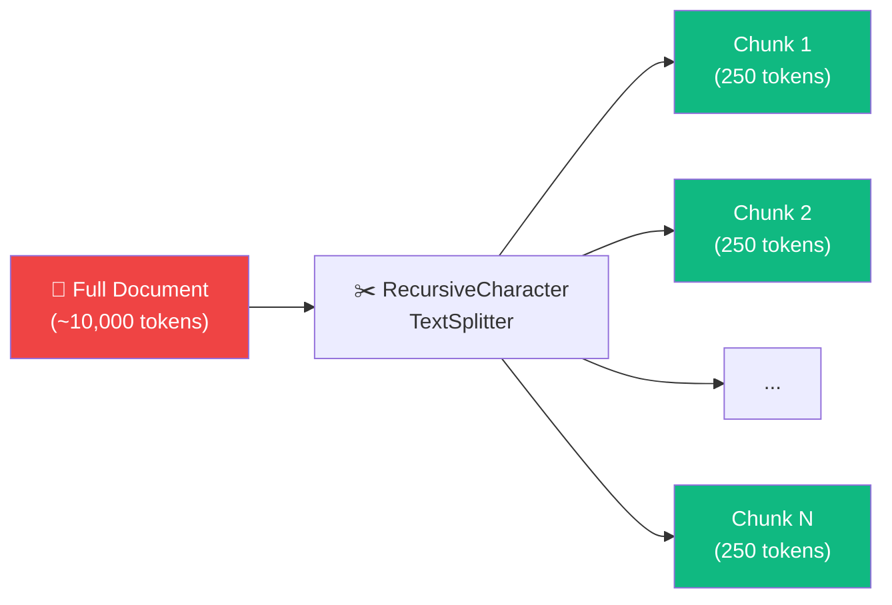
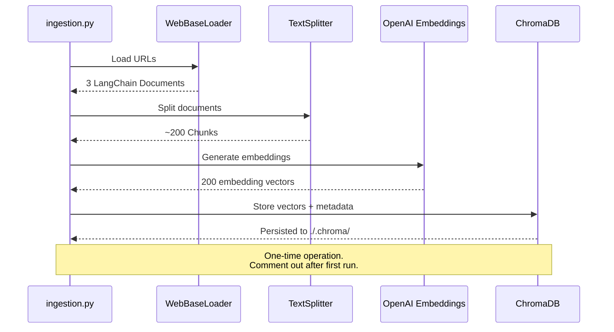

# 13.05 — LangChain Vector Store Ingestion Pipeline

## Overview

Before implementing advanced retrieval techniques, we need a **knowledge base**. This lesson implements the **ingestion pipeline** — the process of loading web articles, chunking them into manageable pieces, generating embeddings, and storing everything in a local ChromaDB vector store.

Think of ingestion as the "preparation" phase — like a student preparing for an exam by organizing their notes. Before you can answer questions (retrieval + generation), you need to have your knowledge base ready to search.

> [!NOTE]
> In a production Agentic RAG system, the ingestion pipeline can be heavily optimized (chunking strategies, embedding models, metadata enrichment, etc.). This lesson focuses on getting a **functional baseline** — the advanced work is on the **retrieval** side, not ingestion.

---

## What Are Embeddings and Why Do We Need Them?

Before diving into the code, let's understand the core concept that makes this entire system work: **embeddings**.

An **embedding** is a way to represent text as a list of numbers (a vector). For example, the sentence "Agent memory helps AI systems remember" might be represented as a vector like `[0.032, -0.015, 0.089, ...]` with 1,536 numbers in total (when using OpenAI's embedding model).

Why is this useful? Because **similar texts produce similar vectors**. The sentences "Agent memory helps AI systems remember" and "How do AI agents store information?" would have vectors that are mathematically close to each other, even though they use completely different words. This is the magic of embeddings — they capture **semantic meaning**, not just keyword matches.

This allows us to do **semantic search**: when a user asks a question, we convert the question into an embedding, then find which stored document embeddings are most similar. The most similar documents are likely the most relevant ones.

## What Is a Vector Store?

A **vector store** (also called a vector database) is a database specifically designed to store and search embeddings. Unlike a regular database that searches by exact text matches, a vector store searches by **mathematical similarity** between vectors.

**ChromaDB** is the vector store we use in this project. It runs locally on your machine (no server to set up), persists data to disk (so you don't lose your embeddings when you restart), and integrates seamlessly with LangChain.

---

## Ingestion Pipeline Architecture


---

## Source Articles

Three web articles are ingested, covering key AI/LLM topics:

| # | Topic | Content Coverage |
|---|---|---|
| 1 | **Autonomous Agents** | Memory systems, planning, reasoning, tool use |
| 2 | **Prompt Engineering** | Zero-shot, few-shot, chain-of-thought, ReAct |
| 3 | **Adversarial Attacks** | Prompt hacking, jailbreaking, LLM security |

These articles ensure the vector store has rich, diverse content for testing the RAG system across different query types.

---

## Implementation

### Step 1: Imports and Environment

```python
from dotenv import load_dotenv
from langchain.text_splitter import RecursiveCharacterTextSplitter
from langchain_community.document_loaders import WebBaseLoader
from langchain_community.vectorstores import Chroma
from langchain_openai import OpenAIEmbeddings

load_dotenv()
```

### Step 2: Load Documents from URLs

```python
urls = [
    "https://lilianweng.github.io/posts/2023-06-23-agent/",
    "https://lilianweng.github.io/posts/2023-03-15-prompt-engineering/",
    "https://lilianweng.github.io/posts/2023-10-25-adv-attack-llm/",
]

# Load each URL into a LangChain Document
docs = [WebBaseLoader(url).load() for url in urls]

# Flatten the nested list → each WebBaseLoader returns [Document]
docs_list = [item for sublist in docs for item in sublist]
# Result: list of 3 LangChain Document objects
```

> [!TIP]
> `WebBaseLoader` uses **BeautifulSoup** under the hood to parse HTML and extract text content from web pages. That's why `beautifulsoup4` is a required dependency. It handles all the messy work of stripping HTML tags, navigation elements, ads, and other non-content elements.

**What does each Document look like?** A LangChain `Document` has two key attributes:
- `page_content` — the full text content of the article (could be thousands of words)
- `metadata` — information like the source URL

At this point, we have 3 very large documents. These are too big to store as single embeddings — an embedding represents the meaning of the entire text, and a 10,000-word article is too broad for a single embedding to capture specific details. This is why we need the next step: chunking.

### Step 3: Chunk Documents

**Why do we chunk?** LLMs have a limited context window, and embeddings work best on focused, specific text. If you embed an entire 10,000-word article as one vector, the embedding captures the *average meaning* of the whole article — a very general "this article is about AI agents." That's not specific enough for precise retrieval.

By splitting the article into 250-token chunks, each embedding captures a *specific topic or detail* — "this chunk is about how agents use short-term memory" or "this chunk is about the ReAct prompting framework." When a user asks about a specific topic, we can find the specific chunk that discusses it.

Think of it like a book index: you wouldn't have one index entry for the entire book ("AI: pages 1-300"). You'd have specific entries ("short-term memory: page 45", "ReAct prompting: page 128"). Chunking creates that granularity.

```python
text_splitter = RecursiveCharacterTextSplitter.from_tiktoken_encoder(
    chunk_size=250,
    chunk_overlap=0,
)

doc_splits = text_splitter.split_documents(docs_list)
# Result: ~200 smaller document chunks
```

#### Chunking Parameters

| Parameter | Value | Rationale |
|---|---|---|
| `chunk_size` | 250 tokens | Small enough for precise retrieval, large enough for context |
| `chunk_overlap` | 0 | No overlap — keeps chunks independent (acceptable for this use case) |
| Tokenizer | TikToken | Accurate token counting aligned with OpenAI models |



> [!NOTE]
> `RecursiveCharacterTextSplitter` tries to split on natural boundaries (paragraphs, sentences, words) before resorting to character-level splits. This preserves semantic coherence within chunks.

### Step 4: Embed and Store in ChromaDB

```python
# Index chunks into ChromaDB (one-time operation)
vectorstore = Chroma.from_documents(
    documents=doc_splits,
    collection_name="rag-chroma",
    embedding=OpenAIEmbeddings(),
    persist_directory="./.chroma",
)
```

| Parameter | Value | Purpose |
|---|---|---|
| `documents` | `doc_splits` | The chunked documents to embed and store |
| `collection_name` | `"rag-chroma"` | Named collection within ChromaDB — like a table in a regular database |
| `embedding` | `OpenAIEmbeddings()` | Uses `text-embedding-3-small` by default — this model converts text to 1,536-dimensional vectors |
| `persist_directory` | `"./.chroma"` | Saves the vector store to disk, so you don't have to re-embed documents every time you restart |

**What happens inside `Chroma.from_documents()`:**
1. For each of the ~200 document chunks, it calls OpenAI's embedding API to generate a vector
2. Each vector (1,536 numbers) is stored in ChromaDB alongside the original text
3. The entire database is persisted to the `.chroma/` directory on disk
4. ChromaDB builds an index for fast similarity search

This is a **one-time cost** — you pay for embedding generation once, and then you can search the vector store as many times as you want without additional embedding costs.

### Step 5: Create a Retriever

```python
# Load the persisted vector store and create a retriever
retriever = Chroma(
    collection_name="rag-chroma",
    persist_directory="./.chroma",
    embedding_function=OpenAIEmbeddings(),
).as_retriever()
```

The `as_retriever()` method wraps the vector store in a LangChain `Retriever` interface, enabling:
- `.invoke(query)` — returns the most similar documents
- Integration with LangChain chains and agents

---

## Complete Ingestion Flow



---

## Important Considerations

### One-Time Ingestion

The ingestion pipeline should only run **once**. After the initial indexing:

```python
# Comment out after first run:
# vectorstore = Chroma.from_documents(...)

# Always load from disk:
retriever = Chroma(
    collection_name="rag-chroma",
    persist_directory="./.chroma",
    embedding_function=OpenAIEmbeddings(),
).as_retriever()
```

> [!WARNING]
> Running ingestion multiple times without clearing the store will create **duplicate embeddings** — each query will return redundant copies of the same content.

### Production Ingestion Optimizations (Not Covered)

In a production system, you would also consider:

| Optimization | Description |
|---|---|
| **Chunking strategy** | Semantic chunking, parent-child chunks, sliding window with overlap |
| **Metadata enrichment** | Source URL, section headers, document titles, timestamps |
| **Embedding model selection** | Task-specific embeddings, dimensionality tradeoffs |
| **Deduplication** | Content hashing to prevent duplicate chunks |
| **Incremental ingestion** | Only process new/changed documents |
| **Batch processing** | Parallel embedding generation for large corpora |

---

## Summary

| Step | Input | Output | Tool |
|---|---|---|---|
| Load | 3 URLs | 3 LangChain Documents | `WebBaseLoader` |
| Chunk | 3 Documents | ~200 Chunks (250 tokens each) | `RecursiveCharacterTextSplitter` |
| Embed | ~200 Chunks | ~200 Embedding Vectors | `OpenAIEmbeddings` |
| Store | Vectors + Metadata | Persisted ChromaDB | `Chroma` |
| Retrieve | User Query | Top-K Similar Chunks | `Chroma.as_retriever()` |

> [!TIP]
> GitHub branch reference: `3-ingestion`