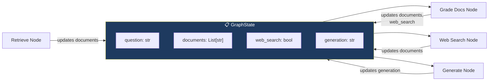
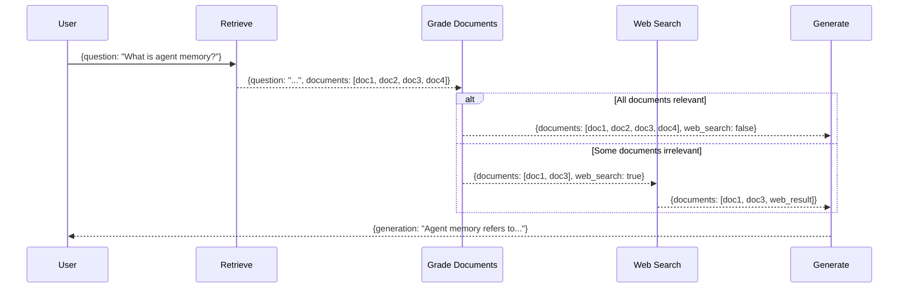

# 13.06 — Managing Information Flow in LangGraph

## Overview

Every LangGraph workflow requires a **state object** — a structured container that flows through every node during execution. This lesson defines the `GraphState`, the single source of truth that each node reads from and writes to as the graph executes.

Think of the GraphState as a **shared clipboard** that gets passed from person to person (node to node) on a team. Each person reads what they need from the clipboard, does their work, writes their results back onto the clipboard, and passes it to the next person. By the end, the clipboard contains everybody's contributions.

> [!NOTE]
> The GraphState is the **communication backbone** of the entire Agentic RAG system. Every node receives the current state, performs its operation, and returns a dictionary of updates to apply to the state. Without it, the nodes would have no way to share information with each other.

---

## Why State Matters in LangGraph

In a simple Python program, you might just pass variables between functions. But LangGraph workflows are different because:

1. **Nodes don't call each other directly** — the graph orchestrator decides which node runs next
2. **Execution paths can vary** — conditional edges mean different nodes may run in different orders
3. **Cycles are possible** — the graph might loop back and re-run a node (like regenerating an answer)
4. **Multiple nodes need the same data** — the question, for example, is needed by almost every node

The state solves all of these problems by serving as a **centralized, structured data container** that every node reads from and writes to.

---

## The Role of State in LangGraph



In LangGraph, the state object follows this lifecycle:

1. **Initialization** — When you invoke the graph (e.g., `app.invoke({"question": "What is agent memory?"})`), LangGraph creates the initial state from the dictionary you provide. Fields not provided start as `None` or `undefined`.

2. **Passed to every node** — Each node function receives the **entire current state** as its input argument. The node can read any field it needs.

3. **Updated by each node** — Each node returns a **plain dictionary** containing only the fields it wants to update. LangGraph **merges** this dictionary into the existing state. Fields not included in the return dictionary remain unchanged.

4. **Accumulates changes** — As the graph executes, the state gets progressively richer. The Retrieve Node adds `documents`. The Grade Documents Node updates `documents` (filtered) and sets `web_search`. The Generate Node adds `generation`.

5. **Contains the final result** — When the graph reaches the `END` node, the final state contains all the accumulated data, including the generated answer.

---

## GraphState Definition

```python
# graph/state.py

from typing import List
from typing_extensions import TypedDict


class GraphState(TypedDict):
    """
    Represents the state that flows through the LangGraph execution.
    
    Attributes:
        question:   The user's original question (persists throughout execution)
        generation: The LLM-generated answer (populated by the generate node)
        web_search: Flag indicating whether web search is needed (set by grade_documents)
        documents:  List of retrieved/filtered document contents (updated by multiple nodes)
    """
    question: str
    generation: str
    web_search: bool
    documents: List[str]
```

This is only 4 fields, but each one plays a critical role. Let's understand each one in depth.

---

## Field-by-Field Breakdown

### `question` (str)

**What it is:** The original question that the user asked — for example, `"What is agent memory?"`.

**Who sets it:** This is set at the very beginning when you invoke the graph. It typically doesn't change during execution (the user's question stays the same throughout).

**Who uses it:**
- The **Retrieve Node** uses it to query the vector store
- The **Grade Documents Node** uses it to evaluate whether each document is relevant *to this specific question*
- The **Web Search Node** uses it to query the Tavily search engine
- The **Generate Node** passes it to the LLM as part of the prompt
- The **Router** (in Adaptive RAG) uses it to decide where to search
- The **Answer Grader** (in Self-RAG) uses it to check if the answer addresses *this* question

**Why it's important:** The question is referenced by almost every node in the graph. Without it, the system wouldn't know what it's trying to answer. It's the anchor that keeps the entire pipeline focused.

### `documents` (List[str])

**What it is:** A list of document content strings — the text chunks that will be used as context for the LLM.

**Who sets it:**
- The **Retrieve Node** populates it with the initial set of retrieved document chunks
- The **Grade Documents Node** updates it — filtering out irrelevant documents
- The **Web Search Node** updates it — appending web search results

**Who uses it:**
- The **Grade Documents Node** reads each document to grade its relevance
- The **Generate Node** passes all documents to the LLM as context
- The **Hallucination Grader** (Self-RAG) compares the generation against these documents

**Why it's important:** This is the evolving knowledge base for the current query. It starts as raw retrieval results, gets refined through grading and filtering, and may be enriched with web search results. By the time it reaches the Generate Node, it should contain only high-quality, relevant content.

### `web_search` (bool)

**What it is:** A boolean flag — `True` means "we should search the web for more information," `False` means "no web search needed."

**Who sets it:** The **Grade Documents Node** sets this to `True` if any retrieved document was graded as irrelevant. If all documents pass the relevance check, it stays `False`.

**Who uses it:** The **conditional edge** after the Grade Documents Node reads this flag to decide which path to take:
- If `True` → route to the Web Search Node
- If `False` → route directly to the Generate Node

**Why it's important:** This is the decision point that triggers the CRAG fallback mechanism. It's a simple boolean, but it controls a critical branch in the graph's execution flow. Without it, the system would have no way to communicate the grading result to the routing logic.

### `generation` (str)

**What it is:** The LLM's generated answer — a natural language response to the user's question, grounded in the provided documents.

**Who sets it:** The **Generate Node** populates this after running the generation chain.

**Who uses it:**
- The **Hallucination Grader** (Self-RAG) checks if this answer is supported by the documents
- The **Answer Grader** (Self-RAG) checks if this answer addresses the question
- The **final output** — this is what gets returned to the user

**Why it's important:** This is the end product of the entire pipeline. All the retrieval, grading, searching, and augmentation is done in service of producing this one piece of text.

---

## Field Interaction Summary

| Field | Type | Set By | Used By | Purpose |
|---|---|---|---|---|
| `question` | `str` | Initial input | All nodes | The user's original query — referenced throughout for relevance checks, grading, and routing |
| `documents` | `List[str]` | Retrieve, Grade Docs, Web Search | Generate, Grade Docs | Retrieved document contents — filtered and supplemented as the graph executes |
| `web_search` | `bool` | Grade Documents | Conditional edge (`decide_to_generate`) | Flag that triggers the web search node when at least one document is irrelevant |
| `generation` | `str` | Generate | Conditional edge (`grade_generation_v_documents_and_question`) | The LLM's generated answer — subject to hallucination and relevance checks |

---

## State Flow Through the Graph

Here's how the state evolves as it passes through each node:



**Reading this diagram:** Follow the flow from top to bottom. The state starts with just a `question`, gains `documents` after retrieval, then gets refined (documents filtered, web_search set) by the grading step, and finally gains a `generation` after the LLM produces an answer.

---

## Design Decisions

### Why `TypedDict` Instead of a Dataclass or Regular Class?

You might wonder why the state is defined as a `TypedDict` rather than a Python `dataclass` or a regular class. There are several important reasons:

| Reason | Explanation |
|---|---|
| **Dictionary-based updates** | Each node returns a plain Python `dict` — LangGraph automatically merges these updates into the state. This wouldn't work cleanly with a class instance. |
| **Partial updates** | Nodes only need to include the fields they actually changed. If a node doesn't change `web_search`, it simply doesn't include it in the return dictionary. |
| **Compatibility** | LangGraph's internal state management is built around dict-like objects. Using `TypedDict` provides type safety while maintaining dict compatibility. |
| **Simplicity** | No `__init__` method, no constructor arguments, no boilerplate. Just define the fields and their types. |
| **Serialization** | Dicts are easily serializable (to JSON, for logging, for LangSmith tracing, etc.). Class instances require custom serialization. |

**What `TypedDict` gives you vs. a plain dict:** Type checking. Your IDE will warn you if you try to access `state["questoin"]` (typo) or assign a wrong type to a field. But at runtime, it's still just a regular dictionary.

### Why `List[str]` for Documents Instead of `List[Document]`?

The documents field stores **page content as strings** rather than full LangChain `Document` objects (which also carry metadata like source URL, chunk index, etc.). This simplifies serialization and state management while retaining the essential text content needed for augmentation and grading.

> [!TIP]
> In more complex systems, you might store `List[Document]` to preserve metadata (source URL, chunk index, etc.) — but for this implementation, the text content is sufficient. The metadata isn't used by any downstream node in this workflow.

---

## How Nodes Update State

Every node in the Agentic RAG system follows the same three-step pattern:

```python
def some_node(state: GraphState) -> dict:
    # Step 1: READ from state — extract the data you need
    question = state["question"]
    documents = state["documents"]
    
    # Step 2: PROCESS — do your actual work
    result = do_something(question, documents)
    
    # Step 3: WRITE back — return ONLY the fields you want to update
    return {
        "documents": result,
        "question": question,  # pass through unchanged
    }
```

**The critical insight:** Nodes return a **plain dictionary**, not a `GraphState` object. LangGraph takes this dictionary and **merges** it into the existing state. Any fields not included in the return dictionary simply retain their previous values.

This means:
- If the Retrieve Node returns `{"documents": [...], "question": "..."}`, the `web_search` and `generation` fields remain `None` (they haven't been set yet).
- If the Grade Documents Node returns `{"documents": [...], "question": "...", "web_search": True}`, the `generation` field remains `None`, but `web_search` is now set.
- Each node only needs to worry about the fields it's responsible for.

> [!IMPORTANT]
> Nodes return a **plain dictionary**, not a `GraphState`. LangGraph **merges** this dictionary into the existing state — fields not included in the return value retain their previous values. This is a fundamental pattern in LangGraph that enables clean, modular node design.

---

## Summary

The `GraphState` is simple by design — four fields that capture the essential information flowing through the Agentic RAG pipeline:

1. **`question`** — What the user asked. This is the anchor — it persists throughout execution and is referenced by almost every node.
2. **`documents`** — The evolving set of relevant documents. Starts as raw retrieval results, gets filtered and supplemented, and eventually serves as the context for answer generation.
3. **`web_search`** — A simple boolean decision flag. Set by the Grade Documents Node, read by the conditional edge that decides whether to search the web.
4. **`generation`** — The final answer. Populated by the Generate Node and validated by the reflection checks in Self-RAG.

Despite its simplicity, this state object is the **single source of truth** for the entire graph. Every node reads from it and writes to it. The conditional edges use it to make routing decisions. And the final state contains everything needed to understand what happened during execution — what was asked, what documents were used, whether web search was triggered, and what answer was generated.

> [!TIP]
> GitHub branch reference: `4-state`