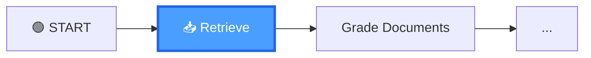
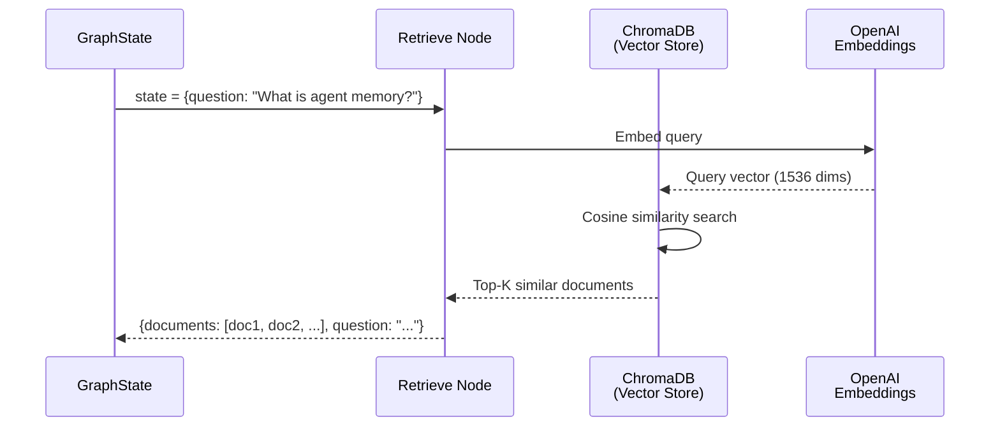

# 13.07 — LangGraph Retrieve Node

## Overview

The **Retrieve Node** is the first operational node in the Agentic RAG graph. It takes the user's question from the state, performs a **semantic similarity search** against the ChromaDB vector store, and populates the `documents` field with the most relevant chunks.

This node is intentionally simple — it's purely about data retrieval, not data processing. Think of it as a librarian who goes to the shelves when you ask a question and comes back with an armful of books that seem related. The librarian doesn't read the books or judge their quality — that's the next person's job (the Grade Documents Node).

---

## Node Position in the Graph



The Retrieve Node is the **entry point** of the graph — it runs first whenever the graph is invoked (in the basic CRAG flow; later in Adaptive RAG, a router may run before this node).

---

## Implementation

```python
# graph/nodes/retrieve.py

from typing import Any, Dict
from graph.state import GraphState
from ingestion import retriever


def retrieve(state: GraphState) -> Dict[str, Any]:
    """
    Retrieve relevant documents from the vector store.
    
    Args:
        state: Current graph state containing the user's question
        
    Returns:
        Updated state with retrieved documents
    """
    print("---RETRIEVE---")
    question = state["question"]
    
    # Perform semantic search
    documents = retriever.invoke(question)
    
    return {
        "documents": documents,
        "question": question,
    }
```

Let's walk through this code line by line:

1. **`question = state["question"]`** — The node reads the user's question from the current graph state. This is the query that will be used for the vector search.

2. **`documents = retriever.invoke(question)`** — This is where the magic happens. The `retriever` object (created in `ingestion.py`) wraps the ChromaDB vector store. When you call `.invoke()` with a question string, it:
   - Converts the question into an embedding vector using OpenAI Embeddings
   - Searches the ChromaDB collection for the most similar document chunks
   - Returns a list of LangChain `Document` objects, ordered by similarity

3. **`return {"documents": documents, "question": question}`** — The node returns a dictionary that updates the state. The `documents` field is now populated with the retrieved chunks. The `question` is passed through (unchanged) as a defensive practice.

---

## Execution Flow



---

## What Happens Under the Hood

When `retriever.invoke(question)` is called, a lot happens behind the scenes. Here's the full sequence:

### Step 1: Query Embedding

The question string `"What is agent memory?"` is sent to OpenAI's embedding API (the same `text-embedding-3-small` model used during ingestion). OpenAI returns a **1536-dimensional floating-point vector** — a numerical representation of the question's meaning.

For example, the question might be represented as something like:
```
[0.032, -0.015, 0.089, 0.041, ..., -0.023]  # 1536 numbers
```

This vector captures the **semantic meaning** of the question. Questions with similar meanings will have similar vectors, even if they use different words. For example, "What is agent memory?" and "How do AI agents remember things?" would have similar vectors because they ask about the same concept.

### Step 2: Similarity Search

ChromaDB takes this query vector and compares it against **every embedding** stored in the `rag-chroma` collection (the ~200 document chunks we ingested earlier). For each stored embedding, it calculates **cosine similarity** — a measure of how "close" two vectors are in the high-dimensional space.

Cosine similarity ranges from -1 (opposite meaning) to 1 (identical meaning). Documents with higher cosine similarity to the query vector are considered more relevant.

### Step 3: Ranking

All ~200 document chunks are ranked by their cosine similarity score, from highest to lowest.

### Step 4: Return Top-K

The top **K** most similar chunks are returned as LangChain `Document` objects. By default, `k=4` (this can be configured when creating the retriever with `as_retriever(search_kwargs={"k": 6})`, for example).

Each returned `Document` has two main attributes:
- **`page_content`** — the actual text content of the chunk
- **`metadata`** — additional information like the source URL

| Step | Action | Detail |
|---|---|---|
| 1 | **Embed the query** | The question string is converted to a 1536-dimensional vector using `OpenAIEmbeddings` |
| 2 | **Similarity search** | ChromaDB compares the query vector against all ~200 stored embeddings using cosine similarity |
| 3 | **Rank results** | Document chunks are ranked by cosine similarity score (highest = most relevant) |
| 4 | **Return Top-K** | The 4 most similar document chunks are returned as LangChain `Document` objects |

---

## State Update Pattern

Here's exactly how the state changes after this node runs:

| Field | Before | After |
|---|---|---|
| `question` | `"What is agent memory?"` | `"What is agent memory?"` (unchanged) |
| `documents` | `undefined` | `[Document(...), Document(...), Document(...), Document(...)]` — 4 retrieved chunks |
| `web_search` | `undefined` | `undefined` (not set by this node — it's the Grade Documents Node's job) |
| `generation` | `undefined` | `undefined` (not set by this node — it's the Generate Node's job) |

> [!NOTE]
> The `question` is explicitly passed through in the return dictionary. While LangGraph would preserve it anyway if not included (because it only merges the returned keys), explicitly returning it is a **defensive practice** — ensuring the question is always available for downstream nodes regardless of how LangGraph's merge behavior might change in future versions.

---

## Why the Retrieve Node Is So Simple

You might wonder: why doesn't this node do more? Why not also filter, grade, or process the documents here?

The answer is **separation of concerns** — a fundamental software engineering principle:

| Decision | Rationale |
|---|---|
| **Retriever imported from `ingestion.py`** | The vector store connection is defined once in `ingestion.py` and reused here. If you change the vector store (e.g., switch from ChromaDB to Pinecone), you only update `ingestion.py`. |
| **No processing of documents** | Raw retrieval only. The Retrieve Node's job is to get documents, not to judge them. Filtering happens in the next node (Grade Documents). This keeps each node focused and testable. |
| **Simple function (not a class)** | LangGraph nodes are plain functions that accept a state dict and return a state update dict. There's no need for class boilerplate when a simple function suffices. |
| **Print statement for debugging** | The `print("---RETRIEVE---")` helps trace execution flow in terminal logs. This is especially useful when debugging the graph — you can see which nodes executed and in what order. These prints also appear in LangSmith traces. |

This simplicity is a strength. The Retrieve Node does one thing and does it well. If there's a bug in retrieval, you know it's in this node or in the vector store setup. If there's a bug in document filtering, you know it's in the Grade Documents Node. Clean separation makes debugging much easier.

---

## Summary

The Retrieve Node is the **data intake** for the graph — it fills the state with raw information that downstream nodes will refine:

1. **Input**: User question (from `GraphState.question`)
2. **Operation**: Semantic similarity search against ChromaDB — converts the question to an embedding, searches the vector store, and returns the top-4 most similar document chunks
3. **Output**: Unfiltered document chunks stored in `state["documents"]`

At this point in the pipeline, we have **candidate documents** — we don't know yet if they're all relevant. That determination happens in the next node, **Grade Documents**, which is the core of the Corrective RAG approach.

> [!TIP]
> GitHub branch reference: `5-retrieve-node`