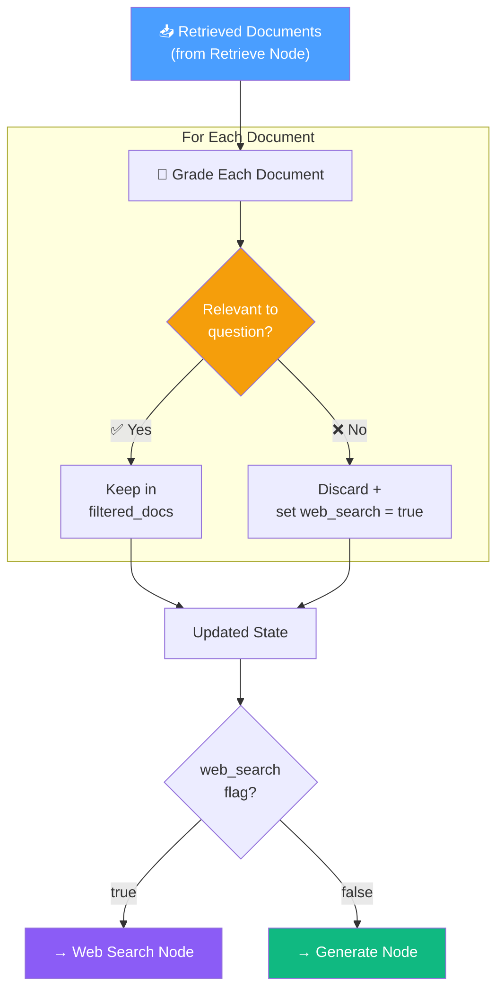
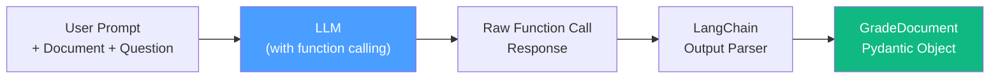
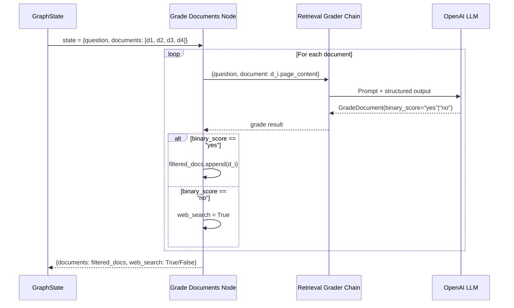
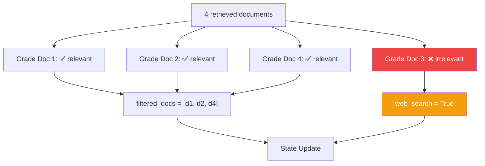

# 13.08 — Relevance Filter for RAG

## Overview

This lesson implements two critical components of the Corrective RAG flow: the **Retrieval Grader Chain** and the **Grade Documents Node**. Together, they form the **quality gate** that evaluates each retrieved document for relevance, filters out noise, and triggers a web search fallback when the vector store's coverage is insufficient.

> [!IMPORTANT]
> This is where Agentic RAG diverges from standard RAG. Instead of blindly trusting all retrieved documents, the system uses an LLM to **critically evaluate** each one.

---

## Conceptual Foundation: Using an LLM as a Judge

The core idea behind this lesson is surprisingly simple but powerful: **use an LLM to judge the quality of another process's output**.

In the previous step, the vector store retrieved documents based on embedding similarity. But embedding similarity is a mathematical measure — it tells you how close two vectors are in high-dimensional space. It doesn't tell you whether a document is actually *relevant* to a question in the way a human would understand relevance.

So we add a second opinion: we ask a language model — which understands language, context, and intent — to read each document and the original question, and simply answer: "Is this document relevant to this question? Yes or no."

This is like having two experts on your team:
- **Expert 1 (Vector Search):** "Based on the mathematical similarity of the text patterns, these 4 documents seem related to your question."
- **Expert 2 (LLM Grader):** "Let me read each one... Document 1, yes definitely relevant. Document 2, no this is about something different. Document 3, yes relevant. Document 4, borderline but yes."

By combining both experts, you get much better results than relying on either one alone.

### Why Not Just Improve the Vector Search?

You might ask: "Why not just make the vector search better so it only returns relevant documents?" While there are many ways to improve retrieval quality (better embeddings, re-ranking, hybrid search), no retrieval system is perfect. The LLM grader acts as a **safety net** that catches the inevitable mistakes, regardless of how good the retrieval system is.

---

## Architecture Overview



---

## Part 1: Retrieval Grader Chain

### Purpose

The Retrieval Grader is a **LangChain chain** that takes a single document and the original question, then returns a binary relevance score (`yes` or `no`) using structured LLM output.

The key challenge here is: how do we get a clean, programmatic answer from an LLM? If we just ask the LLM "Is this document relevant?" in plain text, it might respond with something like:

> "Well, the document does mention some concepts related to the question, but it's not directly about agent memory per se. I would say it's somewhat relevant but not entirely on topic..."

That's a perfectly reasonable LLM response, but it's **useless for our code**. We need a clean `yes` or `no` that our program can use in an `if` statement. This is where **structured output** and **Pydantic schemas** come in.

### Pydantic Schema

```python
# chains/retrieval_grader.py

from pydantic import BaseModel, Field

class GradeDocument(BaseModel):
    """Binary score for relevance of a retrieved document."""
    binary_score: str = Field(
        description="Documents are relevant to the question, 'yes' or 'no'"
    )
```

**What is this doing?** We're defining a Python class called `GradeDocument` that describes the **exact shape** of the LLM's response. It has one field: `binary_score`, which is a string that should be either `"yes"` or `"no"`.

The `Field(description=...)` is **critically important**. It's not just documentation for human readers — **the LLM actually reads this description** as part of the function calling schema. It guides the LLM to understand what to put in this field. Think of it as prompt engineering, but embedded in the data structure itself.

> [!NOTE]
> The `Field(description=...)` is **critically important** here. When using `with_structured_output()`, LangChain passes the field descriptions to the LLM as part of the function calling schema. The description guides the LLM's decision-making.

### Understanding Structured Output

Before we continue, let's make sure we deeply understand what **structured output** means and why it's so powerful.

In traditional LLM interactions, you send text in and get text out. The output is unstructured — it's just a string. If you want the LLM to give you a yes/no answer, you have to parse the string yourself, which is fragile and error-prone.

**Structured output** solves this by using OpenAI's **function calling** feature. Here's how it works:

1. You define a Pydantic model (like `GradeDocument`) that describes the shape of the data you want
2. LangChain converts this Pydantic model into a JSON Schema
3. This JSON Schema is sent to the LLM as a "function" definition — basically telling the LLM: "Instead of responding with free text, respond by calling this function with the appropriate arguments"
4. The LLM responds with a structured function call (e.g., `{"binary_score": "yes"}`)
5. LangChain parses this structured response back into a Pydantic object
6. You get back a clean Python object with typed attributes that you can use in your code

The result: instead of parsing free text and hoping for the best, you get a **guaranteed-schema** response that your code can work with confidently.

### Structured Output Configuration

```python
from langchain_openai import ChatOpenAI

llm = ChatOpenAI(temperature=0)

# Bind the Pydantic schema as a structured output
structured_llm_grader = llm.with_structured_output(GradeDocument)
```

**How `with_structured_output()` works under the hood:**



| Step | Detail |
|---|---|
| 1. **Schema binding** | The Pydantic model is converted to a JSON Schema and attached as a "function" for function calling |
| 2. **LLM invocation** | The LLM responds with a structured function call matching the schema |
| 3. **Parsing** | LangChain parses the function call arguments into a Pydantic object |
| 4. **Validation** | Pydantic validates the output types and constraints |

> [!WARNING]
> `with_structured_output()` requires an LLM that supports **function calling** (e.g., GPT-3.5-turbo, GPT-4). Models without function calling support will fail.

### Prompt Template

```python
from langchain_core.prompts import ChatPromptTemplate

system = """You are a grader assessing relevance of a retrieved document 
to a user question. If the document contains keywords or semantic meaning 
related to the question, grade it as relevant. Give a binary score 'yes' 
or 'no' to indicate whether the document is relevant to the question."""

grade_prompt = ChatPromptTemplate.from_messages([
    ("system", system),
    ("human", "Retrieved document: \n\n {document} \n\n User question: {question}"),
])
```

### Complete Chain

```python
retrieval_grader = grade_prompt | structured_llm_grader
```

The chain pipes the formatted prompt into the structured LLM, returning a `GradeDocument` object for each invocation.

---

## Part 2: Grade Documents Node

### Purpose

The **Grade Documents Node** iterates through all retrieved documents, invokes the grader chain on each one, filters out irrelevant documents, and sets the `web_search` flag if any document was discarded.

### Implementation

```python
# graph/nodes/grade_documents.py

from typing import Any, Dict
from graph.state import GraphState
from chains.retrieval_grader import retrieval_grader


def grade_documents(state: GraphState) -> Dict[str, Any]:
    """
    Grade each retrieved document for relevance to the question.
    Filter out irrelevant documents and flag for web search if needed.
    """
    print("---CHECK DOCUMENT RELEVANCE TO QUESTION---")
    
    question = state["question"]
    documents = state["documents"]
    
    filtered_docs = []
    web_search = False
    
    for doc in documents:
        # Invoke the grader chain for each document
        score = retrieval_grader.invoke({
            "question": question,
            "document": doc.page_content,
        })
        
        grade = score.binary_score
        
        if grade.lower() == "yes":
            print("---GRADE: DOCUMENT RELEVANT---")
            filtered_docs.append(doc)
        else:
            print("---GRADE: DOCUMENT NOT RELEVANT---")
            web_search = True  # Trigger fallback search
            continue
    
    return {
        "documents": filtered_docs,
        "question": question,
        "web_search": web_search,
    }
```

### Execution Flow



---

## Part 3: Testing the Grader

### Test Strategy

Testing LLM-based applications presents unique challenges:

| Challenge | Description |
|---|---|
| **Non-determinism** | LLM responses are stochastic — same input may yield different outputs |
| **Third-party dependency** | OpenAI API availability, rate limits, and errors |
| **Cost** | Each test invocation costs API tokens |
| **CI/CD integration** | Flaky tests are problematic in automated pipelines |

> [!TIP]
> Despite these challenges, **manual test runs provide essential sanity checks**. Even without CI/CD integration, running tests locally validates that chains work correctly during development.

### Test Cases

```python
# chains/tests/test_chains.py

from dotenv import load_dotenv
load_dotenv()

from chains.retrieval_grader import GradeDocument, retrieval_grader
from ingestion import retriever


def test_retrieval_grader_answer_yes():
    """Test: relevant document should be graded as 'yes'."""
    question = "agent memory"
    docs = retriever.invoke(question)
    doc_text = docs[1].page_content  # Highest-scored doc about agent memory
    
    result: GradeDocument = retrieval_grader.invoke({
        "question": question,
        "document": doc_text,
    })
    
    assert result.binary_score == "yes"


def test_retrieval_grader_answer_no():
    """Test: irrelevant question should yield 'no' for a topic-specific document."""
    question = "agent memory"
    docs = retriever.invoke(question)
    doc_text = docs[0].page_content  # Doc about agent memory
    
    # Ask about something completely unrelated
    result: GradeDocument = retrieval_grader.invoke({
        "question": "how to make pizza",  # Intentional mismatch
        "document": doc_text,
    })
    
    assert result.binary_score == "no"
```

### Running Tests

```bash
pytest . -s -v
# Expected: 2 passed
```

---

## The Web Search Heuristic

The decision logic for triggering web search is a **simple but effective heuristic**:

```python
if any document is NOT relevant:
    web_search = True   # → route to Web Search Node
else:
    web_search = False  # → route to Generate Node
```



**Rationale**: If the vector store returned even one irrelevant document for the query, it may not have complete coverage of the topic. Supplementing with real-time web search provides additional, potentially more current information.

---

## State Update Summary

| Field | Before (from Retrieve) | After (from Grade Docs) |
|---|---|---|
| `question` | `"What is agent memory?"` | `"What is agent memory?"` (unchanged) |
| `documents` | `[doc1, doc2, doc3, doc4]` | `[doc1, doc2, doc4]` (filtered) |
| `web_search` | `undefined` | `True` (at least one doc was irrelevant) |
| `generation` | `undefined` | `undefined` (not set by this node) |

> [!TIP]
> GitHub branch reference: `6-grade-document-node`