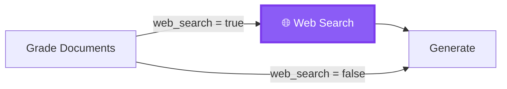
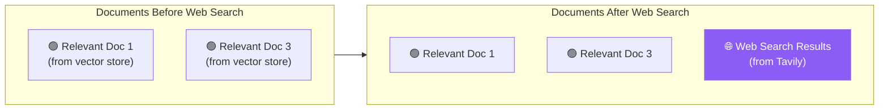
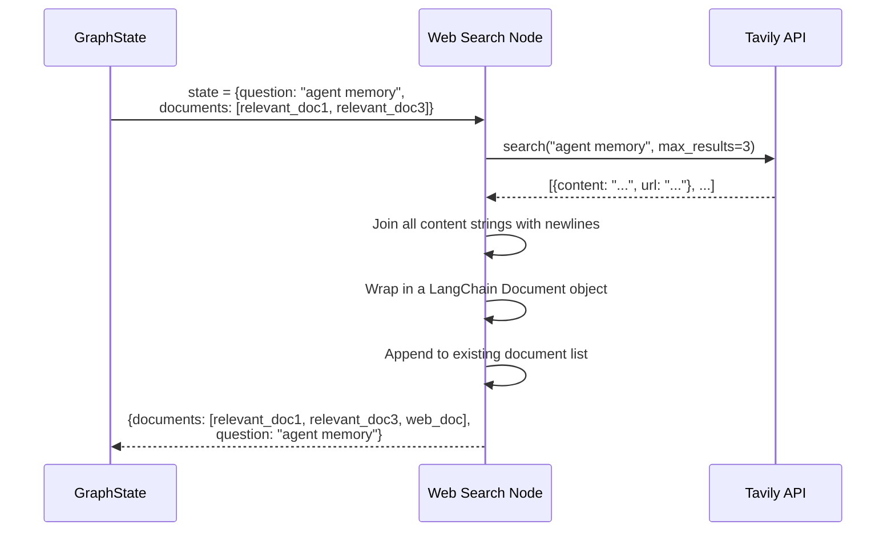

# 13.09 — Web Search Node with Tavily API

## Overview

The **Web Search Node** is the fallback retrieval mechanism in the Corrective RAG flow. When the Grade Documents Node determines that the vector store's coverage is insufficient (by setting `web_search = True`), this node performs an **external web search** using the Tavily API and incorporates the results into the document set.

Think of it as a backup plan: your local library (vector store) didn't have everything you needed, so you go online (web search) to find additional information. The key insight is that you don't throw away what your library had — you **add** the web results to the library materials you already have.

> [!NOTE]
> [Tavily](https://tavily.com/) is a search engine specifically optimized for LLM-based applications. Unlike Google or Bing, which return HTML pages full of ads and navigation elements, Tavily returns **clean, content-focused results** — just the text you need, ready to be consumed by a language model. This saves you from having to scrape, parse, and clean web pages.

---

## When Does This Node Run?

The Web Search Node does **not** run on every query. It only executes when the Grade Documents Node explicitly triggers it by setting `web_search = True` in the state. This happens when at least one retrieved document was graded as irrelevant.



**Why not always search the web?** Because web search:
- Costs API credits (Tavily is a paid service)
- Adds latency (network round-trip to Tavily's servers)
- May introduce noise (web content can be low-quality or irrelevant)

By only triggering web search when the vector store's coverage is demonstrably insufficient, the system stays efficient on easy queries and only pays the extra cost when it's actually needed.

---

## Implementation

```python
# graph/nodes/web_search.py

from typing import Any, Dict
from langchain.schema import Document
from langchain_community.tools.tavily_search import TavilySearchResults
from graph.state import GraphState

# Initialize Tavily with max 3 results
web_search_tool = TavilySearchResults(max_results=3)


def web_search(state: GraphState) -> Dict[str, Any]:
    """
    Perform web search using Tavily and add results to documents.
    
    Args:
        state: Current graph state with question and filtered documents
        
    Returns:
        Updated state with web search results appended to documents
    """
    print("---WEB SEARCH---")
    
    question = state["question"]
    documents = state["documents"]
    
    # Invoke Tavily search
    tavily_results = web_search_tool.invoke({"query": question})
    
    # Combine all search result contents into a single string
    joined_content = "\n".join(
        [result["content"] for result in tavily_results]
    )
    
    # Wrap in a LangChain Document
    web_results = Document(page_content=joined_content)
    
    # Append to existing documents (or create new list)
    if documents is not None:
        documents.append(web_results)
    else:
        documents = [web_results]
    
    return {
        "documents": documents,
        "question": question,
    }
```

Let's break this down step by step:

### Step 1: Extract State

```python
question = state["question"]  # The original user question
documents = state["documents"]  # Already-filtered relevant documents from Grade Docs
```

**Important context:** By the time this node runs, the `documents` list has already been filtered by the Grade Documents Node. So `documents` contains **only** the documents that were graded as relevant. The irrelevant ones have already been removed. This means we're building on a clean foundation — we're supplementing quality content, not mixing good and bad.

### Step 2: Invoke Tavily Search

```python
tavily_results = web_search_tool.invoke({"query": question})
```

This sends the user's original question to Tavily's search API. Tavily searches the web and returns up to 3 results (because we set `max_results=3`).

### Step 3: Process Search Results

Tavily returns a list of dictionaries, where each dictionary represents one search result:

```python
# Example Tavily response:
[
    {
        "content": "Agent memory in AI systems refers to the mechanisms 
                    by which artificial agents store, retrieve, and utilize 
                    information across interactions...",
        "url": "https://example.com/agent-memory"
    },
    {
        "content": "There are several types of memory in AI agents: 
                    short-term memory (sensory buffer), long-term memory 
                    (knowledge store), and episodic memory...",
        "url": "https://example.com/ai-memory-types"
    },
    {
        "content": "Recent research has explored how memory architectures 
                    can improve autonomous agent performance in complex 
                    planning tasks...",
        "url": "https://example.com/memory-architectures"
    }
]
```

Notice that each result has a `content` field (the useful text) and a `url` field (where it came from). We only need the content — the URL isn't used downstream.

### Step 4: Combine Into a Single Document

```python
joined_content = "\n".join([result["content"] for result in tavily_results])
web_results = Document(page_content=joined_content)
```

This takes the `content` from all 3 search results, joins them with newlines into one big string, and wraps it in a LangChain `Document` object. The result is a single document containing all web search information.

**Why combine into a single document instead of keeping them separate?** This is a design choice. Keeping them as one document:
- Simplifies the document list management downstream
- Reduces the total number of documents the LLM has to process
- Treats all web search content as a single supplementary source

You could also create separate documents for each search result, but for this implementation, the simpler approach works well.

### Step 5: Merge with Existing Documents

```python
if documents is not None:
    documents.append(web_results)
else:
    documents = [web_results]
```

This is the **critical merging step**. Web search results are **appended** to the existing filtered documents — they don't replace them:



The Generate Node will now receive a richer set of documents: the best of the vector store PLUS supplementary web information. This gives the LLM a more complete picture when generating the answer.

**Edge case — no documents survived grading:** If the Grade Documents Node filtered out ALL documents (every single one was irrelevant), then `documents` might be empty or `None`. In that case, the web search results become the **only** context available. This is still better than having no context at all — the LLM can generate an answer based purely on what Tavily found online.

---

## Execution Flow



---

## Why Tavily Instead of Regular Google Search?

You might wonder why the system uses Tavily instead of just scraping Google search results. Here's why:

| Aspect | Google/Bing | Tavily |
|---|---|---|
| **Output format** | HTML pages with ads, navigation, scripts, and other noise | Clean `{content, url}` JSON — just the text you need |
| **Content extraction** | You'd need to scrape each page, parse HTML, remove boilerplate | Already done for you — content is pre-extracted and clean |
| **API access** | Complex APIs, rate limits, legal restrictions on scraping | Simple REST API designed specifically for programmatic access |
| **LLM optimization** | Not designed for LLM consumption | Specifically optimized to return content that's useful for LLMs |
| **Speed** | Would need multiple HTTP requests + parsing | Single API call returns everything |

In short, Tavily saves you from building an entire web scraping and content extraction pipeline. It's purpose-built for this exact use case.

---

## State Update Summary

| Field | Before (from Grade Docs) | After (from Web Search) |
|---|---|---|
| `question` | `"What is agent memory?"` | `"What is agent memory?"` (unchanged) |
| `documents` | `[doc1, doc3]` (filtered, only relevant docs) | `[doc1, doc3, web_doc]` (supplemented with web results) |
| `web_search` | `True` | `True` (unchanged — this node doesn't modify the flag) |
| `generation` | `undefined` | `undefined` (not set by this node) |

---

## Summary

The Web Search Node acts as the **safety net** of the Agentic RAG system:

1. **Trigger**: Only runs when `web_search = True` (set by Grade Documents Node)
2. **Action**: Queries the Tavily Search API with the user's original question, getting up to 3 results
3. **Processing**: Concatenates all search result contents into a single LangChain Document
4. **Merging**: Appends the web result document to the already-filtered relevant documents from the vector store
5. **Next Step**: Forwards the enriched document set to the Generate Node

The key principle is **supplementation, not replacement**. Good documents from the vector store are kept. Web search adds more information to fill the gaps. The Generate Node then gets the **best of both worlds** — curated local knowledge plus fresh web information.

> [!TIP]
> GitHub branch reference: `7-web-search-node`