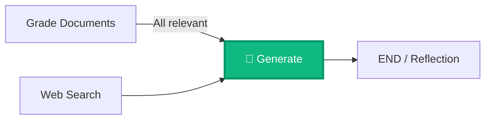
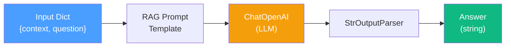
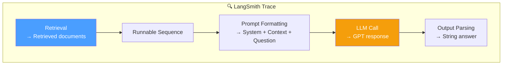

# 13.10 — LLM Generation Node

## Overview

The **Generation Node** is the final processing stage in the core RAG pipeline. After all the hard work of retrieving, grading, filtering, and optionally web searching — we finally have a curated, high-quality set of documents. Now it's time to actually **answer the question**.

This node takes the curated documents and the original question, passes them to an LLM with a carefully crafted RAG prompt, and produces a natural language answer. This is where the **"Generation"** in "Retrieval-Augmented Generation" happens.

This lesson implements two components:
- The **Generation Chain** — the LLM logic (prompt + model + output parser)
- The **Generate Node** — the state management wrapper that plugs the chain into the graph

---

## Node Position in the Graph



The Generate Node runs **after** all document preparation is complete. It receives documents via one of two paths:
- **Direct path**: Grade Documents → Generate (when all documents were relevant, no web search needed)
- **Fallback path**: Grade Documents → Web Search → Generate (when some documents were irrelevant and web search was triggered)

Either way, by the time we reach this node, `state["documents"]` contains only high-quality, relevant content — the best foundation for generating a good answer.

---

## Part 1: The Generation Chain

### What Is a Chain?

In LangChain, a **chain** is a sequence of processing steps connected together using the pipe operator (`|`). Data flows through each step in order, with the output of one step becoming the input of the next. Think of it like a pipeline in a factory — raw materials go in one end, and a finished product comes out the other.

### What Is LCEL?

**LCEL (LangChain Expression Language)** is the syntax for building chains. The pipe operator `|` connects components together. It's inspired by Unix pipes (`cat file.txt | grep "search" | wc -l`), where data flows from left to right through a series of transformations.

### The RAG Prompt

The chain uses a standard RAG prompt pulled from the **LangChain Hub** (`rlm/rag-prompt`). The LangChain Hub is a repository of community-shared, pre-tested prompts. The `rlm/rag-prompt` is maintained by the LangChain team and is specifically designed for RAG question-answering.

This prompt tells the LLM:
- **Role**: You are an assistant for question-answering tasks
- **Context**: Here are the retrieved documents (the `{context}` variable)
- **Question**: Here is what the user asked (the `{question}` variable)
- **Constraints**: Use three sentences maximum, keep the answer concise, and if you don't know the answer, say so

The two key variables the prompt expects:
- `context` — The retrieved/filtered documents that will be injected as the LLM's knowledge base
- `question` — The user's original question that needs to be answered

### Chain Construction

```python
# chains/generation.py

from langchain import hub
from langchain_core.output_parsers import StrOutputParser
from langchain_openai import ChatOpenAI

# Initialize the LLM with temperature=0 for deterministic responses
llm = ChatOpenAI(temperature=0)

# Pull the RAG prompt from LangChain Hub
prompt = hub.pull("rlm/rag-prompt")

# Build the chain using LCEL (pipe operator)
generation_chain = prompt | llm | StrOutputParser()
```

Let's understand each component:

**`ChatOpenAI(temperature=0)`** — Creates an LLM client for OpenAI's GPT model. `temperature=0` means the model will always choose the most likely next token, making responses more deterministic and consistent. For factual Q&A, low temperature is preferred over high temperature (which introduces randomness and creativity).

**`hub.pull("rlm/rag-prompt")`** — Downloads a pre-built prompt template from the LangChain Hub. This saves you from writing your own RAG prompt and ensures you're using a well-tested template.

**`StrOutputParser()`** — The LLM returns an `AIMessage` object (which includes metadata like token usage). The `StrOutputParser` extracts just the text content from this message, giving you a clean string.

### Chain Pipeline Visualization



**Step by step, here's what happens when you invoke the chain:**

1. **Input**: You pass a dictionary `{"context": documents, "question": "What is agent memory?"}` to the chain
2. **Prompt Template**: The RAG prompt template takes these values and produces a formatted chat message. The documents get inserted into the `{context}` placeholder, and the question gets inserted into the `{question}` placeholder. The result is a complete prompt like: *"You are an assistant for question-answering tasks. Use the following context to answer: [document text here]. Question: What is agent memory?"*
3. **LLM Call**: The formatted prompt is sent to OpenAI's GPT model. The model processes the prompt and generates a response based on the provided context.
4. **Output Parser**: The `StrOutputParser` extracts the text content from the LLM's response, stripping away the `AIMessage` wrapper and metadata. You get back a clean string like: *"Agent memory refers to the mechanisms by which AI agents store and retrieve information..."*

| Component | What It Does | Input | Output |
|---|---|---|---|
| **RAG Prompt** | Formats system instructions + context + question into a chat message | `{context, question}` dict | Formatted chat prompt |
| **ChatOpenAI** | Sends the prompt to OpenAI's GPT and gets a response | Chat prompt | `AIMessage` object |
| **StrOutputParser** | Extracts the text string from the AI message | `AIMessage` | Plain string answer |

---

## Part 2: The Generate Node

The Generate Node is the **state management wrapper** for the generation chain. It reads the necessary inputs from the graph state, invokes the chain, and writes the result back to the state.

### Implementation

```python
# graph/nodes/generate.py

from typing import Any, Dict
from graph.state import GraphState
from chains.generation import generation_chain


def generate(state: GraphState) -> Dict[str, Any]:
    """
    Generate an answer using the RAG generation chain.

    Args:
        state: Current graph state with question and curated documents

    Returns:
        Updated state with the LLM-generated answer
    """
    print("---GENERATE---")

    question = state["question"]
    documents = state["documents"]

    # Invoke the generation chain
    generation = generation_chain.invoke({
        "context": documents,
        "question": question,
    })

    return {
        "documents": documents,
        "question": question,
        "generation": generation,  # NEW: the LLM's answer
    }
```

**Walking through this code:**

1. **Read from state**: Extract the `question` and `documents` from the current graph state. At this point, `documents` contains only curated, relevant content (filtered by Grade Documents, possibly supplemented by Web Search).

2. **Invoke the chain**: Pass the documents as `context` and the question to the generation chain. The chain formats the prompt, calls the LLM, and returns a clean string answer.

3. **Write to state**: Return a dictionary that updates the state. The critical new field is `generation` — this is the LLM's answer. The `documents` and `question` are passed through unchanged.

### State Update

| Field | Before | After |
|---|---|---|
| `question` | `"What is agent memory?"` | `"What is agent memory?"` (unchanged) |
| `documents` | `[doc1, doc3, web_doc]` | `[doc1, doc3, web_doc]` (unchanged) |
| `web_search` | `True` | `True` (unchanged) |
| `generation` | `undefined` | `"Agent memory refers to the mechanisms..."` **(NEW — this is the answer!)** |

Notice that this is the first node that populates the `generation` field. All previous nodes were focused on preparing the documents; this node actually produces the answer.

---

## Part 3: Testing the Generation Chain

```python
# chains/tests/test_chains.py

from pprint import pprint
from chains.generation import generation_chain
from ingestion import retriever


def test_generation_chain():
    """Sanity check: verify the generation chain produces output."""
    question = "agent memory"
    docs = retriever.invoke(question)

    generation = generation_chain.invoke({
        "context": docs,
        "question": question,
    })

    pprint(generation)
    # Visual inspection — verify the answer is about agent memory
    assert len(generation) > 0
```

**Why is this test so simple?** Testing LLM-based applications is inherently challenging because:

- **Non-determinism**: Even with `temperature=0`, the LLM might produce slightly different responses across different API calls (especially with model updates)
- **No exact expected output**: We can't assert that the answer equals a specific string, because there are many valid ways to answer "What is agent memory?"
- **Content validation is subjective**: Whether an answer is "good enough" depends on interpretation

So instead of a precise assertion, we do a **sanity check**: the chain should produce a non-empty output, and by printing it with `pprint`, we can visually verify it's about agent memory. This is a pragmatic approach — not perfect, but much better than no testing at all.

> [!NOTE]
> This test is a **sanity check** rather than a strict assertion. Because LLM responses are non-deterministic, we verify that the chain produces a non-empty output and visually inspect the result. The `pprint` output helps confirm the answer is topically relevant.

---

## Observability with LangSmith

One of the most powerful features of this architecture is **full observability** through LangSmith. After running the generation, you can inspect the entire chain execution in the LangSmith dashboard:



In the LangSmith dashboard, you can inspect:
- **The exact documents** that were used as context — see what information the LLM had access to
- **The fully formatted prompt** — see the exact text that was sent to the LLM, including all template variables filled in
- **The raw LLM response** — see what the model actually said before any parsing
- **Token usage** — how many tokens were consumed (input + output), which directly affects cost
- **Latency** — how long each step took, helping identify bottlenecks

This observability is invaluable for debugging. If the answer is wrong, you can trace back through each step and ask: Were the right documents retrieved? Were they relevant? Was the prompt formatted correctly? Did the LLM respond sensibly?

---

## Summary

The Generation Node completes the core RAG pipeline. After all the retrieval and quality control, it's the node that actually produces the answer:

1. **Input**: Curated documents + original question
2. **Chain**: RAG prompt (from LangChain Hub) → LLM (ChatOpenAI) → String output parser
3. **Output**: Natural language answer stored in `state["generation"]`

| Component | File | Purpose |
|---|---|---|
| Generation Chain | `chains/generation.py` | The LLM logic — formats the prompt, calls the model, parses the response |
| Generate Node | `graph/nodes/generate.py` | The state wrapper — reads inputs from state, invokes the chain, writes the answer back |
| Test | `chains/tests/test_chains.py` | Sanity check — verifies the chain produces non-empty output |

> [!IMPORTANT]
> In the basic CRAG flow, the Generate Node is the **terminal node** — after generation, the graph ends and the answer is returned to the user. But in the next lesson (Self-RAG), we add a **reflection layer** after generation that checks whether the answer is actually good before returning it. This changes the Generate Node from a terminal node to a mid-flow node, with conditional branching happening after it.

> [!TIP]
> GitHub branch reference: `8-generate-node`