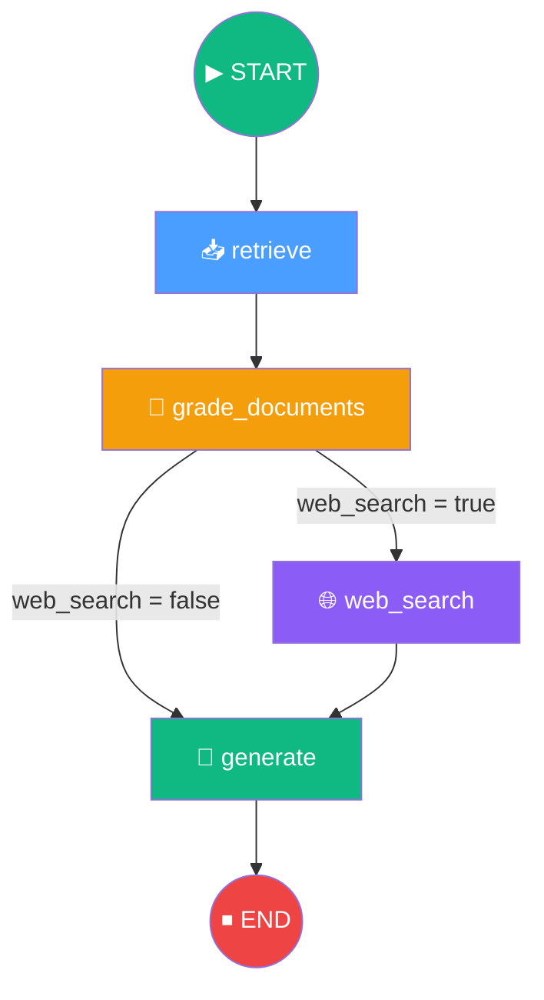
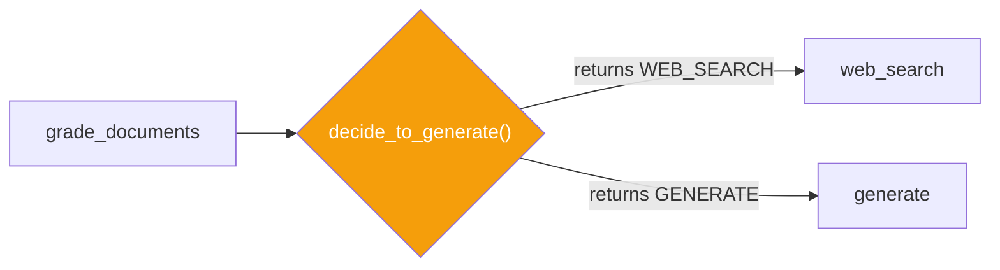
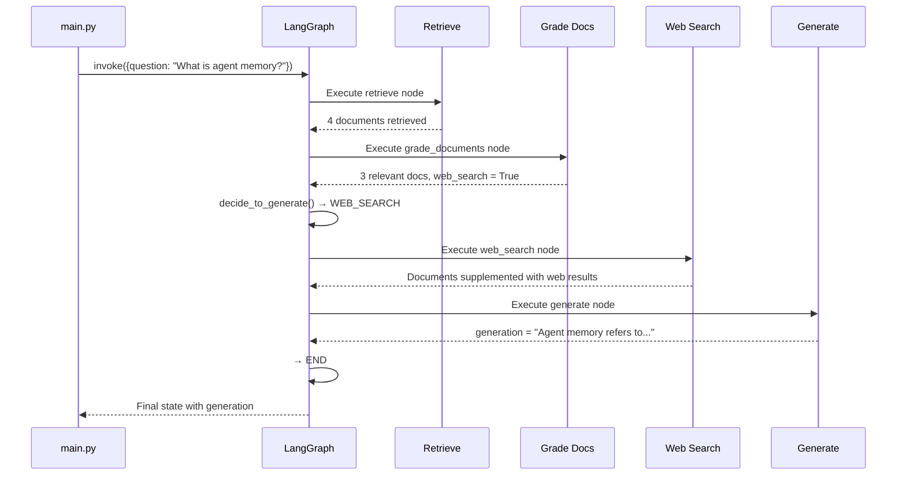

# 13.11 — Running the Complete LangGraph Agent

## Overview

This lesson is the **culmination of the Corrective RAG implementation**. All previously built components — nodes, chains, state, and constants — are wired together into a single **LangGraph StateGraph**. The graph is compiled, visualized, and executed end-to-end.

Up until now, we've built individual bricks: the Retrieve Node, the Grade Documents Node, the Web Search Node, the Generate Node, and all the chains that power them. But these pieces don't know about each other. They're just standalone functions sitting in separate files.

This lesson is where we connect them all together. We tell LangGraph: "Here are the nodes. Here's the order they should run in. Here are the conditions for branching. Here's where the graph starts. Here's where it ends." The result is a **compiled graph** — a fully functional Agentic RAG agent that can process any question from start to finish.

Think of it like building a circuit: you've manufactured all the individual components (resistors, capacitors, LEDs), and now you're soldering them onto a circuit board and connecting them with wires.

---

## The Complete CRAG Graph



---

## Step 1: Export Nodes via `__init__.py`

Before wiring the graph, all node functions must be importable from the `nodes` package:

```python
# graph/nodes/__init__.py

from graph.nodes.generate import generate
from graph.nodes.grade_documents import grade_documents
from graph.nodes.retrieve import retrieve
from graph.nodes.web_search import web_search

__all__ = ["generate", "grade_documents", "retrieve", "web_search"]
```

The `__all__` list makes these functions accessible via `from graph.nodes import *` or individual imports from outside the package.

---

## Step 2: Define Constants

Centralized node name constants prevent magic string duplication:

```python
# graph/consts.py

RETRIEVE = "retrieve"
GRADE_DOCUMENTS = "grade_documents"
GENERATE = "generate"
WEB_SEARCH = "web_search"
```

| Constant | Value | Referenced By |
|---|---|---|
| `RETRIEVE` | `"retrieve"` | Entry point, edge definitions |
| `GRADE_DOCUMENTS` | `"grade_documents"` | Edge source, conditional edge |
| `GENERATE` | `"generate"` | Conditional edge target, terminal edge |
| `WEB_SEARCH` | `"web_search"` | Conditional edge target, edge source |

> [!TIP]
> Using constants ensures that if a node name changes, you only update **one place** (`consts.py`). All references stay consistent.

---

## Step 3: Build the Graph

### Imports

```python
# graph/graph.py

from dotenv import load_dotenv
from langgraph.graph import END, StateGraph

from graph.consts import RETRIEVE, GRADE_DOCUMENTS, GENERATE, WEB_SEARCH
from graph.nodes import generate, grade_documents, retrieve, web_search
from graph.state import GraphState

load_dotenv()
```

### Conditional Edge Function

The `decide_to_generate` function determines whether to route to web search or directly to generation:

```python
def decide_to_generate(state: GraphState) -> str:
    """
    Conditional edge: route based on the web_search flag.

    Returns:
        WEB_SEARCH if any document was irrelevant
        GENERATE if all documents were relevant
    """
    if state["web_search"]:
        return WEB_SEARCH
    else:
        return GENERATE
```

### Graph Assembly

```python
# Create the state graph
workflow = StateGraph(GraphState)

# Add nodes (not yet connected)
workflow.add_node(RETRIEVE, retrieve)
workflow.add_node(GRADE_DOCUMENTS, grade_documents)
workflow.add_node(GENERATE, generate)
workflow.add_node(WEB_SEARCH, web_search)

# Set entry point
workflow.set_entry_point(RETRIEVE)

# Add edges
workflow.add_edge(RETRIEVE, GRADE_DOCUMENTS)

# Conditional edge: grade_documents → web_search OR generate
workflow.add_conditional_edges(
    GRADE_DOCUMENTS,               # Source node
    decide_to_generate,            # Decision function
    {
        WEB_SEARCH: WEB_SEARCH,    # Path map: key → target node
        GENERATE: GENERATE,
    },
)

workflow.add_edge(WEB_SEARCH, GENERATE)
workflow.add_edge(GENERATE, END)

# Compile the graph
app = workflow.compile()

# Export the graph visualization
app.get_graph().draw_mermaid_png(output_file_path="graph.png")
```

---

## Understanding `add_conditional_edges`

The `add_conditional_edges` method has three arguments:

```python
workflow.add_conditional_edges(
    source_node,       # Where the conditional routing starts
    decision_function, # Function that returns a string (edge label)
    path_map,          # Dict mapping edge labels → target node names
)
```



### Path Map Explained

The `path_map` dictionary maps the **return value** of the decision function to the **actual node** to execute:

| Return Value | Target Node | When |
|---|---|---|
| `WEB_SEARCH` ("web_search") | Web Search | At least one document was irrelevant |
| `GENERATE` ("generate") | Generate | All documents were relevant |

> [!NOTE]
> In this case, the return values happen to match the node names, making the path map seem redundant. However, the path map is essential when the decision function returns **semantic labels** (like "useful" or "not_supported") that don't match node names — as we'll see in the Self-RAG lesson.

---

## Step 4: Execute the Graph

```python
# main.py

from dotenv import load_dotenv
from graph.graph import app

load_dotenv()

if __name__ == "__main__":
    result = app.invoke({"question": "What is agent memory?"})
    print(result["generation"])
```

### Example Execution Trace

```
---RETRIEVE---
---CHECK DOCUMENT RELEVANCE TO QUESTION---
---GRADE: DOCUMENT RELEVANT---
---GRADE: DOCUMENT RELEVANT---
---GRADE: DOCUMENT NOT RELEVANT---     ← One doc is irrelevant
---GRADE: DOCUMENT RELEVANT---
---WEB SEARCH---                       ← Web search triggered
---GENERATE---
Agent memory refers to the mechanisms by which AI agents store, 
recall, and utilize information across interactions...
```



---

## LangSmith Tracing

The complete execution is visible in the LangSmith dashboard:

| Trace Element | Content |
|---|---|
| **Graph Start** | Input question |
| **Retrieve** | Vector store query + retrieved documents |
| **Grade Documents** | Per-document relevance scores |
| **Web Search** | Tavily query + search results |
| **Generate** | Full prompt (context + question) + LLM response |
| **Graph End** | Final state with generation |

> [!TIP]
> LangSmith traces are invaluable for debugging. If the answer is wrong, you can trace back through each node to identify whether the issue was in retrieval, grading, web search, or generation.

---

## Summary

| Component | File | Role |
|---|---|---|
| Node exports | `graph/nodes/__init__.py` | Makes nodes importable |
| Constants | `graph/consts.py` | Centralized node name strings |
| Conditional edge | `decide_to_generate()` in `graph.py` | Routes based on `web_search` flag |
| Graph assembly | `graph/graph.py` | Wires nodes + edges into StateGraph |
| Entry point | `main.py` | Invokes the compiled graph |
| Visualization | `graph.png` | Auto-generated graph diagram |

The Corrective RAG graph is now **fully operational**. The next lessons extend this graph with **Self-RAG** (answer reflection) and **Adaptive RAG** (intelligent query routing).

> [!TIP]
> GitHub branch reference: `9-langgraph`