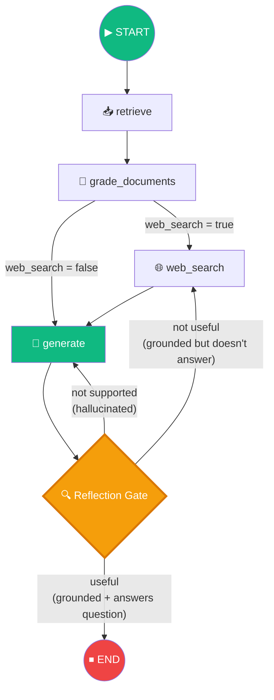
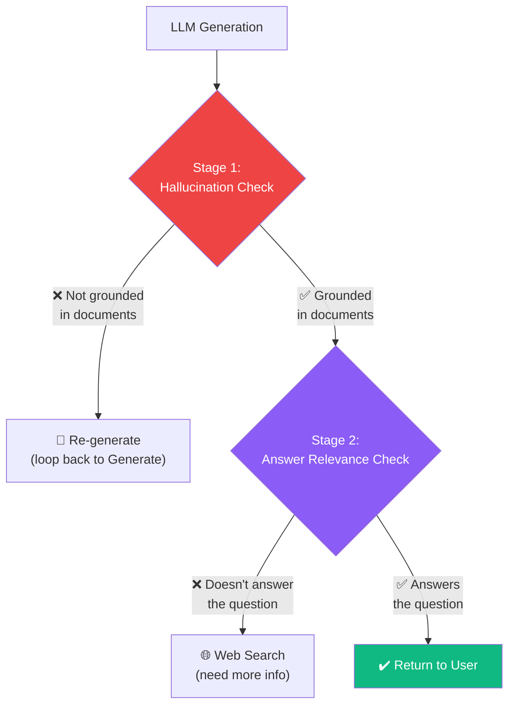
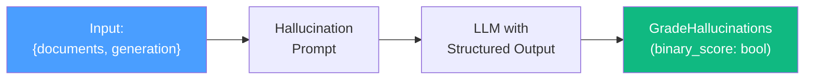
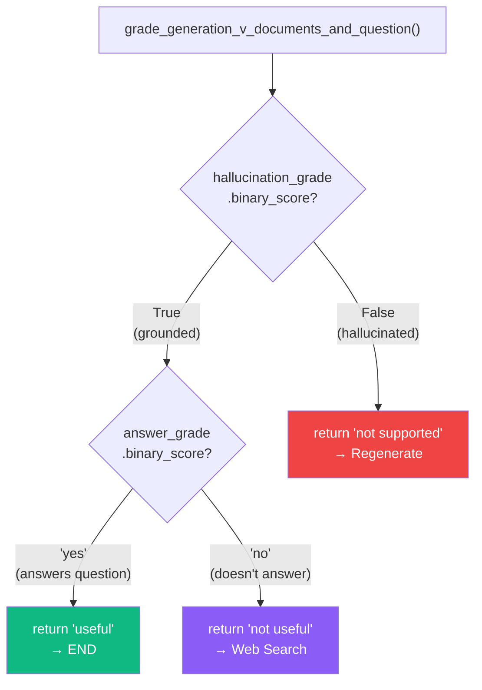
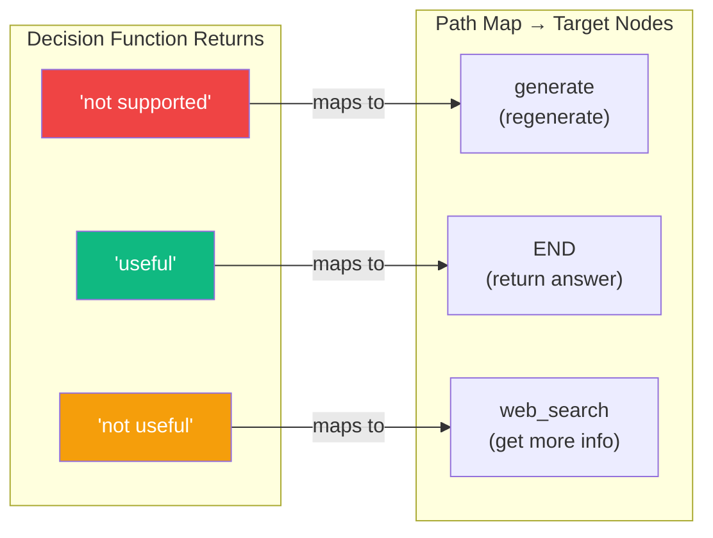

# 13.12 — Self-RAG

## Overview

**Self-RAG** extends the Corrective RAG pipeline by adding a **reflection layer after generation**. Instead of blindly returning the LLM's answer, the system critically evaluates the response through two quality checks:

1. **Hallucination Check** — Is the answer grounded in the provided documents?
2. **Answer Relevance Check** — Does the answer actually address the user's question?

Based on these checks, the system can **accept**, **regenerate**, or **re-search** — creating a self-correcting loop.

> [!IMPORTANT]
> Self-RAG is derived from the [Self-RAG: Learning to Retrieve, Generate, and Critique through Self-Reflection](https://arxiv.org/abs/2310.11511) research paper. The key insight is that **generation quality can be dramatically improved by reflecting on the output** before returning it to the user.

---

## Why Do We Need Answer Reflection?

Up to this point in the Agentic RAG pipeline, we've been very careful about the **input quality** — we graded documents, filtered out irrelevant ones, and supplemented with web search. But we haven't checked the **output quality** at all. We've been trusting that if the LLM gets good input, it will produce good output.

This isn't always true. LLMs can fail in two distinct ways even when given perfect context:

### Failure Mode 1: Hallucination

**What it is:** The LLM generates information that is **not present in the provided documents**. It makes things up, sometimes very convincingly.

**Why it happens:** LLMs are trained on vast amounts of text and have enormous "knowledge" baked into their parameters. When generating, they sometimes blend their pre-trained knowledge with the provided context, producing statements that sound plausible and factual but aren't supported by the actual documents.

**Example:** 
- **Documents say:** "Agent memory has two types: short-term and long-term."
- **LLM generates:** "Agent memory has three types: short-term, long-term, and episodic. The episodic type was introduced by Smith et al. in 2023."
- **Problem:** The documents never mentioned "episodic" memory or "Smith et al." The LLM pulled this from its training data and presented it as fact.

This is especially dangerous because the hallucinated content often sounds perfectly reasonable. A user reading this response would have no way to know that the "episodic memory" claim isn't in the source documents.

### Failure Mode 2: Answer Doesn't Address the Question

Sometimes the LLM generates an answer that is perfectly **grounded** in the documents — every fact it states is actually in the context — but the answer doesn't actually **answer what was asked**.

**Example:**
- **Question:** "How does agent memory persist across sessions?"
- **Documents contain:** General information about types of agent memory
- **LLM generates:** "Agent memory consists of short-term memory (working memory buffer) and long-term memory (knowledge store). Short-term memory holds recently accessed information..."
- **Problem:** This is all factually correct and grounded in the documents, but it doesn't answer the specific question about persistence *across sessions*.

This happens when the documents simply don't contain the specific information needed to answer the question, but the LLM tries its best to generate *something* relevant rather than admitting "I don't have enough information to answer this specific question."

### The Self-RAG Solution

Self-RAG addresses both failure modes by adding a **reflection step** after generation — the system checks its own work before presenting it to the user. The analogy is a student who writes an essay, then re-reads it before submitting to check: (1) "Did I cite sources for all my claims?" and (2) "Did I actually answer the question that was asked?"

---

## Extended Graph Architecture



The key addition is the **Reflection Gate** after the Generate node — a conditional edge that runs two grader chains before deciding the next step. Notice the **loops** — the system can cycle back to Generate (if hallucinating) or to Web Search (if the answer doesn't address the question) multiple times.

This creates a **self-correcting feedback loop**. The system keeps trying until it produces an answer that passes both quality checks, or until it exhausts its options.

---

## The Two-Stage Reflection Process

The reflection happens in two sequential stages. Stage 2 only runs if Stage 1 passes. This is intentional — there's no point checking if the answer addresses the question if the answer is hallucinated in the first place.



| Check | Question Asked | Yes Outcome | No Outcome |
|---|---|---|---|
| **Hallucination** | Is the answer grounded in the documents? | → Proceed to answer check | → Regenerate (loop to Generate node) |
| **Answer Relevance** | Does the answer address the question? | → Return answer (useful) | → Web search (need more info) |

---

## Part 1: Hallucination Grader Chain

### Purpose

Determines whether the LLM's generation is **supported by / grounded in** the provided documents. If the answer contains claims not found in the context, it is flagged as hallucinated.

### Pydantic Schema

```python
# chains/hallucination_grader.py

from pydantic import BaseModel, Field

class GradeHallucinations(BaseModel):
    """Binary score for hallucination present in generated answer."""
    binary_score: bool = Field(
        description="Answer is grounded in the facts, 'yes' or 'no'"
    )
```

> [!NOTE]
> Unlike the retrieval grader (which uses `str`), the hallucination grader uses a **boolean** for `binary_score`. LangChain's output parser will cast the LLM's yes/no response into `True`/`False` automatically.

### System Prompt

```
You are a grader assessing whether an LLM generation is grounded in / 
supported by a set of retrieved facts. Give a binary score 'yes' or 'no'. 
Yes means that the answer is grounded in / supported by the set of facts.
```

### Human Message Template

```
Set of facts:

{documents}

LLM generation: {generation}
```

### Chain Construction

```python
from langchain_openai import ChatOpenAI
from langchain_core.prompts import ChatPromptTemplate

llm = ChatOpenAI(temperature=0)
structured_llm_grader = llm.with_structured_output(GradeHallucinations)

hallucination_prompt = ChatPromptTemplate.from_messages([
    ("system", system_message),
    ("human", "Set of facts: \n\n {documents} \n\n LLM generation: {generation}"),
])

hallucination_grader = hallucination_prompt | structured_llm_grader
```

### Chain Flow



---

## Part 2: Answer Grader Chain

### Purpose

Determines whether the LLM's generation **actually answers / addresses** the user's original question. An answer can be perfectly grounded in documents but still fail to answer what was asked.

### Pydantic Schema

```python
# chains/answer_grader.py

from pydantic import BaseModel, Field

class GradeAnswer(BaseModel):
    """Binary score to assess if answer addresses the question."""
    binary_score: str = Field(
        description="Answer addresses the question, 'yes' or 'no'"
    )
```

### System Prompt

```
You are a grader assessing whether an answer addresses / resolves a question.
Give a binary score 'yes' or 'no'. Yes means that the answer resolves the question.
```

### Chain Construction

```python
structured_llm_grader = llm.with_structured_output(GradeAnswer)

answer_prompt = ChatPromptTemplate.from_messages([
    ("system", system_message),
    ("human", "User question: \n\n {question} \n\n LLM generation: {generation}"),
])

answer_grader = answer_prompt | structured_llm_grader
```

---

## Part 3: Testing

### Hallucination Grader Tests

```python
# Test: Answer IS grounded in documents → binary_score = True
def test_hallucination_grader_answer_yes():
    question = "agent memory"
    docs = retriever.invoke(question)

    # Generate an answer grounded in retrieved docs
    generation = generation_chain.invoke({
        "context": docs,
        "question": question,
    })

    result = hallucination_grader.invoke({
        "documents": docs,
        "generation": generation,
    })

    assert result.binary_score == True


# Test: Answer is NOT grounded in documents → binary_score = False
def test_hallucination_grader_answer_no():
    question = "agent memory"
    docs = retriever.invoke(question)

    # Fabricate a hallucinated answer
    generation = "In order to make pizza, we first need to start with the dough."

    result = hallucination_grader.invoke({
        "documents": docs,
        "generation": generation,
    })

    assert result.binary_score == False
```

---

## Part 4: Conditional Edge Implementation

The reflection logic is implemented as a **conditional edge function** in `graph.py`:

```python
# graph/graph.py

from chains.hallucination_grader import hallucination_grader
from chains.answer_grader import answer_grader


def grade_generation_v_documents_and_question(state: GraphState) -> str:
    """
    Two-stage reflection on the generated answer.

    Stage 1: Check if generation is grounded in documents (hallucination check)
    Stage 2: Check if generation addresses the question (relevance check)

    Returns:
        "not supported" → regenerate (loop to Generate)
        "useful"        → return to user (END)
        "not useful"    → web search (need more info)
    """
    question = state["question"]
    documents = state["documents"]
    generation = state["generation"]

    # Stage 1: Hallucination Check
    hallucination_grade = hallucination_grader.invoke({
        "documents": documents,
        "generation": generation,
    })

    if hallucination_grade.binary_score:
        # Generation IS grounded in documents
        print("---DECISION: GENERATION IS GROUNDED IN DOCUMENTS---")

        # Stage 2: Answer Relevance Check
        answer_grade = answer_grader.invoke({
            "question": question,
            "generation": generation,
        })

        if answer_grade.binary_score == "yes":
            print("---DECISION: GENERATION ADDRESSES QUESTION---")
            return "useful"
        else:
            print("---DECISION: GENERATION DOES NOT ADDRESS QUESTION---")
            return "not useful"
    else:
        # Generation is NOT grounded — hallucinated
        print("---DECISION: GENERATION IS NOT GROUNDED, RE-GENERATE---")
        return "not supported"
```

### Decision Tree



---

## Part 5: Graph Wiring with Path Map

```python
# Replace the simple edge from GENERATE → END with a conditional edge
workflow.add_conditional_edges(
    GENERATE,                                        # Source node
    grade_generation_v_documents_and_question,       # Decision function
    {
        "not supported": GENERATE,  # Hallucinated → regenerate
        "useful": END,              # Good answer → return to user
        "not useful": WEB_SEARCH,   # Doesn't answer → get more info
    },
)
```

### Path Map Visualization



> [!NOTE]
> The path map serves two purposes: (1) it maps semantic labels to actual node names, and (2) the **key labels appear on the graph edges** in the visualization, making the graph more explainable. Instead of seeing generic node names on edges, you see "useful", "not supported", and "not useful".

---

## Why Conditional Edge vs. Node?

A valid question: why not implement the reflection as a **node** instead of a conditional edge function?

| Approach | When to Use |
|---|---|
| **Node** | When you want to perform processing and **update state** |
| **Conditional Edge** | When you want to **make a routing decision** without modifying state |

The reflection logic is purely a **decision point** — it doesn't update the state, it only determines which node to execute next. This makes a conditional edge the natural choice.

---

## Complete Execution Example

### Happy Path (Good Answer)

```
---RETRIEVE---
---CHECK DOCUMENT RELEVANCE TO QUESTION---
---GRADE: DOCUMENT RELEVANT---
---GRADE: DOCUMENT RELEVANT---
---GRADE: DOCUMENT RELEVANT---
---GRADE: DOCUMENT RELEVANT---
---GENERATE---
---DECISION: GENERATION IS GROUNDED IN DOCUMENTS---
---DECISION: GENERATION ADDRESSES QUESTION---
→ Answer returned to user ✅
```

### Regeneration Path (Hallucinated Answer)

```
---GENERATE---
---DECISION: GENERATION IS NOT GROUNDED, RE-GENERATE---
---GENERATE---  (second attempt)
---DECISION: GENERATION IS GROUNDED IN DOCUMENTS---
---DECISION: GENERATION ADDRESSES QUESTION---
→ Answer returned to user ✅
```

### Web Search Path (Answer Doesn't Address Question)

```
---GENERATE---
---DECISION: GENERATION IS GROUNDED IN DOCUMENTS---
---DECISION: GENERATION DOES NOT ADDRESS QUESTION---
---WEB SEARCH---
---GENERATE---  (with web context)
→ Answer returned to user ✅
```

---

## Summary

Self-RAG adds a powerful self-correction capability to the Agentic RAG system:

| Component | File | Purpose |
|---|---|---|
| Hallucination Grader | `chains/hallucination_grader.py` | Check if answer is grounded in documents |
| Answer Grader | `chains/answer_grader.py` | Check if answer addresses the question |
| Reflection Edge | `grade_generation_v_documents_and_question()` | Two-stage decision routing |
| Path Map | `graph.py` → `add_conditional_edges` | Maps semantic labels to node targets |

### Three Possible Outcomes After Generation

| Outcome | Label | Next Action |
|---|---|---|
| Answer is hallucinated | `"not supported"` | Loop back to Generate (regenerate) |
| Answer is good | `"useful"` | Return to user (END) |
| Answer doesn't address question | `"not useful"` | Route to Web Search (need more info) |

> [!TIP]
> GitHub branch reference: `10-self-rag`