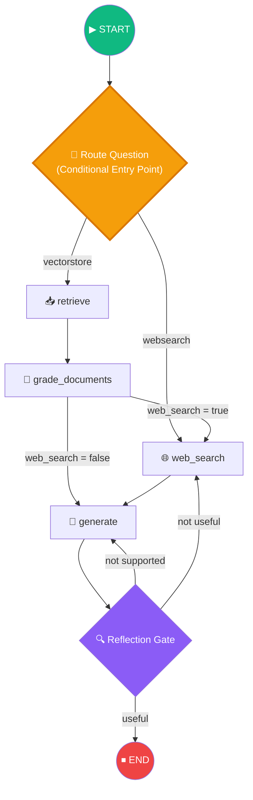
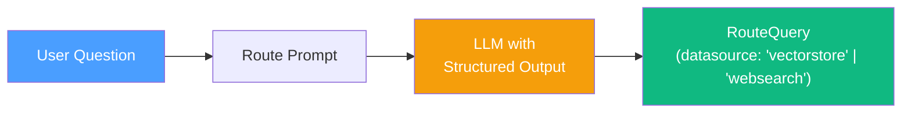
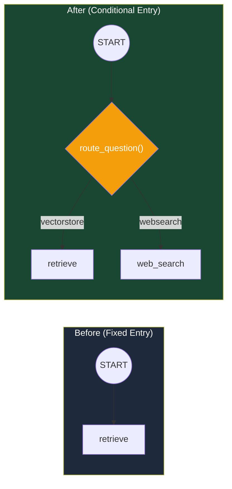
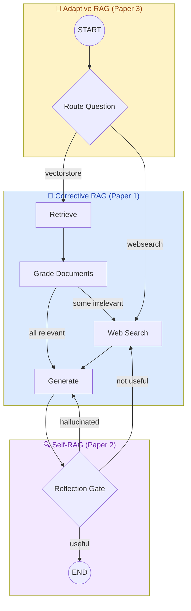

# 13.13 — Adaptive RAG

## Overview

**Adaptive RAG** is the final enhancement to the Agentic RAG system. Based on the [Adaptive-RAG: Learning to Adapt Retrieval-Augmented Large Language Models through Question Complexity](https://arxiv.org/abs/2403.14403) research paper, it introduces **intelligent query routing** — analyzing the user's question **before any retrieval** to determine the optimal data source.

In simpler terms: instead of always hitting the vector store first, the system decides upfront whether the answer is likely in the local knowledge base or if it should go directly to web search.

> [!NOTE]
> Adaptive RAG transforms the entry point from a fixed node to a **conditional entry point** — the first decision in the graph is *where* to search, not *how* to search.

---

## Why Does Routing Matter?

Until now, our Agentic RAG system always starts by searching the vector store. But what happens when someone asks a question that has **nothing to do** with the content in our vector store?

Remember, we indexed three articles about:
1. Autonomous AI agents (memory, planning, reasoning)
2. Prompt engineering techniques
3. Adversarial attacks on LLMs

Now imagine someone asks: **"What is the weather in Berlin today?"**

With the current system (no routing), here's what would happen:

1. **Retrieve:** The vector store searches for documents about weather. It doesn't have any, but it returns the 4 documents that are least dissimilar (they're all still irrelevant).
2. **Grade Documents:** The grader checks each document... all 4 are irrelevant to weather. All are filtered out.
3. **Web Search:** The `web_search` flag is set to `True`, so we search the web.
4. **Generate:** The LLM generates an answer based on web search results.

The system eventually gets the right answer, but steps 1 and 2 were **completely wasted**. We made 1 embedding API call (for the query), 1 ChromaDB search, and 4 LLM calls (to grade documents that we already could have predicted would be irrelevant) — all for nothing.

**Adaptive RAG eliminates this waste.** By analyzing the question first, it can say: "This question is about weather, which is not one of our indexed topics (agents, prompt engineering, adversarial attacks). Let's skip the vector store entirely and go directly to web search."

This saves time, money (API calls), and latency. For an application receiving many queries, these savings add up significantly.

### The Routing Decision Is Actually Simple

The router doesn't need to deeply understand the question. It just needs to classify it into one of two buckets:
- **"This is about topics we have in our vector store"** → search the vector store
- **"This is about something else entirely"** → search the web

This is a straightforward classification task that LLMs are very good at, especially when you tell them exactly what topics the vector store covers.

---

## Final Graph Architecture



The **Route Question** node at the top is the new addition — it replaces the fixed entry point with a conditional one.

---

## The Question Router Chain

### Purpose

Analyze the user's question and decide which data source is most appropriate:

| Route | When | Example Questions |
|---|---|---|
| **Vector Store** | Question matches indexed topics (agents, prompt engineering, adversarial attacks) | "What is agent memory?", "Explain chain-of-thought prompting" |
| **Web Search** | Question is outside the vector store's domain | "What is the weather today?", "Latest news about GPT-5" |

### Pydantic Schema with Literal Types

```python
# chains/router.py

from typing import Literal
from pydantic import BaseModel, Field

class RouteQuery(BaseModel):
    """Route a user query to the most appropriate data source."""
    datasource: Literal["vectorstore", "websearch"] = Field(
        ...,
        description="Given a user question, choose to route it to "
                    "web search or a vectorstore.",
    )
```

#### Key Design Elements

| Element | Detail |
|---|---|
| `Literal["vectorstore", "websearch"]` | **Type constraint** — the LLM can only output one of these two values |
| `Field(...)` | **Required field** — the ellipsis (`...`) makes this field mandatory (no default value) |
| `description` | Guides the LLM's routing decision through function calling |

> [!TIP]
> The `Literal` type is powerful for structured outputs. It constrains the LLM's response to a predefined set of values, preventing unexpected routing decisions.

### System Prompt

```
You are an expert at routing a user question to a vectorstore or web search.
The vectorstore contains documents related to agents, prompt engineering, 
and adversarial attacks. Use the vectorstore for questions on those topics. 
For everything else, use web search.
```

> [!IMPORTANT]
> The system prompt explicitly lists the **topics covered by the vector store**. This gives the LLM the domain knowledge needed to make accurate routing decisions. If you add new topics to the vector store, update this prompt accordingly.

### Chain Construction

```python
from langchain_openai import ChatOpenAI
from langchain_core.prompts import ChatPromptTemplate

llm = ChatOpenAI(temperature=0)
structured_llm_router = llm.with_structured_output(RouteQuery)

route_prompt = ChatPromptTemplate.from_messages([
    ("system", system_message),
    ("human", "{question}"),
])

question_router = route_prompt | structured_llm_router
```

### Chain Flow



---

## Testing the Router

```python
# chains/tests/test_chains.py

from chains.router import question_router, RouteQuery


def test_router_to_vectorstore():
    """Questions about indexed topics should route to vectorstore."""
    question = "agent memory"
    result: RouteQuery = question_router.invoke({"question": question})
    assert result.datasource == "vectorstore"


def test_router_to_websearch():
    """Questions outside indexed topics should route to web search."""
    question = "how is the weather in Berlin today?"
    result: RouteQuery = question_router.invoke({"question": question})
    assert result.datasource == "websearch"
```

### Test Matrix

| Question | Expected Route | Rationale |
|---|---|---|
| "agent memory" | `vectorstore` | Matches "agents" topic in vector store |
| "chain of thought prompting" | `vectorstore` | Matches "prompt engineering" topic |
| "how to jailbreak an LLM" | `vectorstore` | Matches "adversarial attacks" topic |
| "weather in Berlin today" | `websearch` | Not in vector store domain |
| "latest GPT-5 news" | `websearch` | Current events — not in indexed articles |

---

## Graph Integration: Conditional Entry Point

Instead of `workflow.set_entry_point(RETRIEVE)`, we use `set_conditional_entry_point`:

```python
# graph/graph.py

from chains.router import question_router

def route_question(state: GraphState) -> str:
    """
    Route the question to vectorstore retrieval or web search.
    
    Returns:
        WEB_SEARCH or RETRIEVE based on the router's decision
    """
    question = state["question"]
    result = question_router.invoke({"question": question})
    
    if result.datasource == "websearch":
        print("---ROUTE QUESTION TO WEB SEARCH---")
        return WEB_SEARCH
    elif result.datasource == "vectorstore":
        print("---ROUTE QUESTION TO VECTOR STORE---")
        return RETRIEVE


# Replace fixed entry point with conditional entry
workflow.set_conditional_entry_point(
    route_question,               # Decision function
    {
        WEB_SEARCH: WEB_SEARCH,   # Route to web search
        RETRIEVE: RETRIEVE,       # Route to vector store retrieval
    },
)
```

### Before vs After



---

## Complete System: All Three Papers Combined

The final Agentic RAG system synthesizes all three research papers:



### Paper Contribution Map

| Research Paper | Component | Graph Elements |
|---|---|---|
| **Corrective RAG** | Document quality gate | Retrieve → Grade → Filter → Web Search fallback |
| **Self-RAG** | Answer reflection | Hallucination check → Answer relevance check → Regenerate/Re-search |
| **Adaptive RAG** | Query routing | Conditional entry point → Route to vector store or web search |

---

## Execution Scenarios

### Scenario 1: Vector Store Path (Happy Flow)

```
Question: "What is agent memory?"
→ ROUTE: vectorstore
→ RETRIEVE: 4 documents
→ GRADE: all relevant
→ GENERATE: answer about agent memory
→ REFLECT: grounded + answers question
→ END: return answer ✅
```

### Scenario 2: Vector Store with Web Search Fallback

```
Question: "Explain ReAct prompting"
→ ROUTE: vectorstore
→ RETRIEVE: 4 documents
→ GRADE: 1 irrelevant → web_search = true
→ WEB SEARCH: supplemental results
→ GENERATE: answer about ReAct
→ REFLECT: grounded + answers question
→ END: return answer ✅
```

### Scenario 3: Direct Web Search

```
Question: "What is the weather in Berlin?"
→ ROUTE: websearch (not in vector store domain)
→ WEB SEARCH: weather results
→ GENERATE: answer about weather
→ REFLECT: grounded + answers question
→ END: return answer ✅
```

### Scenario 4: Regeneration Loop

```
Question: "What is agent memory?"
→ ROUTE: vectorstore
→ RETRIEVE + GRADE + GENERATE
→ REFLECT: NOT grounded (hallucinated)
→ GENERATE: (second attempt)
→ REFLECT: grounded + answers question
→ END: return answer ✅
```

---

## Summary

Adaptive RAG completes the Agentic RAG system with intelligent query routing:

| Component | File | Purpose |
|---|---|---|
| Router Chain | `chains/router.py` | LLM-powered question routing with `Literal` type constraints |
| RouteQuery Schema | `chains/router.py` | Pydantic model restricting output to "vectorstore" or "websearch" |
| Route Function | `graph/graph.py` → `route_question()` | Conditional entry point decision function |
| Tests | `chains/tests/test_chains.py` | Validates routing for in-domain and out-of-domain questions |

### The Complete Agentic RAG Pipeline

| Layer | Paper | Technique | When It Acts |
|---|---|---|---|
| **Routing** | Adaptive RAG | Question classification → optimal data source | Before retrieval |
| **Filtering** | Corrective RAG | Document grading → relevance filtering + web fallback | After retrieval |
| **Reflection** | Self-RAG | Hallucination detection + answer validation | After generation |

> [!TIP]
> GitHub branch reference: `11-adaptive-rag`