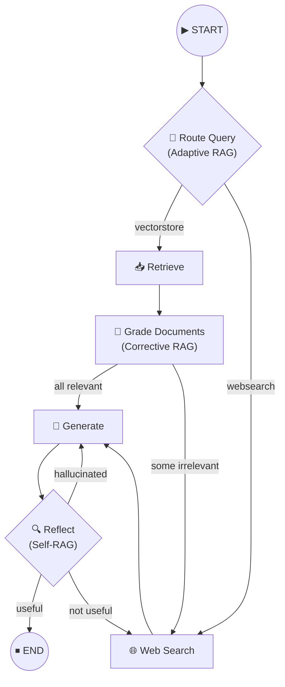

# 13. Agentic RAG — Technical Knowledge Base

## Overview

This section is a comprehensive **13-lesson technical deep-dive** into building an advanced, production-grade **Agentic RAG** (Retrieval-Augmented Generation) system using **LangGraph**, **LangChain**, and **ChromaDB**.

The system synthesizes three research papers — **Corrective RAG**, **Self-RAG**, and **Adaptive RAG** — into a single, self-correcting pipeline that retrieves, grades, generates, and reflects on answers before returning them to the user.

---

## Lesson Map

| # | Lesson | Focus |
|---|---|---|
| 01 | [Agentic RAG Architecture](01-agentic-rag-architecture.md) | System overview, research paper foundations, high-level flow |
| 02 | [Improving RAG with Corrective Flow](02-improving-rag-with-corrective-flow.md) | CRAG paper — document grading and web search fallback |
| 03 | [Boilerplate Setup](03-boilerplate-setup.md) | Poetry, dependencies, API keys, environment validation |
| 04 | [Code Structure](04-code-structure.md) | Repository architecture — nodes, chains, tests, state |
| 05 | [Vector Store Ingestion Pipeline](05-langchain-vector-store-ingestion-pipeline.md) | Document loading, chunking, embedding, ChromaDB storage |
| 06 | [Managing Information Flow](06-managing-information-flow-in-langgraph.md) | GraphState definition and state management patterns |
| 07 | [Retrieve Node](07-langgraph-retrieve-node.md) | Vector store semantic search node |
| 08 | [Relevance Filter for RAG](08-relevance-filter-for-rag.md) | Retrieval grader chain, document filtering, testing strategies |
| 09 | [Web Search Node](09-web-search-node-with-tavily-api.md) | Tavily API integration, fallback retrieval |
| 10 | [LLM Generation Node](10-llm-generation-node.md) | Generation chain, RAG prompt, LCEL pipeline |
| 11 | [Running the Complete Agent](11-running-the-complete-langgraph-agent.md) | Graph wiring, conditional edges, end-to-end execution |
| 12 | [Self-RAG](12-self-rag.md) | Hallucination detection, answer validation, reflection loops |
| 13 | [Adaptive RAG](13-adaptive-rag.md) | Intelligent query routing, conditional entry points |

---

## Architecture at a Glance

## Usage

Start with **Lesson 01** for the conceptual overview, then follow sequentially. Each lesson builds on the previous one, incrementally constructing the full system.
