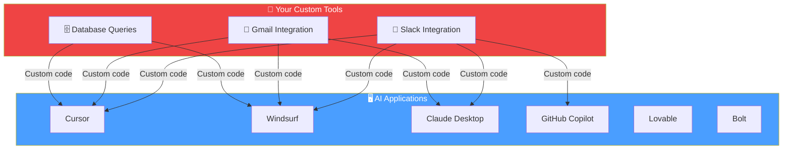
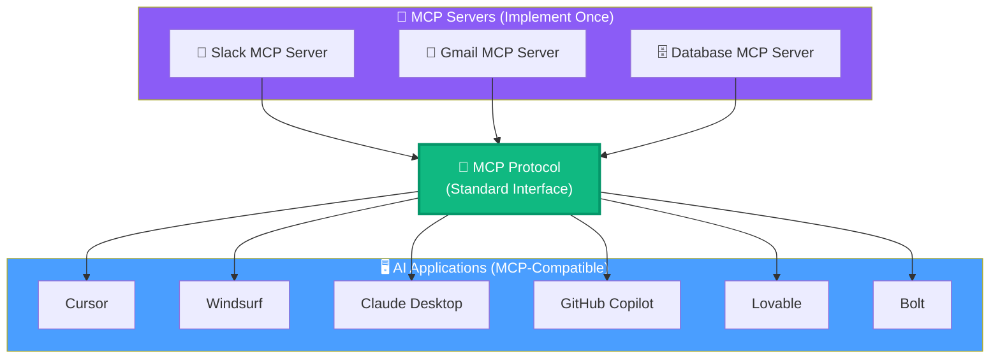

# 14.01 — Why MCP?

## Overview

The **Model Context Protocol (MCP)** exists to solve a fundamental problem in AI application development: **the integration explosion**. As AI agents need to interact with more external services (Slack, Gmail, databases, APIs), the number of custom integrations grows out of control — and every integration needs to be rewritten for every AI application that wants to use it.

MCP solves this by adding a **standardization layer** between AI applications and external tools, so that a tool only needs to be implemented once and can be used by any compliant AI application.

> [!NOTE]
> MCP was created by **Anthropic** (the company behind Claude) and has been rapidly adopted across the AI ecosystem. As of 2024–2025, Cursor, Claude Desktop, Windsurf, GitHub Copilot, and many other AI applications support MCP.

---

## The Problem: Integration Explosion

Imagine you're building an AI agent that needs to:
- Send messages on **Slack**
- Read and send **emails** via Gmail
- Query a **database**

To make this work, you'd need to:
1. Study each API's documentation (Slack API, Gmail API, database SDK)
2. Write custom integration code for each service
3. Wrap each integration as a "tool" that your agent can invoke
4. Potentially add custom restrictions (e.g., allow reading emails but not deleting them)

This is fine for a single agent. But now imagine the following scenario:

**Every combination requires its own custom integration code.** If you have 3 tools and 6 AI applications, you potentially need **18 custom integrations**. Add more tools or more applications, and this explodes:

| Tools | Applications | Custom Integrations Needed |
|---|---|---|
| 3 | 6 | Up to 18 |
| 10 | 6 | Up to 60 |
| 10 | 20 | Up to 200 |
| 50 | 20 | Up to 1,000 |

**Nobody wants to write a thousand integrations.** And even if you did, keeping them all maintained and up to date would be impossible.

---

## The Solution: One Standard Protocol

MCP eliminates this explosion by introducing a **standard interface** between AI applications and tools. Instead of writing custom integrations for each app, you:

1. **Implement your tool once** as an MCP server
2. **Any AI application** that supports MCP can connect to it automatically

Now the math is completely different:

| Tools | Applications | Integrations Needed |
|---|---|---|
| 3 | 6 | **3** (one per tool) |
| 10 | 6 | **10** |
| 10 | 20 | **10** |
| 50 | 20 | **50** |

Instead of O(tools × applications), it's O(tools). Each tool is implemented once, and every application gets it for free.

---

## The Computer Science Principle Behind MCP

MCP is a textbook application of a fundamental principle in computer science:

> **"Any problem in computer science can be solved by adding another layer of abstraction."**

MCP is that layer of abstraction. It sits **between** AI applications and external tools/services, providing a standard communication protocol that both sides agree on. The applications don't need to know how external tools are implemented internally. The tools don't need to know which application is calling them. They just speak the same protocol.

This is exactly what other successful standards have done:

| Standard | What It Standardizes | Before |
|---|---|---|
| **USB-C** | Physical device connections | Every device had its own proprietary connector |
| **HTTP** | Web communication | Every network service had its own protocol |
| **SQL** | Database queries | Every database had its own query language |
| **MCP** | AI ↔ Tool communication | Every AI app had its own tool integration code |

---

## The Network Effect

MCP's value grows exponentially with adoption — this is the **network effect**. The more AI applications that support MCP, the more valuable each MCP server becomes (because it's usable by more apps). And the more MCP servers that exist, the more valuable each MCP-compatible application becomes (because it gets access to more tools).

This is the same dynamic that makes social media platforms valuable: a social network with 10 users isn't very useful, but a network with 10 million users creates enormous value. MCP is experiencing this same flywheel:

1. **Anthropic** creates MCP and integrates it into Claude Desktop
2. **Cursor** and other AI code editors add MCP support
3. Developers start building MCP servers for popular services (Slack, GitHub, Stripe, etc.)
4. More AI applications add MCP support to access those servers
5. More developers build more MCP servers because more apps can use them
6. The ecosystem grows and becomes more valuable for everyone

> [!IMPORTANT]
> As of early 2025, there are **thousands** of community-built MCP servers available, and major companies (Stripe, Cloudflare, etc.) are maintaining official MCP servers for their services.

---

## Real-World Impact

To understand the practical impact, consider this concrete example:

**Without MCP:** You build a custom Slack integration for Cursor. It took a week to implement and test. Now your company switches from Cursor to Windsurf. You need to spend another week rewriting the entire integration for Windsurf's different plugin system. If you want it in Claude Desktop too, that's another week.

**With MCP:** You build a Slack MCP server once. It works in Cursor, Windsurf, Claude Desktop, GitHub Copilot, and any future AI application that adopts MCP — with zero additional work. When you switch tools, your integrations come with you.

---

## Summary

| Aspect | Without MCP | With MCP |
|---|---|---|
| **Integration work** | Custom code per tool × per app | Implement tool once as MCP server |
| **Portability** | Locked to one AI application | Works across all MCP-compatible apps |
| **Maintenance** | Every integration maintained separately | One MCP server maintained per tool |
| **Scaling** | O(tools × apps) effort | O(tools) effort |
| **Ecosystem** | Isolated, fragmented | Community-shared, network effects |

MCP doesn't add new capabilities to LLMs — LLMs still can't execute tools directly. What MCP does is **standardize how applications connect tools to LLMs**, eliminating redundant work and enabling a shared ecosystem.