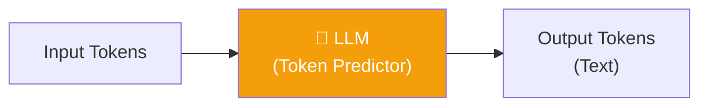
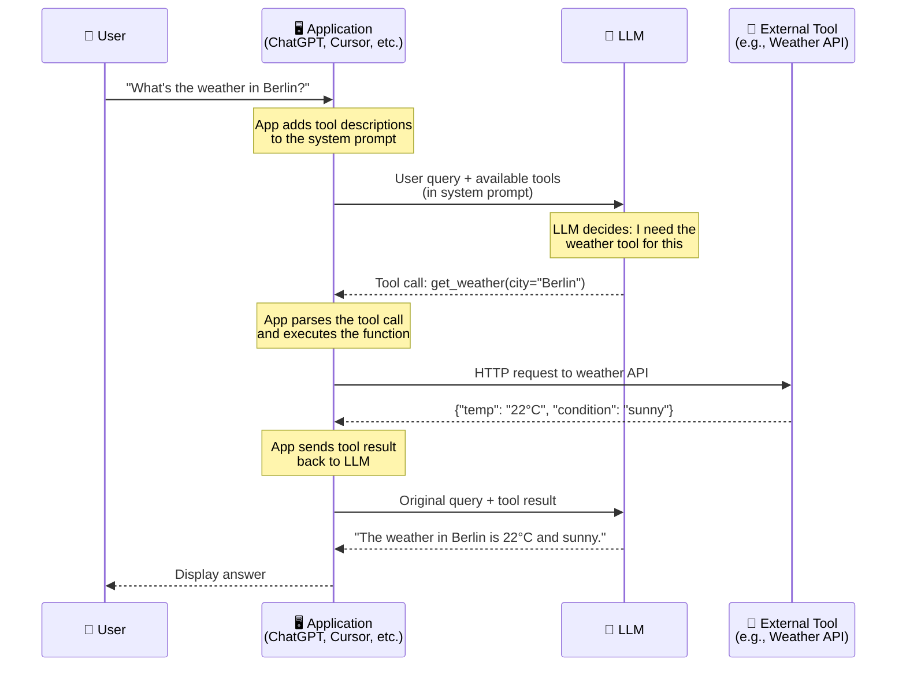
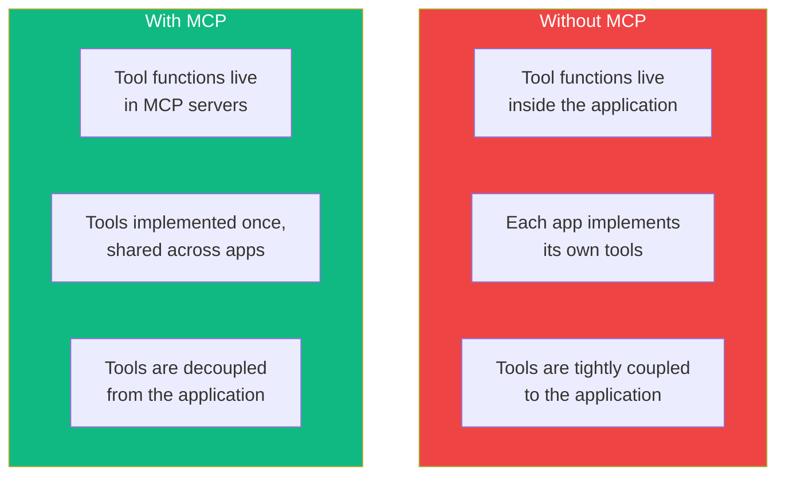

# 14.02 — How LLMs Use Tools

## Overview

Before diving deep into MCP, we need to understand a fundamental truth about LLMs that many people overlook: **LLMs cannot do anything except generate text**. They cannot search the web, execute code, send emails, or query databases. All of those capabilities are **external tools** that are integrated into the **application layer** around the LLM.

Understanding how tool calling works "under the hood" is essential for understanding MCP, because MCP is fundamentally about **standardizing how tools get connected to LLMs**.

---

## LLMs Are Token Predictors — Nothing More

At their core, Large Language Models are **statistical token generators**. They take a sequence of tokens (words/word pieces) as input and predict the most likely next token. They repeat this process — predicting one token, appending it, predicting the next — until they produce a complete response.

That's it. That's all they do. Everything else is a layer built **on top** of this basic capability.



This is important because popular AI products like ChatGPT, Claude, and Cursor make it *seem* like the LLM can search the web, execute Python code, browse websites, and more. But the LLM isn't doing any of those things — the **application** (ChatGPT's web app, Claude's desktop app, Cursor's IDE) is doing them. The LLM just generates text that tells the application what to do.

### What LLMs Can and Cannot Do

| ✅ LLMs CAN | ❌ LLMs CANNOT |
|---|---|
| Generate and complete text | Execute code or programs |
| Follow instructions in the prompt | Access the internet or databases |
| Output structured formats (JSON, code) | Send emails, messages, or API calls |
| Understand and reason about context | Interact with external systems directly |
| Generate image descriptions (if multimodal) | Actually perform real-world actions |

Every "action" you see an LLM perform — web searching, code execution, file reading — is the **application** doing it, triggered by the LLM's text output.

---

## How Tool Calling Works

So if LLMs can only generate text, how do they "use" tools? The answer is **tool calling** (also called **function calling**) — a clever mechanism where the LLM generates **structured text** that the application interprets as a request to invoke a specific function.

### The Process Step by Step



Let's walk through each step in detail:

### Step 1: The User Asks a Question

The user types something like: *"What's the weather in Berlin right now?"*

The LLM, by itself, cannot answer this question truthfully because it doesn't have access to real-time weather data. Its training data has a cutoff date, and it has no ability to access the internet. If it tried to answer directly, it would **hallucinate** — generate a plausible-sounding but made-up answer.

### Step 2: The Application Injects Tool Descriptions

Before sending the user's query to the LLM, the application **augments the prompt** with descriptions of available tools. This is done through a **system prompt** — a special set of instructions that the user doesn't see but the LLM does.

The augmented prompt looks something like this (simplified):

```
System: You are a helpful assistant. You have access to the following tools:

Tool: get_weather
  Description: Get the current weather for a location
  Parameters:
    - city (string, required): The city to get weather for
    - units (string, optional): "celsius" or "fahrenheit"

Tool: web_search
  Description: Search the web for information
  Parameters:
    - query (string, required): The search query

When you need to use a tool, output a tool call in JSON format.

User: What's the weather in Berlin right now?
```

The LLM now knows what tools are available, what they do, and what arguments they expect. This information becomes part of its context for generating a response.

### Step 3: The LLM Generates a Tool Call

Instead of generating a natural language answer (which would be a hallucination since it doesn't know the current weather), the LLM generates a **structured tool call**:

```json
{
  "tool": "get_weather",
  "arguments": {
    "city": "Berlin",
    "units": "celsius"
  }
}
```

This is the key insight: **the LLM doesn't execute the tool** — it just generates text that says *which* tool to call and *with what arguments*. The LLM is using its language understanding capabilities to:
1. Understand what the user wants (weather information)
2. Determine which available tool is appropriate (`get_weather`)
3. Extract the relevant parameters from the query (`city = "Berlin"`)
4. Format the tool call in the expected structure

### Step 4: The Application Executes the Tool

The application receives the LLM's output, **parses** it, detects that it's a tool call (not a final answer), and executes the corresponding function. This is regular application code — a software engineer wrote a `get_weather()` function that makes an HTTP request to a weather API.

```python
# This runs in the APPLICATION, not in the LLM
def get_weather(city: str, units: str = "celsius") -> dict:
    response = requests.get(f"https://api.weather.com/{city}")
    return response.json()
```

The tool returns real data: `{"temp": "22°C", "condition": "sunny", "humidity": "45%"}`.

### Step 5: The LLM Generates the Final Answer

The application sends a **second LLM call** containing:
- The original user question
- The tool result

The LLM now has the real data it needs and can generate an accurate, truthful response:

*"The current weather in Berlin is 22°C and sunny, with 45% humidity."*

This answer is grounded in real data from the tool, not hallucinated from training data.

---

## Why Tool Calling Is Not 100% Reliable

It's important to understand that tool calling is **probabilistic**, not deterministic. The LLM is making a statistical prediction about which tool to call and what arguments to use. This means:

- Sometimes the LLM might call the **wrong tool** (e.g., using `web_search` when `get_weather` would be more appropriate)
- Sometimes it might **extract incorrect arguments** (e.g., getting the city name wrong from an ambiguous query)
- Sometimes it might choose to answer **directly instead of calling a tool** (e.g., hallucinating the weather instead of using the tool)
- Sometimes it might make a tool call when **no tool is needed** (overusing tools)

In practice, modern LLMs (GPT-4, Claude 3.5, Gemini Pro) are very good at tool calling — they get it right the vast majority of the time. But "most of the time" is not "all of the time," which is why robust agentic applications include error handling and feedback loops.

> [!NOTE]
> Each LLM vendor (OpenAI, Anthropic, Google) implements tool calling slightly differently in their APIs, though the core concept is the same. Some use JSON function schemas, others use XML-like structures, and some rely on specially trained prompt formats. This vendor-specific variation is one of the problems MCP helps address.

---

## The Connection to MCP

Now that we understand how tool calling works, we can see where MCP fits in:



MCP doesn't change **how** tool calling works — the LLM still generates structured tool calls, and the application still executes them. What MCP changes is **where** the tools live and **how** they're discovered:

| Aspect | Without MCP | With MCP |
|---|---|---|
| **Where tools live** | Hardcoded inside each application | In separate MCP servers |
| **How tools are discovered** | Manually defined in application code | Dynamically discovered from MCP servers at startup |
| **Tool execution** | Runs inside the application process | Runs in the MCP server process |
| **Portability** | Tools locked to one application | Same tools work across all MCP-compatible apps |

---

## Summary

Tool calling is the **foundation** that MCP builds upon. Here's the key chain of understanding:

1. **LLMs are just text generators** — they cannot execute actions themselves
2. **Tool calling** is a mechanism where the LLM generates structured text describing which function to invoke
3. **The application** parses this text and executes the actual tool code
4. **Each vendor implements tool calling differently**, creating fragmentation
5. **MCP standardizes the tool layer** — tools are implemented once in MCP servers and discovered dynamically by any compatible application

With this foundation, the next lessons will explore exactly *how* MCP organizes the communication between applications and tools.