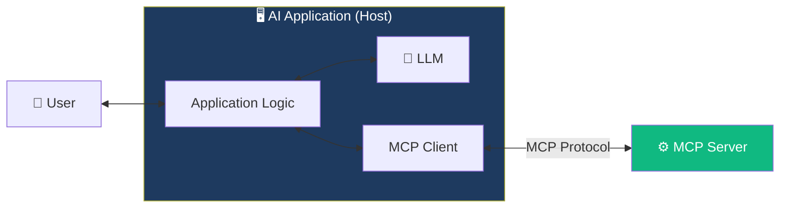
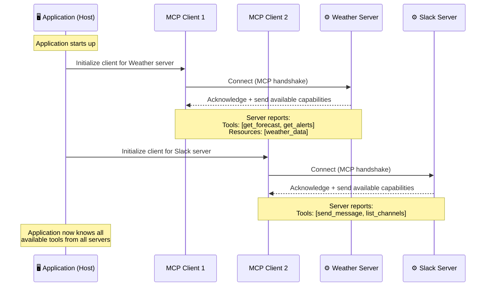
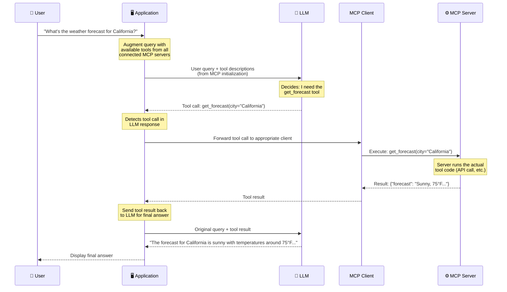
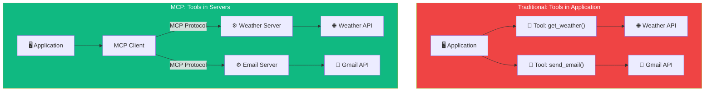

# 14.03 — Essentials of the Protocol with Tool Calling

## Overview

This lesson walks through the **complete MCP interaction flow** — from application startup to final answer delivery. Understanding this flow is critical because it reveals exactly how the MCP protocol orchestrates communication between the user, the application, the LLM, the MCP client, and the MCP server.

By the end of this lesson, you'll understand every step of what happens when an MCP-connected AI application processes a user's tool-requiring query.

---

## The MCP Component Map

Before we trace the flow, let's identify every component involved:



| Component | Role | Example |
|---|---|---|
| **User** | The person making queries | You, typing in Cursor or Claude Desktop |
| **Host / Application** | The AI application that hosts everything | Cursor, Windsurf, Claude Desktop, or your custom agent |
| **LLM** | The language model that processes queries and generates responses/tool calls | GPT-4, Claude 3.5, Gemini Pro |
| **MCP Client** | A component inside the host that speaks the MCP protocol to communicate with servers | Built into the host application — one client per server connection |
| **MCP Server** | An external service that exposes tools, resources, and prompts via MCP | Weather server, Slack server, database server |

> [!IMPORTANT]
> The **MCP Client lives inside the host application**. It's not a separate application — it's a component of the AI application itself. The host may contain **multiple clients**, each connected to a different MCP server. However, each client connects to exactly **one** server (1:1 relationship).

---

## Phase 1: Initialization (Application Startup)

The MCP lifecycle begins **before any user interaction** — it happens when the AI application starts up.



### What Happens During Initialization

1. **The application reads its MCP configuration** — which MCP servers to connect to (configured by the user, usually in a JSON config file)
2. **For each configured server, the application creates an MCP Client** — one client per server
3. **Each client connects to its server using the MCP protocol** — this can be via:
   - **stdio** (standard input/output) — for locally running servers
   - **SSE** (Server-Sent Events) — for remote servers running over HTTP
4. **The MCP handshake happens** — the client and server negotiate protocol version, capabilities, etc.
5. **The server reports its available capabilities** — tools, resources, and prompts

After initialization, the application knows exactly what tools are available across **all** connected MCP servers. This tool catalog is stored in memory and will be injected into LLM prompts when users make queries.

### What the Server Reports

During initialization, each MCP server sends its **capability manifest** to the client. For tools, this includes:

```json
{
  "tools": [
    {
      "name": "get_forecast",
      "description": "Get weather forecast for a specific location",
      "inputSchema": {
        "type": "object",
        "properties": {
          "city": {"type": "string", "description": "City name"},
          "days": {"type": "integer", "description": "Number of forecast days"}
        },
        "required": ["city"]
      }
    },
    {
      "name": "get_alerts",
      "description": "Get active weather alerts for a region",
      "inputSchema": {
        "type": "object",
        "properties": {
          "state": {"type": "string", "description": "US state code (e.g., CA)"}
        },
        "required": ["state"]
      }
    }
  ]
}
```

Notice that each tool definition includes a **name**, a **description** (which will be shown to the LLM so it can decide when to use the tool), and an **input schema** (which tells the LLM what arguments to provide). This is the information that bridges the gap between the MCP server's capabilities and the LLM's understanding.

---

## Phase 2: User Query Processing

Once initialization is complete, the application is ready to handle user queries. Here's the complete flow for a query that requires tool use:



### Step-by-Step Breakdown

**Step 1 — User Query:** The user types a question into the AI application.

**Step 2 — Prompt Augmentation:** The application takes the user's query and **augments** it with the tool descriptions that were collected during initialization. This is the same tool-calling mechanism we discussed in the previous lesson, but now the tool descriptions come from MCP servers rather than being hardcoded.

**Step 3 — LLM Decision:** The LLM receives the augmented prompt (user query + available tools) and makes a decision:
- If the query can be answered from its training data → generate a direct answer
- If the query requires external information → generate a **tool call** specifying which tool to invoke and with what arguments

**Step 4 — Tool Execution via MCP:** This is **the key difference between MCP and traditional tool calling**:

| Traditional Tool Calling | MCP Tool Calling |
|---|---|
| Application executes the tool locally | Application sends the tool call to the **MCP server** |
| Tool function runs in the application process | Tool function runs in the **server process** |
| Tool code is part of the application | Tool code is **decoupled** from the application |

The application routes the tool call through the MCP Client, which sends it to the appropriate MCP Server over the MCP protocol. The server executes the actual tool code (makes the API call, queries the database, etc.) and returns the result.

**Step 5 — Result Return:** The MCP Server sends the tool result back through the MCP Client to the application.

**Step 6 — Final LLM Call:** The application makes a second LLM call with the original query plus the tool result. The LLM generates a natural language answer grounded in the real data.

**Step 7 — User Receives Answer:** The application displays the final answer to the user.

---

## The Key Difference: Where Tools Execute

The most important architectural difference between traditional tool calling and MCP tool calling is **where the tool code runs**:



**Why does this matter?** Because decoupling tool execution from the application provides several major advantages:

| Advantage | Explanation |
|---|---|
| **Independent scaling** | MCP servers can be deployed, scaled, and monitored independently from the AI application. Run them on Kubernetes, serverless, Docker — whatever makes sense. |
| **Independent updates** | Update, fix, or add new tools to an MCP server without redeploying the AI application. The client re-initializes and discovers the new capabilities automatically. |
| **Separation of concerns** | The AI application handles orchestration (when to call tools). The MCP server handles execution (how to call tools). Clean architecture. |
| **Debugging & logging** | Monitor tool execution separately from application logic. Track which tools are being called, how often, with what arguments, and what they return. |
| **Dynamic tool discovery** | The client can periodically re-initialize, discovering new tools that have been added to the server since the last check. The agent gains new capabilities without code changes. |
| **Security isolation** | Tools run in a separate process (or even a separate machine), limiting the blast radius if something goes wrong. |

---

## Dynamic Tool Discovery

One of the most powerful features enabled by MCP's architecture is **dynamic tool discovery**. Because the client discovers tools by querying the server at initialization time, you can:

1. **Add a new tool** to an MCP server (e.g., add `get_humidity` alongside `get_forecast`)
2. **Restart the MCP server** (or wait for the client to re-initialize)
3. **The AI application automatically discovers the new tool** — no code changes, no redeployment

This means your AI agents can **evolve their capabilities** over time just by updating the MCP servers they connect to. You don't need to redeploy the agent itself.

> [!TIP]
> In a production setup, you can configure the MCP client to re-initialize periodically (e.g., every hour), so new tools are discovered automatically. This gives you the behavior of **dynamic tool calling** — the agent's capabilities grow without any downtime or redeployment.

---

## Summary

The MCP interaction flow has two phases:

### Phase 1: Initialization (at startup)
1. Application creates MCP Clients (one per configured server)
2. Each client connects to its server via the MCP protocol
3. Servers report their available tools, resources, and prompts
4. Application stores the complete tool catalog in memory

### Phase 2: Query Processing (per user query)
1. User sends a query
2. Application augments the query with available tool descriptions (from initialization)
3. LLM generates a tool call (or a direct answer)
4. Application routes the tool call through MCP Client → MCP Server
5. Server executes the tool and returns the result
6. Application sends the result back to the LLM for final answer generation
7. Final answer is displayed to the user

The key architectural insight: **tool execution is decoupled from the application**. The LLM decides *what* to call, the MCP server executes *how* to call it, and the MCP protocol connects them.