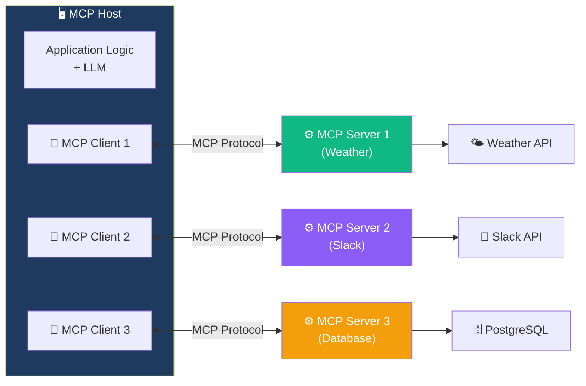
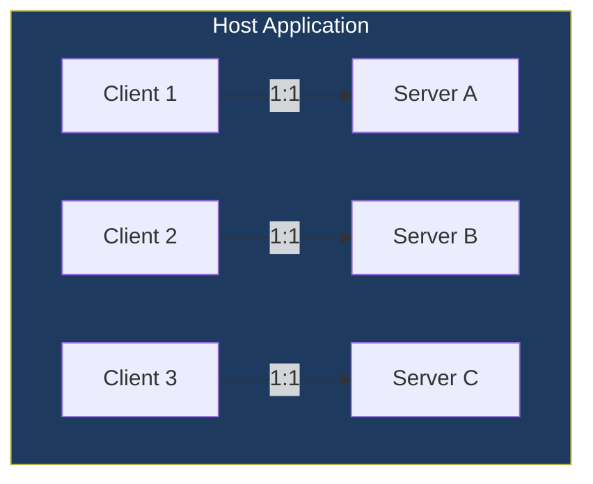
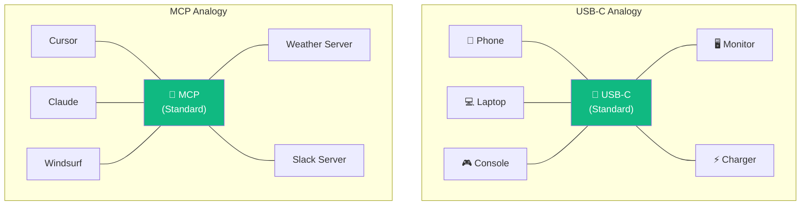

# 14.04 — MCP Architecture

## Overview

This lesson dives into the **three core components** of the MCP architecture — **Hosts**, **Clients**, and **Servers** — and how they relate to each other. We also explore the kinds of capabilities MCP servers can expose and compare the MCP approach to existing frameworks like LangChain.

---

## MCP's Goal (Recap)

The Model Context Protocol standardizes how AI applications provide **context** to LLMs. "Context" is intentionally broad — it can mean:

| Context Type | What It Provides | Example |
|---|---|---|
| **Tools** | Functions the LLM can invoke | `get_weather()`, `send_email()`, `query_db()` |
| **Resources** | Data and information to augment the LLM's knowledge | PDF documents, database records, API data |
| **Prompts** | Pre-defined prompt templates for common interactions | "Summarize this code," "Write a SQL query for..." |

By standardizing how these three types of context are exposed and consumed, MCP creates a universal interface between AI applications and the external world.

---

## The Three Components

### 1. MCP Host

The **Host** is the AI application that the user interacts with. It's the "outer shell" that contains everything else.

**Examples of MCP Hosts:**
- **Claude Desktop** — Anthropic's desktop chat application
- **Cursor** — AI-powered code editor
- **Windsurf** — Another AI code editor
- **Your own custom agent** — any application you build that implements the MCP protocol

**The Host's responsibilities:**
- Present a user interface for interaction
- Manage one or more MCP Clients
- Route user queries to the LLM
- Handle the orchestration loop (user query → LLM → tool call → tool result → LLM → answer)
- Enforce security policies (which servers to trust, what operations to allow)

Think of the Host as the **conductor of an orchestra** — it doesn't play any instrument itself, but it coordinates everything.

### 2. MCP Client

The **Client** is a component that **lives inside the Host**. Its job is to communicate with exactly one MCP Server using the MCP protocol.

**Key properties:**
- Each client connects to exactly **one** server (1:1 relationship)
- A host can contain **multiple** clients (one per server)
- The client handles the protocol mechanics — connecting, sending requests, receiving responses
- The client is typically an SDK/library that the host application uses

> [!IMPORTANT]
> **An MCP Client canNOT talk to multiple servers.** If you want your application to connect to 5 MCP servers, you need 5 MCP Clients. This 1:1 constraint simplifies the protocol — each client-server connection is independent and self-contained.

### 3. MCP Server

The **Server** is the component that actually **holds the capabilities** — the tools, resources, and prompts. It's the piece you (as a tool developer) build and maintain.

**The Server's responsibilities:**
- Expose a list of available tools, resources, and prompts
- Handle incoming tool call requests and execute the underlying code
- Return results to the client
- Manage its own dependencies and state (API keys, database connections, etc.)

**Think of MCP Servers as specialized microservices** — each one does one job well and exposes its functionality through a standard interface.

---

## The USB-C Analogy

The USB-C comparison is frequently used to explain MCP, and it's apt:

Just as USB-C lets any device connect to any accessory through one standard port, MCP lets any AI application connect to any tool server through one standard protocol.

---

## The MCP Server Protocol Interface

To be a valid MCP server, a server must implement specific **protocol methods**. These are the "endpoints" that clients use to interact with the server:

| Method | Purpose | Example |
|---|---|---|
| `list_tools` | Return all available tools with their names, descriptions, and input schemas | Client discovers what the server can do |
| `call_tool` | Execute a specific tool with given arguments and return the result | Client invokes `get_forecast(city="Berlin")` |
| `list_resources` | Return available data resources | Server exposes CSV files, database tables, etc. |
| `read_resource` | Read a specific resource's content | Client reads a specific PDF or API response |
| `list_resource_templates` | Return URI templates for dynamic resources | Template: `weather://{city}/forecast` |
| `list_prompts` | Return available prompt templates | Common interaction patterns |
| `get_prompt` | Get a specific prompt template with arguments filled in | "Summarize this code" template |
| `progress_notification` | Send progress updates for long-running operations | "Processing 50%... 75%... done" |

> [!NOTE]
> A server doesn't need to implement **all** of these methods. A simple tool-only server might just implement `list_tools` and `call_tool`. A data-focused server might implement `list_resources` and `read_resource`. You implement what you need.

---

## MCP vs. LangChain: Complementary, Not Competing

A common question is: "If LangChain already handles tools, why do we need MCP?" The answer is that they solve **different problems** and work well together:

| Aspect | LangChain | MCP |
|---|---|---|
| **Purpose** | Framework for building LLM applications | Protocol for exposing tools to LLM applications |
| **Tool scope** | Tools live inside the application | Tools live in separate servers |
| **Target audience** | Developers building agents | Developers building reusable tool services |
| **Integration** | One application at a time | Any MCP-compatible application |
| **Plug and play** | Use community packages (`langchain-openai`, etc.) | Use community MCP servers |

**They're complementary:** You can build a LangChain/LangGraph agent (the application framework) that connects to MCP servers (the tool services). LangChain handles the orchestration and agent logic. MCP handles the tool discovery and execution.

The **LangChain MCP Adapter** (covered in lesson 06) bridges them explicitly — it converts MCP tools into LangChain-compatible tools so your LangGraph agent can use any MCP server.

---

## Wild Example: Ordering Food from Cursor

To illustrate the breadth of what's possible with MCP, consider an example from the community: a developer created an **Uber Eats MCP Server** and connected it to Cursor (an AI code editor).

The interaction looked like this:

1. User types in Cursor: *"I want fika. Where can I get kanelbullar?"*
2. Cursor's LLM recognizes this requires the food ordering tool
3. The LLM calls `search_menu(query="kanelbullar")` on the Uber Eats MCP server
4. The server queries the Uber Eats API and returns matching menu items
5. The LLM presents the options and asks for confirmation
6. User confirms, and the LLM calls `order_food(item_id="...")` on the MCP server
7. The server places the actual order through the Uber Eats API

**The same MCP server would work in Claude Desktop, Windsurf, or any other MCP-compatible application** — without any changes to the server code.

This example highlights a key insight: MCP servers can wrap **any** API or service. If it has an API, it can be an MCP server. The possibilities are limited only by what APIs exist and what developers build.

---

## Summary

| Component | Role | Analogy |
|---|---|---|
| **MCP Host** | The AI application that the user interacts with | The laptop (it provides the interface) |
| **MCP Client** | Communication bridge inside the host, one per server | The USB-C port (the connection point) |
| **MCP Server** | External service exposing tools, resources, and prompts | The USB-C device (monitor, charger, etc.) |
| **MCP Protocol** | The standard communication format | USB-C specification |

Key architectural rules:
- One client connects to exactly **one** server (1:1)
- A host can have **multiple** clients (for multiple servers)
- The client lives **inside** the host application
- The server runs **separately** from the host (locally or remotely)