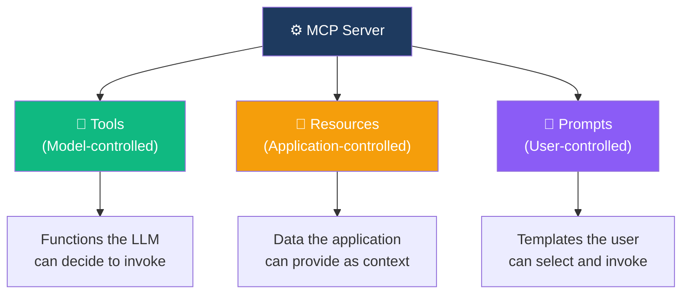
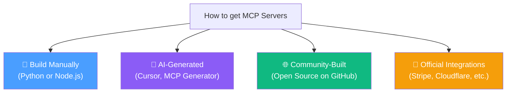
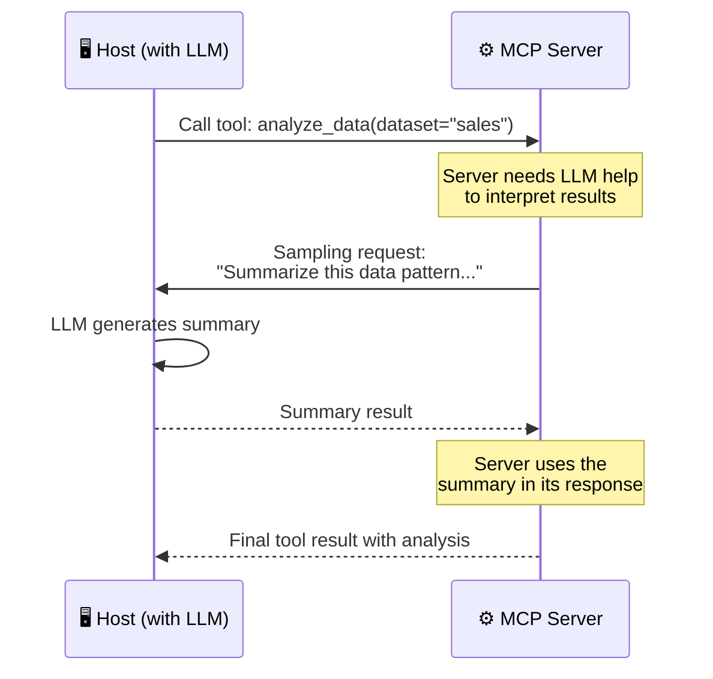
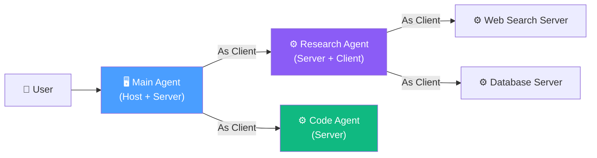

# 14.05 — MCP Servers

## Overview

**MCP Servers** are the functional heart of the MCP ecosystem. They're the components that actually **do things** — wrap APIs, expose data, execute tools. Everything else in the architecture (hosts, clients, the protocol itself) exists to connect users and LLMs to these servers.

This lesson covers the three types of capabilities MCP servers can expose, how to obtain or build MCP servers, the transport mechanisms for running them, and advanced features like sampling and composability.

---

## The Three Server Capabilities

MCP servers expose functionality through three primary interfaces. Each serves a different purpose and is controlled differently:



### 1. Tools (Model-Controlled)

**What they are:** Functions that the LLM can decide to invoke during a conversation. These are the most commonly used MCP capability and the one we've discussed most — the `get_weather()`, `send_email()`, `query_db()` functions.

**Who controls them:** The **model** (LLM) decides when and whether to use a tool, based on the tool's description and the current conversation context. The user doesn't explicitly request tool use — the LLM determines that a tool is needed.

**What you can do with tools:** Virtually anything that can be expressed as a function call:
- Make API requests (weather, payments, social media, etc.)
- Query databases (SQL queries, search operations)
- Read and write files
- Send notifications (Slack messages, emails)
- Execute computations
- Control external systems (IoT devices, CI/CD pipelines)

**Technical detail — tools are just functions:**

```python
# Example: What a tool looks like inside an MCP server

@server.tool()
async def get_forecast(city: str, days: int = 5) -> str:
    """Get weather forecast for a specific city.
    
    Args:
        city: The city to get the forecast for
        days: Number of days to forecast (default: 5)
    """
    response = await weather_api.get(f"/forecast/{city}?days={days}")
    return json.dumps(response.data)
```

The decorator `@server.tool()` registers this function as an MCP tool. The **docstring becomes the tool description** that the LLM sees. The **function parameters become the input schema**. The return value is sent back to the application.

### 2. Resources (Application-Controlled)

**What they are:** Data and information that the MCP server exposes to the AI application. Unlike tools (which are invoked by the LLM), resources are managed by the **application layer** — the application decides which resources to include as context.

**Who controls them:** The **application** (host) decides which resources to fetch and inject into the LLM's context. The LLM doesn't directly request resources — the application selects them based on the user's query or the current context.

**Types of resources:**

| Type | Examples | Static or Dynamic |
|---|---|---|
| **Static data** | PDF documents, text files, images, JSON configs | Static — content doesn't change |
| **Dynamic data** | Database query results, live API responses | Dynamic — content changes based on parameters |
| **Resource templates** | `weather://{city}/current` | Dynamic — URI pattern with fillable parameters |

**Why resources are different from tools:** Tools *do* things (invoke APIs, execute code). Resources *provide* things (data, documents, information). A tool might call the weather API and return the result. A resource might provide a cached weather report that's already available.

### 3. Prompts (User-Controlled)

**What they are:** Pre-defined prompt templates that standardize common interactions. They help users interact with the AI system in a consistent way.

**Who controls them:** The **user** explicitly selects and invokes prompts. Unlike tools (LLM decides) or resources (application decides), prompts are user-driven.

**Examples:**
- "Summarize this codebase" — a template that includes instructions for how to analyze and summarize code
- "Write a SQL query for..." — a template that guides the LLM to generate SQL
- "Debug this error..." — a template with structured debugging steps

**Why prompts matter:** They ensure consistent, high-quality interactions for common use cases. Instead of each user crafting their own prompt (which varies widely in quality), the MCP server provides battle-tested templates.

---

## How to Get MCP Servers

There are four main ways to obtain MCP servers:



### Option 1: Build Manually

Write the server code yourself in Python (using the `mcp` SDK) or Node.js. This gives you full control over the implementation but requires the most effort.

Typical effort: **50–300 lines of code** depending on complexity.

### Option 2: AI-Generated

Use AI tools (like Cursor or dedicated MCP generators) to generate MCP server boilerplate. You describe what tools you want, and the AI generates the server code. This is increasingly popular and can save significant time.

### Option 3: Community-Built

As of early 2025, there are **thousands of open-source MCP servers** on GitHub, covering popular services like:
- GitHub, GitLab (repo management, PRs, issues)
- Slack, Discord (messaging)
- Google Drive, Dropbox (file storage)
- PostgreSQL, MongoDB, Redis (databases)
- Jira, Linear (project management)
- And many more

You can clone, modify, and extend these servers for your needs.

### Option 4: Official Integrations

Major companies are maintaining **official MCP servers** for their products:
- **Stripe** — payment processing tools
- **Cloudflare** — CDN and workers management
- **Sentry** — error monitoring
- **Brave** — web search

These are the highest-quality options because they're maintained by the companies that build the underlying products.

> [!WARNING]
> **Don't reinvent the wheel.** Before building your own MCP server for a third-party service, check if the service already maintains an official MCP server or if there's a high-quality community one. Many popular services already have well-tested MCP servers available. Building your own when one already exists wastes time and may introduce bugs or security issues.

---

## Transport Mechanisms

MCP servers can run in different ways, depending on deployment needs:

| Transport | How It Works | When to Use |
|---|---|---|
| **stdio** (Standard I/O) | The server runs as a **local process**. Communication happens through stdin/stdout pipes. | Local development, desktop applications (Claude Desktop, Cursor) |
| **SSE** (Server-Sent Events) | The server runs as an **HTTP service**. Communication happens over HTTP with SSE for streaming. | Remote servers, cloud deployments, shared team servers |
| **Docker** | The server runs in a **container**. Can use stdio or SSE internally. | Isolated deployments, reproducible environments |

**stdio** is the most common for local development because it's the simplest — the host application just spawns the server as a child process and communicates via standard I/O streams. No networking, no ports, no configuration.

**SSE** is used when the server runs remotely or needs to be shared across multiple users/applications.

---

## Advanced Feature: Sampling

**Sampling** is a powerful (and somewhat counterintuitive) MCP feature that allows the **server to request LLM completions from the host**. Instead of the usual flow (host sends tool call to server), with sampling, the server asks the host: "Hey, can you ask your LLM to generate something for me?"



**Why is this useful?** It allows MCP servers to leverage the host's LLM for sub-tasks without needing their own LLM connection. For example, a data analysis server could:
1. Query a database and get raw data
2. Use sampling to ask the host's LLM to interpret the data patterns
3. Return a combined response with both the raw data and the LLM's interpretation

> [!WARNING]
> Sampling has **security and privacy implications** because it allows external servers to generate LLM prompts and receive completions. The host application should carefully control which servers are allowed to use sampling and what data they can include in sampling requests.

---

## Advanced Feature: Composability

MCP supports **composability** — any application or agent can act as **both an MCP client AND an MCP server simultaneously**. This enables multi-layered agentic architectures where specialized agents delegate tasks to each other:



In this architecture:
- The **Main Agent** is a host (user interacts with it) AND acts as a client to other servers
- The **Research Agent** is a server (called by the Main Agent) AND a client (calls web search and database servers)
- Each agent is **specialized** for its domain, and they compose together to handle complex tasks

---

## The Future of MCP

The MCP ecosystem is evolving rapidly. Key developments on the roadmap include:

| Feature | What It Will Enable |
|---|---|
| **Registry & Discovery** | A central registry API where anyone can list their MCP server for others to discover — like an "app store" for MCP servers |
| **Server Verification** | Official verification of MCP servers to prevent **supply chain attacks** — malicious servers pretending to be legitimate services |
| **Well-Known Endpoints** | A standard URL path (like `/.well-known/mcp.json`) for websites to expose their MCP capabilities — similar to `robots.txt` for search engines |
| **OAuth 2.0 Support** | Secure authentication between MCP clients and servers, enabling access to user-specific data (Google account, GitHub repos, etc.) |
| **Session Tokens** | Maintaining persistent connections and state across interactions |

> [!TIP]
> The **supply chain security** concern is real and important. Because anyone can publish an MCP server on GitHub, a malicious actor could create a server called "stripe-mcp-server" that looks legitimate but steals API keys or executes malicious code. Always verify the source of MCP servers you use, prefer official integrations, and review the code before running.

---

## Summary

MCP Servers are the **building blocks** of the MCP ecosystem:

| Capability | Controlled By | Purpose |
|---|---|---|
| **Tools** | Model (LLM) | Functions the LLM can invoke — API calls, computations, actions |
| **Resources** | Application (Host) | Data and information provided as context — documents, database records |
| **Prompts** | User | Pre-defined interaction templates — standardized workflows |

Key takeaways:
- Servers can be **built manually**, **AI-generated**, cloned from **community repos**, or used from **official integrations**
- They run via **stdio** (local) or **SSE** (remote)
- **Sampling** lets servers leverage the host's LLM
- **Composability** enables multi-layered agent architectures
- **Don't reinvent the wheel** — check for existing servers before building your own