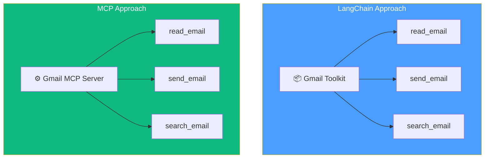
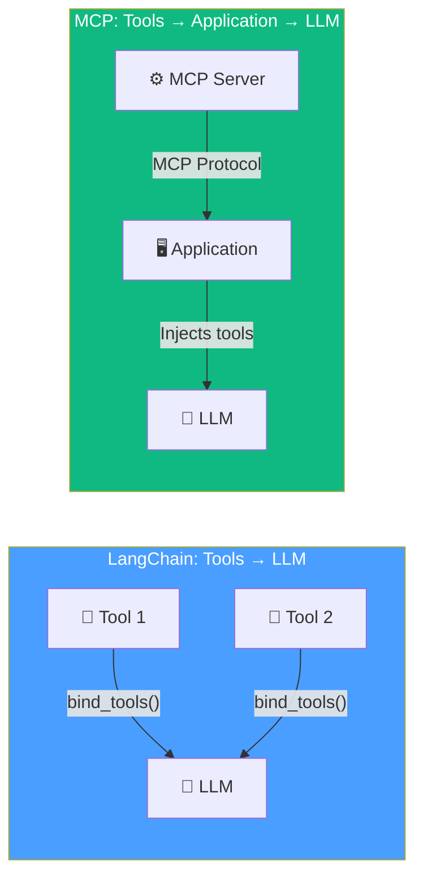
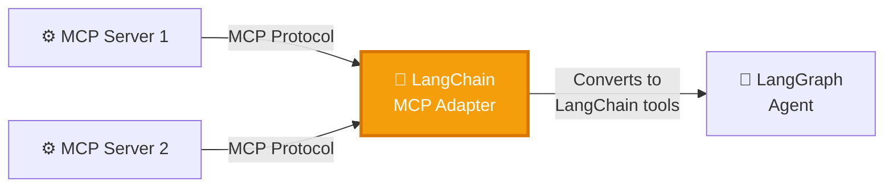

# 14.06 — LangChain MCP Adapter

## Overview

**LangChain** and **MCP** both deal with the concept of "tools" — functions that LLMs can invoke to interact with the external world. They share a very similar mental model, but they implement it differently and serve different purposes. The **LangChain MCP Adapter** bridges the gap, letting you use MCP servers inside LangChain and LangGraph agents.

This lesson compares tools in both ecosystems, explains their similarities and differences, and introduces the adapter that connects them.

---

## Tools: The Shared Concept

Both LangChain and MCP share the same fundamental concept of a "tool":

| Property | LangChain Tool | MCP Tool |
|---|---|---|
| **What it is** | A Python function wrapped with metadata | A function exposed through an MCP server |
| **Name** | Required — identifies the function | Required — identifies the function |
| **Description** | Required — tells the LLM when to use it | Required — tells the LLM when to use it |
| **Input schema** | Defined via type hints or Pydantic models | Defined via JSON Schema |
| **Return value** | The function's return value | The tool's response via MCP protocol |

The **description** is critically important in both ecosystems. It's not just documentation for human developers — it's the text that gets injected into the LLM's prompt to help the model decide **when** to use the tool and **what arguments** to pass. A vague description leads to poor tool selection by the LLM. A clear, specific description leads to accurate tool invocation.

### Tool Definition Comparison

**LangChain tool:**
```python
from langchain_core.tools import tool

@tool
def multiply(a: int, b: int) -> int:
    """Multiply two numbers together. Use this when you need
    to calculate the product of two integers."""
    return a * b
```

**MCP tool (in an MCP server):**
```python
@server.tool()
async def multiply(a: int, b: int) -> str:
    """Multiply two numbers together. Use this when you need
    to calculate the product of two integers."""
    return str(a * b)
```

Notice the similarity — same function name, same parameters, same description. The difference is in how they're registered and where they execute.

---

## Toolkits vs. MCP Servers: Same Idea, Different Scope

LangChain has the concept of a **Toolkit** — a collection of pre-built tools for a specific service. MCP has the concept of an **MCP Server** — also a collection of tools for a specific service.



Both are curated collections of related tools. The difference is:
- **LangChain toolkits** are Python packages you install and use directly in your application code
- **MCP servers** are separate services that communicate via the MCP protocol

---

## The Key Differences

While the concept is similar, there are important architectural differences:

### 1. Where Tools Are Bound



**LangChain:** Tools are bound **directly to the LLM** using `llm.bind_tools([tool1, tool2])`. The tool descriptions are injected into the LLM's system prompt by LangChain.

**MCP:** Tools are exposed by the **MCP server**, discovered by the **MCP client** (inside the host application), and then the host application injects them into the LLM. There are more layers of abstraction between the tool and the LLM.

### 2. Where Tools Execute

| | LangChain | MCP |
|---|---|---|
| **Tool execution** | Runs inside the application process | Runs inside the MCP server process |
| **Deployment** | Part of the application | Separate service (local or remote) |
| **Scaling** | Scales with the application | Scales independently |
| **Updates** | Requires application redeployment | Server can be updated independently |

### 3. Scope of Capabilities

| | LangChain | MCP |
|---|---|---|
| **Tools** | ✅ Supported | ✅ Supported |
| **Resources** | ❌ Not a core concept | ✅ First-class concept |
| **Prompts** | ❌ Not a structured concept | ✅ First-class concept |

MCP generalizes beyond just tools by also supporting **resources** (data) and **prompts** (templates), which LangChain doesn't have as formal concepts.

### 4. Portability

| | LangChain | MCP |
|---|---|---|
| **Works across applications** | ❌ LangChain-specific | ✅ Any MCP-compatible app |
| **Vendor lock-in** | Tied to LangChain ecosystem | Open standard, framework-agnostic |

---

## The Bridge: LangChain MCP Adapter

Given that LangChain and MCP handle tools differently, how do you use MCP servers in a LangChain agent? The **LangChain MCP Adapter** (`langchain-mcp-adapters`) bridges this gap.



### What the Adapter Does

1. **Creates MCP clients** that connect to one or more MCP servers
2. **Discovers tools** from each connected server (using the standard MCP initialization flow)
3. **Converts MCP tools to LangChain tools** — translating the MCP tool schema into LangChain's `BaseTool` format
4. **Returns a list of LangChain-compatible tools** that can be used with `bind_tools()`, in ReAct agents, or in any LangGraph workflow

### What This Enables

- **Use any MCP server** (community-built, official, custom) in your LangChain/LangGraph agent without manual adaptation
- **Mix MCP tools with native LangChain tools** in the same agent
- **Connect to multiple MCP servers** through a single adapter and get all tools as LangChain tools
- **Leverage the entire MCP ecosystem** without leaving the LangChain framework

### Example Usage (Conceptual)

```python
from langchain_mcp_adapters import MultiServerMCPClient
from langgraph.prebuilt import create_react_agent
from langchain_openai import ChatOpenAI

# Connect to MCP servers and get tools
async with MultiServerMCPClient(
    {
        "weather": {
            "command": "python",
            "args": ["weather_server.py"],
            "transport": "stdio",
        },
        "slack": {
            "url": "http://localhost:8080/sse",
            "transport": "sse",
        },
    }
) as client:
    # Get all tools from all connected MCP servers
    tools = client.get_tools()
    # tools is now a list of LangChain-compatible tools
    
    # Create a standard LangGraph ReAct agent with MCP tools
    agent = create_react_agent(
        ChatOpenAI(model="gpt-4"),
        tools=tools,
    )
    
    # Use the agent normally — it can now invoke MCP tools
    result = await agent.ainvoke({
        "messages": [("user", "What's the weather in Berlin?")]
    })
```

**The key insight:** From the agent's perspective, MCP tools are indistinguishable from native LangChain tools. The adapter handles all the protocol translation transparently.

---

## When to Use What

| Scenario | Use |
|---|---|
| Building a quick prototype with simple tools | **LangChain tools** — less overhead, faster to set up |
| Building reusable tools for multiple applications | **MCP servers** — implement once, use everywhere |
| Need tools from the MCP ecosystem | **MCP Adapter** — brings MCP tools into LangChain |
| Production deployment with independent scaling | **MCP servers** — scale tools independently from the agent |
| Need resources and prompts, not just tools | **MCP servers** — first-class support for all three |

---

## Summary

| Aspect | LangChain | MCP | LangChain MCP Adapter |
|---|---|---|---|
| **Role** | Agent framework | Tool protocol | Bridge between them |
| **Tools** | Defined in application code | Defined in MCP servers | Converts MCP → LangChain |
| **Execution** | In-process | In MCP server | Routes to MCP server |
| **Portability** | LangChain only | Any MCP app | LangChain + MCP |
| **Value** | Agent orchestration | Tool standardization | Best of both worlds |

The adapter gives you the best of both worlds: LangChain's powerful agent orchestration combined with MCP's universal tool ecosystem.