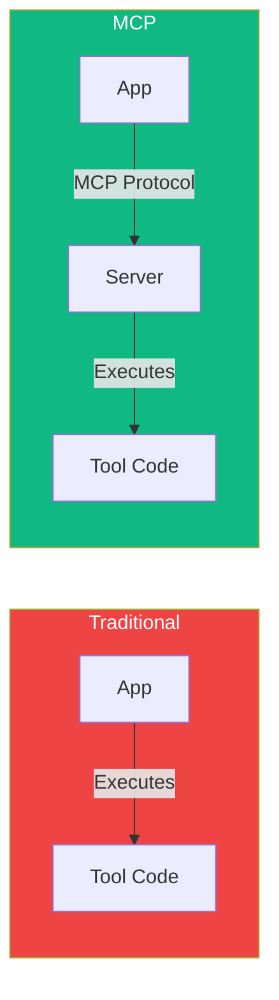
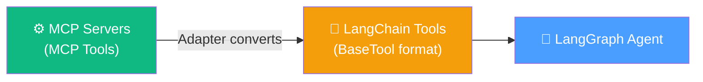

# 14.07 — MCP Knowledge Check

## Overview

This is a comprehensive knowledge check covering all the key concepts from the Model Context Protocol (MCP) section. Each question tests a specific concept, and the detailed explanations reinforce the underlying principles.

---

## Question 1: Purpose of MCP

**What is the primary purpose of the Model Context Protocol (MCP)?**

> **Answer:** To enable seamless integration between LLM applications and external data sources/tools through a standardized protocol.

**Why this is the answer:**

MCP provides a **single, standardized interface** for connecting AI applications to external tools, services, and data sources. Without MCP, each combination of AI application × external service requires custom integration code, creating an O(N×M) explosion of integration work.

With MCP, tools are implemented **once** as MCP servers, and any MCP-compatible application can connect to them. This reduces the integration work to O(N+M) — implement each tool once, implement MCP support in each app once.

The key word is "standardized" — MCP doesn't add new capabilities to LLMs, it standardizes how existing capabilities (tools, resources, prompts) are connected to LLM applications.

---

## Question 2: Role of an MCP Server

**In the MCP architecture, what is the role of an "MCP Server"?**

> **Answer:** It's a lightweight program that exposes specific capabilities (tools, resources, prompts) via the MCP protocol.

**Why this is the answer:**

The MCP Server is the **capability provider** in the architecture. It wraps external functionality (APIs, databases, file systems) and exposes it through the standard MCP protocol interface. The server is responsible for:
- Declaring what tools, resources, and prompts it offers (via `list_tools`, `list_resources`, etc.)
- Executing tool calls when requested (via `call_tool`)
- Providing resource data when requested (via `read_resource`)

The server is "lightweight" because it doesn't contain the LLM or the application logic — it only handles the tool/resource functionality. The orchestration (deciding when to call tools) happens in the host application.

---

## Question 3: Where MCP Servers Run

**Based on the MCP general architecture, where do MCP Servers typically run?**

> **Answer:** On the user's local computer (potentially accessing local data or remote services), or remotely on the cloud.

**Why this is the answer:**

MCP servers are flexible in their deployment:

| Transport | Location | Use Case |
|---|---|---|
| **stdio** | Local machine | Development, desktop apps (Cursor, Claude Desktop) |
| **SSE** | Remote server | Cloud deployments, shared team servers |
| **Docker** | Either | Isolated environments, reproducible setups |

When running locally via stdio, the host application spawns the server as a child process. When running remotely via SSE, the server runs on a different machine and communicates over HTTP.

Regardless of where the server runs, it can access **both local and remote resources**. A locally running server can make API calls to remote services. A remotely running server can access cloud databases.

---

## Question 4: LLM Fundamental Capability

**What is the fundamental capability of a base Large Language Model (LLM) before adding application layers or tools?**

> **Answer:** Predicting the next token in a sequence (text generation).

**Why this is the answer:**

At their core, LLMs are **statistical token predictors**. They take a sequence of tokens as input and predict the most probable next token. This process repeats — predicting one token, appending it, predicting the next — until a complete response is generated.

Everything else — tool calling, web searching, code execution, image generation — is built **on top** of this fundamental capability by the application layer. The LLM itself can only generate text. The application parses that text, detects tool calls, executes them externally, and feeds results back.

This distinction is crucial for understanding MCP: MCP doesn't enhance LLMs themselves. It enhances the **application layer** that wraps them, making it easier to connect tools to the LLM through a standard protocol.

---

## Question 5: How LLMs Initiate Tool Calls

**How does an LLM, within an application designed for tool use, typically initiate an action like calling a weather API?**

> **Answer:** By generating specifically formatted text that represents a "tool call" (e.g., `get_weather(city="New York")`).

**Why this is the answer:**

The LLM doesn't — and can't — execute API calls directly. Instead, it generates **structured text** that encodes a tool invocation request:

```json
{
  "tool": "get_weather",
  "arguments": {"city": "New York"}
}
```

The **application** (not the LLM) then:
1. Detects that the LLM's output is a tool call (not a regular answer)
2. Parses the tool name and arguments
3. Executes the corresponding function
4. Feeds the result back to the LLM for final answer generation

This mechanism works because:
- The application injects tool descriptions into the LLM's system prompt
- The LLM is trained to recognize these descriptions and generate tool calls when appropriate
- Each LLM vendor (OpenAI, Anthropic, Google) has trained their models to support this pattern

---

## Question 6: Who Executes Tools in MCP

**In the MCP flow, which component is ultimately responsible for executing the actual code of a tool?**

> **Answer:** The MCP Server.

**Why this is the answer:**

This is the **key architectural difference** between MCP and traditional tool calling:



In traditional tool calling, the application runs the tool code directly in its own process. In MCP, the application sends the tool call request to the MCP Server, and the **server** runs the actual code in its own process.

This separation enables:
- **Independent scaling** — scale the tool server separately from the application
- **Independent deployment** — update tools without redeploying the application
- **Security isolation** — tool code runs in a separate process or machine
- **Monitoring** — track tool usage independently

---

## Question 7: Tool Descriptions

**What is a crucial element required when defining a tool in both LangChain and MCP for the LLM to use it effectively?**

> **Answer:** A clear description explaining what the tool does and when to use it.

**Why this is the answer:**

LLMs decide which tool to call based on the **description** provided with each tool. The LLM can't inspect the tool's source code — it only sees the description text.

A **good description** leads to accurate tool selection:
> *"Get the current weather forecast for a specific city. Returns temperature, conditions, and humidity. Use this when the user asks about weather, temperature, or forecast."*

A **bad description** leads to tool selection failures:
> *"Weather function."*

The description is effectively **prompt engineering** embedded in the tool definition. It's sent to the LLM as part of the system prompt and directly affects the model's decision-making.

This applies equally to both LangChain (`@tool` decorator with docstring) and MCP (tool registration with description field).

---

## Question 8: Benefits of Decoupled Tool Execution

**What is a key benefit of decoupling tool execution onto an MCP Server?**

> **Answer:** It allows tool execution to happen on a separate service, aiding scalability, monitoring, and deployment.

**Why this is the answer:**

Decoupling creates a clean separation between **reasoning** (the LLM and application logic) and **execution** (the tool code):

| Benefit | Explanation |
|---|---|
| **Scalability** | Scale tool servers independently based on usage patterns |
| **Monitoring** | Track tool calls, latency, errors, and costs in a dedicated system |
| **Deployment** | Update tool logic without redeploying the AI application |
| **Security** | Tool code runs in isolation — a bug doesn't crash the main application |
| **Dynamic updates** | Add new tools to the server; the client discovers them at next initialization |
| **Reusability** | The same server works with multiple AI applications |

This is the same principle behind **microservices architecture** — splitting a monolithic application into independent, focused services that communicate through defined interfaces.

---

## Question 9: LangChain MCP Adapter

**What is the primary purpose of the LangChain MCP Adapter library?**

> **Answer:** To provide tool compatibility, enabling LangChain/LangGraph agents to use tools exposed via the MCP protocol.

**Why this is the answer:**

The adapter is a **bridge** between two ecosystems:



It works by:
1. Creating MCP clients that connect to MCP servers
2. Discovering available tools through the MCP protocol
3. Converting each MCP tool schema into a LangChain `BaseTool` object
4. Returning these tools for use in LangChain agents

This means developers can:
- Use **any** existing MCP server in their LangChain/LangGraph agents
- **Mix** MCP tools with native LangChain tools
- Leverage the **entire MCP ecosystem** without leaving LangChain

---

## Score Reference

| Score | Level |
|---|---|
| 9/9 | 🏆 Expert — You have a thorough understanding of MCP |
| 7-8/9 | ✅ Strong — Solid grasp of core concepts |
| 5-6/9 | 📝 Good — Review the areas you missed |
| <5/9 | 📚 Review — Reread lessons 01–06 before continuing |
