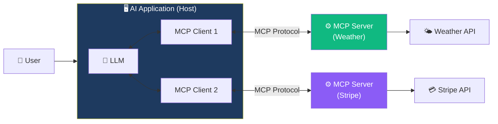

# 14. Model Context Protocol (MCP)

## Overview

The **Model Context Protocol (MCP)** is an open standard created by Anthropic that standardizes how AI applications connect to external tools, data sources, and services. Think of it as the **USB-C of AI integrations** — a universal interface that lets any compliant AI application (Cursor, Claude Desktop, Windsurf, your own agents) connect to any MCP server without custom integration code.

## Lesson Map

| # | Lesson | Focus |
|---|---|---|
| 1 | [Why MCP](01-why-mcp.md) | The problem MCP solves — eliminating redundant integrations |
| 2 | [How LLMs Use Tools](02-how-llms-use-tools.md) | Foundation — how tool calling works under the hood |
| 3 | [Essentials of the Protocol](03-essentials-of-the-protocol-with-tool-calling.md) | The full MCP interaction flow — initialization, tool discovery, execution |
| 4 | [MCP Architecture](04-mcp-architecture.md) | Core components — hosts, clients, servers, and their relationships |
| 5 | [MCP Servers](05-mcp-servers.md) | Server capabilities — tools, resources, prompts, sampling |
| 6 | [LangChain MCP Adapter](06-langchain-mcp-adapter.md) | Bridging MCP tools into LangChain/LangGraph agents |
| 7 | [MCP Quiz](07-mcp-quiz.md) | Knowledge check — 9 questions covering the full MCP stack |

## Architecture at a Glance

