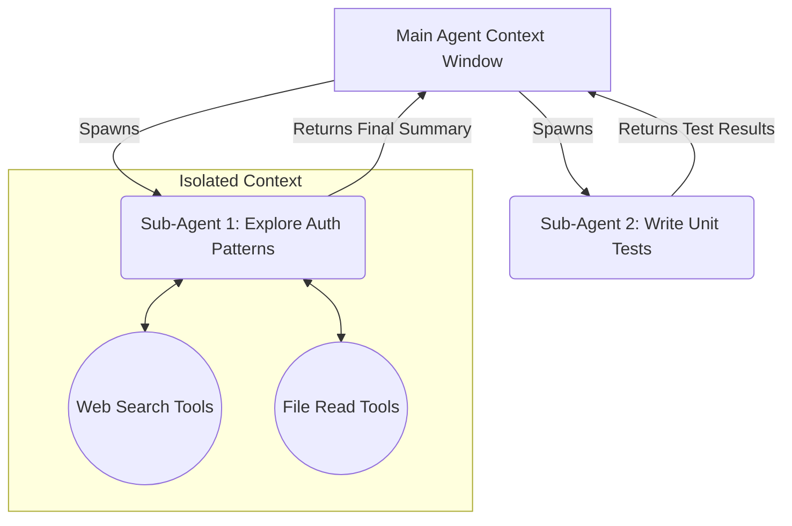

# 18.04 Pillar 2: Hierarchical Delegation & Sub-Agents

The second critical pillar of a Deep Agent is **Hierarchical Delegation**—the ability for the primary agent to spawn instances of itself to tackle specialized sub-tasks.

---

## The "Handyman" Analogy

If you need to fix a leaky skylight on a high ceiling, and you lack the tools or the expertise, you don't climb a ladder and attempt it yourself. You hire a specialized craftsman (a handyman).

You provide the handyman with a high-level goal ("Fix the leak"). The handyman arrives with:
1. **Their own expertise** (A specialized System Prompt).
2. **Their own ladder and tools** (A restricted, specialized Toolset).

The handyman climbs the ladder and works in isolation. You don't need to monitor every single screw they turn. When they finish, they come down and give you a final report ("It's fixed").

## The Technical Implementation: Sub-Agents

This exact concept applies to Deep Agents through **Sub-Agents**.

When a Deep Agent realizes a sub-task is complex, rather than executing it directly and polluting its own context window with intermediate errors and file searches, it spawns a Sub-Agent.

### How it Works:
1. The **Main Agent** writes a specific, focused prompt for the sub-task.
2. The **Sub-Agent** is instantiated. It has its own unique system prompt (e.g., *"You are a dedicated authentication researcher..."*) and its own isolated tool calling loop.
3. The Sub-Agent executes its task locally, potentially failing, retrying, and reading dozens of files.
4. When finished, the Sub-Agent dies and returns **only the final, condensed answer** back to the Main Agent.

### Why Sub-Agents are Crucial

- **Context Isolation:** By keeping the noisy, intermediate tool calls inside the Sub-Agent, the Main Agent's context window remains clean, lean, and focused on the high-level objective.
- **Parallel Execution:** Because Sub-Agents are isolated, the Main Agent can spawn multiple Sub-Agents concurrently, drastically reducing the completion time for massive tasks.