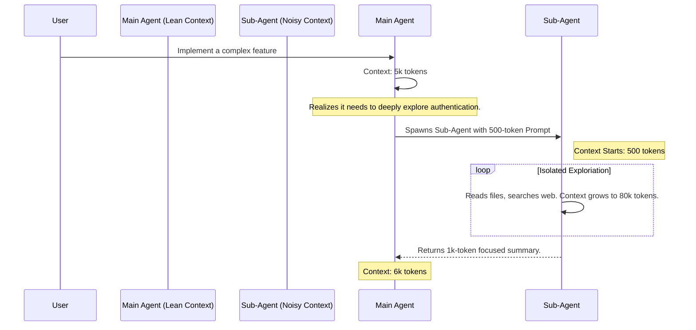

# 18.05 Sub-Agent Context Flow

To truly appreciate the power of Sub-Agents, we must understand exactly how tokens flow between the user, the Main Agent, and the Sub-Agent. The primary superpower of a Sub-Agent is **Context Isolation**.

---

## The Context Window Problem

Every turn in a conversation with an LLM consumes tokens. As you prompt the agent, and as the agent returns observations and executes tools, the context window grows.

- Turn 1: `10k tokens`
- Turn 2: `30k tokens`
- Turn 5: `100k tokens`

As this window approaches the model's limit (e.g., 200k tokens), three things happen:
1. **Cost Explodes:** You pay for every input token on every new generation.
2. **Latency Increases:** The time to first token drastically increases.
3. **Context Pollution:** The LLM gets confused by old, irrelevant data ("Context Rot"), leading to hallucinations.

Without Sub-Agents, the only solution to this problem is to manually "compact" the context or completely clear the history and start fresh, destroying your conversational momentum.

---

## The Sub-Agent Solution

Sub-Agents solve this problem by preventing intermediate tokens from ever reaching the Main Agent's context window.

When the Main Agent identifies a task that will require high-token exploration (like reading deeply into a codebase or doing extensive web searches), it spawns a Sub-Agent.

### The Flow of Tokens

1. **Initialization:** The Main Agent writes a small, focused prompt (e.g., `500 tokens`) explaining the sub-task.
2. **Fresh Context:** The Sub-Agent wakes up. **It does not see the Main Agent's history.** Its entire starting context is just that 500-token prompt.
3. **The Loop:** The Sub-Agent executes tools, reads massive files, makes mistakes, and retries. Its internal context window might swell to `80k tokens`.
4. **Resolution:** The Sub-Agent finishes the task. It writes a condensed final response (e.g., `1k tokens`).
5. **Death & Return:** The Sub-Agent is terminated. The `80k tokens` of noisy intermediate work vanish permanently. Only the `1k token` final summary is passed back to the Main Agent.

### Why This is Elegant

By utilizing Sub-Agents, the Main Agent's conversation thread remains incredibly lean. You can interact with a coding agent like Claude Code continuously for hours without needing to manually clear the chat history, because the noisy, heavy lifting was delegated to disposable background workers.